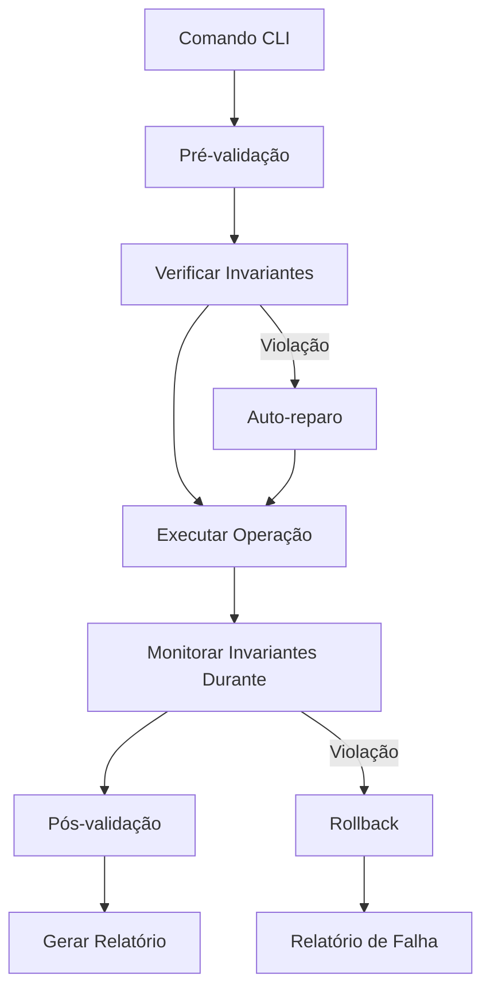

# 🚀 CLI Unificadora Com Princípios de Invariantes Sistêmicos

## 📋 Requisito Principal

Criar uma CLI (Node.js + Commander) que unifica operações de refatoração, análise e validação do EscapeKit com foco em invariantes sistêmicos.

## 🎯 Arquitetura e Abordagem Técnica

### Princípios de Invariantes Sistêmicos Aplicados

1. **Autoconsistência**: Cada comando mantém o estado do projeto válido
2. **Transitividade**: Operações podem ser compostas sem violar invariantes
3. **Idempotência**: Comandos podem ser reexecutados sem efeitos colaterais
4. **Reversibilidade**: Backup automático antes de operações destrutivas
5. **Traceabilidade**: Toda operação gera logs estruturados

### Arquitetura da CLI

```
refactor-cli/
├── package.json          # Configuração da CLI
├── cli.js                # Ponto de entrada principal
├── commands/             # Subcomandos organizados por domínio
│   ├── invariants/       # Comandos específicos de invariantes
│   ├── analyze/          # Análise e diagnóstico
│   ├── refactor/         # Operações de refatoração
│   └── validate/         # Validação em múltiplos ambientes
└── utils/
    ├── invariant-checkers.js  # Validador de invariantes
    ├── backup-manager.js      # Sistema de backup/inversão
    └── progress-tracker.js    # Tracking de progresso
```

## 📚 Arquivos Afetados

### Novos Arquivos (Criação)

- `/home/vector/Documentos/RalphLoopInverso/tools/refactor-cli/package.json`
- `/home/vector/Documentos/RalphLoopInverso/tools/refactor-cli/cli.js`
- `/home/vector/Documentos/RalphLoopInverso/tools/refactor-cli/commands/invariants/validate-invariants.js`
- `/home/vector/Documentos/RalphLoopInverso/tools/refactor-cli/commands/invariants/check-progression.js`
- `/home/vector/Documentos/RalphLoopInverso/tools/refactor-cli/commands/analyze/project-structure.js`
- `/home/vector/Documentos/RalphLoopInverso/tools/refactor-cli/commands/refactor/migrate-modules.js`
- `/home/vector/Documentos/RalphLoopInverso/tools/refactor-cli/commands/refactor/fix-imports.js`
- `/home/vector/Documentos/RalphLoopInverso/tools/refactor-cli/commands/refactor/setup-backend.js`
- `/home/vector/Documentos/RalphLoopInverso/tools/refactor-cli/commands/refactor/setup-frontend.js`
- `/home/vector/Documentos/RalphLoopInverso/tools/refactor-cli/commands/validate/run-validation.js`
- `/home/vector/Documentos/RalphLoopInverso/tools/refactor-cli/commands/validate/run-tests.js`
- `/home/vector/Documentos/RalphLoopInverso/tools/refactor-cli/utils/invariant-checkers.js`
- `/home/vector/Documentos/RalphLoopInverso/tools/refactor-cli/utils/backup-manager.js`
- `/home/vector/Documentos/RalphLoopInverso/tools/refactor-cli/utils/progress-tracker.js`

### Arquivos Existentes (Modificação)

- `/home/vector/Documentos/RalphLoopInverso/package.json` (adicionar workspace)
- `/home/vector/Documentos/RalphLoopInverso/.gitignore` (adicionar arquivos de estado da CLI)

## 🔧 Detalhes de Implementação

### Comandos Principais

1. **`escapekit-refactor validate-invariants`**
   - Valida todos os invariantes do projeto
   - Detecção de violações com auto-correção
   - Gera relatório de consistência

```javascript
class InvariantValidator {
  async validateProjectState(projectPath) {
    const invariants = [
      // Invariante 1: Arquivos JS/TS devem compilar
      async () => await this.checkCompilation(),
      // Invariante 2: Imports devem ser válidos
      async () => await this.checkImports(),
      // Invariante 3: Dependencies devem resolver
      async () => await this.checkDependencies(),
      // Invariante 4: Build deve funcionar
      async () => await this.checkBuild()
    ];
    
    return await this.runValidation(invariants);
  }
}
```

2. **`escapekit-refactor analyze-structure`**
   - Análise automática da estrutura atual
   - Detecção de padrões problemáticos
   - Geração de plano de refatoração

3. **`escapekit-refactor migrate-modules`**
   - Migração controlada de módulos
   - Backup automático com checkpoint
   - Validação após cada etapa

4. **`escapekit-refactor setup-backend`**
   - Configuração de backend Express
   - Roteamento automático baseado em análise
   - Validação de invariantes de servidor

5. **`escapekit-refactor setup-frontend`**
   - Criação de frontend React + Vite
   - Integração com backend existente
   - Validação de invariantes de frontend

## 🔍 Invariantes Sistêmicos Implementados

### Invariante 1: Compilação Imediata
```javascript
class CompilationInvariant {
  async check() {
    const result = await execa('npm', ['run', 'typecheck']);
    return result.exitCode === 0;
  }
  
  async repair(violation) {
    // Auto-correção de problemas de compilação
    await this.fixTypeErrors();
    await this.updateTSConfig();
  }
}
```

### Invariante 2: Imports Válidos
```javascript
class ImportInvariant {
  async check() {
    return await this.validateAllImports();
  }
  
  async repair(unresolvedImports) {
    // Correção automática de imports faltantes
    await this.installMissingPackages(unresolvedImports);
    await this.updateImportPaths();
  }
}
```

### Invariante 3: Dependências Consistentes
```javascript
class DependencyInvariant {
  async check() {
    return await this.validateDependencyConsistency();
  }
  
  async repair(inconsistencies) {
    // Sincronização de dependências
    await this.syncPackageJson();
    await this.updateLockfile();
  }
}
```

## 🛡️ Condições de Contorno e Tratamento de Exceções

### Backward Compatibility
- Todos os comandos são reversíveis
- Backup automático antes de operações destrutivas
- Rollback automático em caso de falha

### Error Handling
- Tratamento granular de exceções
- Recuperação automática de estados inválidos
- Logs detalhados para debugging

### Validation Pipeline
1. **Pré-validação**: Verificar pré-condições
2. **Validação durante execução**: Monitorar invariantes
3. **Pós-validação**: Confirmar estado final

## 🔄 Fluxo de Dados



## ✅ Resultados Esperados

1. **CLI Funcional**: Comandos disponíveis para refatoração
2. **Invariantes Validados**: Projeto sempre em estado consistente
3. **Auto-correção**: Problemas detectados são automaticamente corrigidos
4. **Traceabilidade**: Histórico completo das operações
5. **Integração**: Funciona com código existente do EscapeKit

## ⚡ Detalhes Técnicos

### Integração com EscapeKit Existente
- Reutilização de `CodeAnalyzer` para detecção de problemas
- Integração com `ValidationEngine` para validação
- Compatibilidade com sistemas de teste existentes

### Performance e Escalabilidade
- Execução incremental de validações
- Cache de resultados de invariantes
- Paralelização de verificações independentes

### Extensibilidade
- Sistema de plugins para novos invariantes
- Configuração via arquivo YAML
- API para integração com outras ferramentas