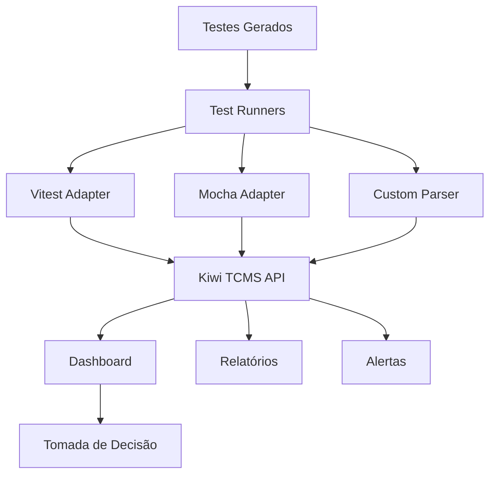
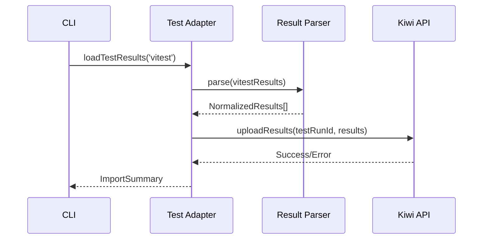

# Kiwi TCMS - Sprint 3

## Objetivo Principal
Implementar integração contínua com Kiwi TCMS para monitoramento e gestão de:
1. 400+ testes existentes
2. Novos testes gerados
3. Métricas de qualidade em tempo real

## Arquitetura Proposta


## Benefícios Esperados
- Visibilidade em tempo real da saúde dos testes
- Rastreamento histórico de execuções
- Identificação rápida de regressões
- Integração com CI/CD existente

## Pré-requisitos
1. Acesso à instância Kiwi TCMS
2. Credenciais de API
3. Configuração inicial do ambiente

## Fase 2: Carga de Resultados - Arquitetura Detalhada

### Componentes Principais

#### 1. VitestAdapter
**Propósito**: Converter resultados do Vitest para o formato padrão do Kiwi TCMS

**Arquivo**: `src/adapters/vitest-adapter.ts`

**Funcionalidades**:
- Parse do JSON de resultados do Vitest
- Extração de metadados (nome do teste, duração, status, stack trace)
- Mapeamento de códigos de status do Vitest para Kiwi TCMS
- Suporte a test suites aninhadas

**Estrutura de entrada (Vitest JSON)**:
```typescript
{
  "testResults": [
    {
      "name": "ImportDetector.detect() returns results",
      "status": "passed",
      "duration": 42,
      "suite": "ImportDetector"
    }
  ]
}
```

**Estrutura de saída (Kiwi TCMS)**:
```typescript
{
  "testCase": "importdetector-detect-returns-results",
  "outcome": "passed",
  "duration": 42,
  "metadata": {
    "suite": "ImportDetector",
    "framework": "vitest"
  }
}
```

#### 2. MochaAdapter
**Propósito**: Suporte para projetos que usam Mocha/Chai

**Arquivo**: `src/adapters/mocha-adapter.ts`

**Funcionalidades**:
- Parse do XML de resultados do Mocha
- Tratamento de hooks (before, after, beforeEach, afterEach)
- Mapeamento de códigos de status do Mocha para Kiwi TCMS

#### 3. CustomTestParser
**Propósito**: Importar testes de formatos personalizados

**Arquivo**: `src/adapters/custom-parser.ts`

**Funcionalidades**:
- Suporte a JSON customizado
- Extensibilidade através de plugins
- Validação de esquema

### Fluxo de Trabalho



## Próximos Passos

### Fase 2.1: Implementar VitestAdapter
- Criar `src/adapters/vitest-adapter.ts`
- Implementar parse de JSON do Vitest
- Criar testes unitários para o adapter

### Fase 2.2: Implementar MochaAdapter
- Criar `src/adapters/mocha-adapter.ts`
- Implementar parse de XML do Mocha
- Criar testes unitários para o adapter

### Fase 2.3: Implementar CustomTestParser
- Criar `src/adapters/custom-parser.ts`
- Implementar sistema de plugins
- Criar exemplos de uso

### Fase 2.4: Integração e Documentação
- Atualizar `run-kiwi-integration.ts` com suporte a adapters
- Criar guia de integração
- Documentar casos de uso

## Critérios de Sucesso

- [ ] VitestAdapter consegue processar 402+ testes do projeto testintel
- [ ] MochaAdapter suporta projetos existentes que usam Mocha
- [ ] CustomParser pode ser estendido para novos formatos
- [ ] Documentação completa disponível
- [ ] Testes de integração passando

## Dependencies Externas

- `@vitest/runner` - Para tipagem do Vitest
- `xml2js` - Para parse de XML do Mocha
- `ajv` - Para validação de esquema customizado