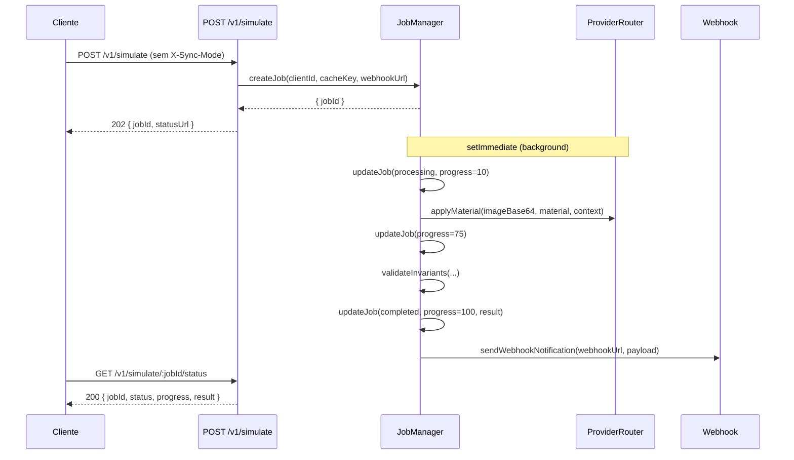
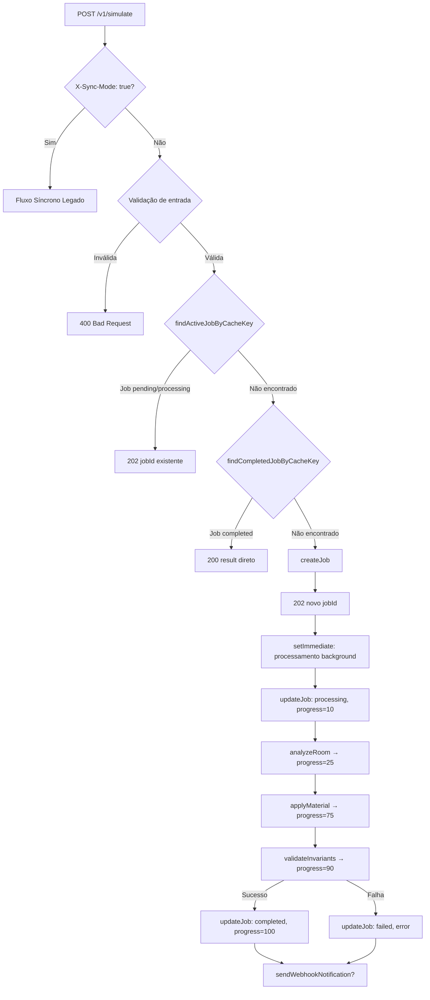

# Design Document: Async Simulation Job

## Overview

O `POST /v1/simulate` atual mantém a conexão HTTP aberta durante todo o processamento de IA (~90s), o que causa falhas silenciosas em ambientes com load balancers (AWS ALB, Nginx) que encerram conexões após 60s.

Esta feature implementa o padrão **202 Async Job**: o endpoint retorna imediatamente com um `jobId`, o processamento ocorre em background via `setImmediate`, e o cliente faz polling em `GET /v1/simulate/:jobId/status`. Um webhook opcional notifica o cliente na conclusão.

Compatibilidade retroativa é mantida via header `X-Sync-Mode: true`, que preserva o comportamento síncrono legado sem alterações.



---

## Architecture

A implementação é **híbrida no mesmo endpoint** `POST /v1/simulate`:

- **Sem** `X-Sync-Mode: true` → retorna 202 imediatamente, processa em background
- **Com** `X-Sync-Mode: true` → comportamento síncrono legado preservado integralmente



### Decisões de Design

**In-memory store vs Redis**: Jobs são armazenados em memória (`Map`) com TTL de 1h. Redis seria necessário apenas em deployments multi-instância. O PisoRealView Pro opera em instância única, tornando Redis desnecessário nesta fase.

**setImmediate vs Worker Threads**: `setImmediate` é suficiente pois o processamento é I/O-bound (chamadas HTTP ao ProviderRouter). Worker threads seriam necessários apenas para CPU-bound work.

**Índice secundário por cacheKey**: `Map<cacheKey, Set<jobId>>` mantido em paralelo ao store principal para busca O(1) na deduplicação, evitando iteração linear sobre todos os jobs.

---

## Components and Interfaces

### JobManager (`backend/services/core/JobManager.js`)

Singleton com `EventEmitter`. Responsável por todo o ciclo de vida dos jobs.

```javascript
class JobManager extends EventEmitter {
  // Store principal
  #jobs = new Map()           // Map<jobId, SimulationJob>
  // Índice secundário para deduplicação O(1)
  #cacheKeyIndex = new Map()  // Map<cacheKey, Set<jobId>>
  #cleanupTimer = null

  static TTL_MS = 3_600_000        // 1 hora
  static CLEANUP_INTERVAL_MS = 300_000  // 5 minutos

  start()   // Inicia setInterval de limpeza
  stop()    // Cancela setInterval (graceful shutdown)

  createJob(clientId, cacheKey, webhookUrl)  // Retorna SimulationJob
  getJob(jobId)                              // Retorna SimulationJob | null
  updateJob(jobId, updates)                  // Merge parcial no job
  cleanup()                                  // Remove jobs expirados

  findActiveJobByCacheKey(cacheKey)     // pending|processing → SimulationJob | null
  findCompletedJobByCacheKey(cacheKey)  // completed → SimulationJob | null
}

export const jobManager = new JobManager()
```

### webhookNotifier (`backend/services/core/webhookNotifier.js`)

```javascript
/**
 * Envia notificação HTTP POST para webhookUrl.
 * Timeout de 5s via AbortController. Não retenta em caso de falha.
 * @returns {Promise<boolean>} true se sucesso (2xx), false caso contrário
 */
export async function sendWebhookNotification(webhookUrl, payload)
```

### Status Endpoint (`backend/routes/simulate/status.js`)

```
GET /v1/simulate/:jobId/status
```

- Aplica `apiKeyMiddleware`
- Verifica `job.clientId === req.client.clientId` (autorização por ownership)
- 404 se job não encontrado ou expirado
- 403 se job pertence a outro cliente
- 200 com payload completo

### Modificações em `backend/routes/simulate.js`

Lógica de alto nível do modo assíncrono inserida antes do fluxo síncrono existente:

1. Validação de entrada (comum a ambos os modos)
2. Branch `X-Sync-Mode: true` → fluxo legado inalterado
3. Gera `cacheKey` via `getSimulationCacheKey(imageBase64, material)`
4. Deduplicação: `findActiveJobByCacheKey` → 202 com jobId existente
5. Cache hit: `findCompletedJobByCacheKey` → 200 com result
6. `jobManager.createJob(clientId, cacheKey, webhookUrl)` → 202
7. `setImmediate` inicia processamento em background

### Modificações em `backend/server.js`

```javascript
import { jobManager } from './services/core/JobManager.js'
import statusRouter from './routes/simulate/status.js'

app.use('/v1/simulate', statusRouter)  // monta GET /:jobId/status

jobManager.start()  // após configurar rotas

process.on('SIGTERM', () => jobManager.stop())
process.on('SIGINT',  () => jobManager.stop())
```

---

## Data Models

### SimulationJob

```typescript
interface SimulationJob {
  id: string;                    // UUID v4 via crypto.randomUUID()
  clientId: string;              // req.client.clientId (do apiKeyMiddleware)
  cacheKey: string;              // SHA-256 de imageBase64 + '\0' + material fields
  webhookUrl: string | null;     // URL validada com protocolo http/https, ou null
  status: 'pending' | 'processing' | 'completed' | 'failed';
  progress: number;              // 0–100, inteiro
  createdAt: number;             // Date.now() no momento da criação
  result: SimulationResponse | null;  // preenchido quando status === 'completed'
  error: string | null;          // preenchido quando status === 'failed'
}
```

### Progressão de Status

| Etapa                        | `status`     | `progress` |
|------------------------------|--------------|-----------|
| Job criado                   | `pending`    | 0         |
| Iniciando processamento      | `processing` | 10        |
| Análise de sala (analyzeRoom)| `processing` | 25        |
| Chamada ao provider          | `processing` | 75        |
| Validação de invariantes     | `processing` | 90        |
| Concluído com sucesso        | `completed`  | 100       |
| Falha                        | `failed`     | (mantém)  |

### Resposta do Status Endpoint

```typescript
// GET /v1/simulate/:jobId/status — 200 OK
interface StatusResponse {
  jobId: string;
  status: JobStatus;
  progress: number;
  createdAt: number;
  result?: SimulationResponse;  // apenas quando status === 'completed'
  error?: string;               // apenas quando status === 'failed'
}

// POST /v1/simulate — 202 Accepted
interface AsyncAcceptedResponse {
  jobId: string;
  statusUrl: string;  // "/v1/simulate/:jobId/status"
}
```

### Payload do Webhook

```typescript
interface WebhookPayload {
  jobId: string;
  status: 'completed' | 'failed';
  result?: SimulationResponse;  // quando completed
  error?: string;               // quando failed
}
```

---

## Correctness Properties

*A property is a characteristic or behavior that should hold true across all valid executions of a system — essentially, a formal statement about what the system should do. Properties serve as the bridge between human-readable specifications and machine-verifiable correctness guarantees.*

### Property 1: Resposta 202 imediata para requisições válidas

*For any* requisição válida a `POST /v1/simulate` sem o header `X-Sync-Mode: true`, o endpoint deve retornar HTTP 202 com os campos `jobId` (UUID v4) e `statusUrl` no formato `/v1/simulate/<jobId>/status`.

**Validates: Requirements 1.1**

---

### Property 2: Invariantes de criação do job

*For any* job criado pelo JobManager, os campos `status` deve ser `"pending"`, `progress` deve ser `0`, `createdAt` deve ser um timestamp recente, e o `cacheKey` deve ser o SHA-256 determinístico de `imageBase64` + `material`. Além disso, o job deve ser recuperável por `getJob(jobId)` imediatamente após a criação.

**Validates: Requirements 1.2, 4.1, 4.2**

---

### Property 3: Rejeição de inputs inválidos

*For any* requisição a `POST /v1/simulate` com campos ausentes ou inválidos (`imageBase64`, `material.type`, `material.color`, `material.dimensions`), o endpoint deve retornar HTTP 400 sem criar nenhum job no JobManager.

**Validates: Requirements 1.3, 6.4**

---

### Property 4: Autenticação obrigatória em todos os endpoints

*For any* requisição a `POST /v1/simulate` ou `GET /v1/simulate/:jobId/status` sem API key válida, o sistema deve retornar HTTP 401 ou 403 sem processar a requisição nem expor dados de jobs.

**Validates: Requirements 1.4, 3.5**

---

### Property 5: Processamento não-bloqueante

*For any* job criado, o retorno de `createJob` deve ocorrer antes do processamento completar — ou seja, o job deve estar em `status: "pending"` ou `"processing"` no momento em que o 202 é enviado ao cliente.

**Validates: Requirements 2.1**

---

### Property 6: Transições de estado do job

*For any* job processado com sucesso, a sequência de estados deve ser `pending → processing → completed` com `progress` seguindo a ordem `0 → 10 → 25 → 75 → 90 → 100`. *For any* job que falhe, o estado final deve ser `failed` com campo `error` preenchido.

**Validates: Requirements 2.2, 2.3, 2.4, 2.5**

---

### Property 7: Completude condicional da resposta do status endpoint

*For any* job existente consultado via `GET /v1/simulate/:jobId/status`, a resposta deve sempre conter `jobId`, `status`, `progress` e `createdAt`. Adicionalmente: se `status === "completed"`, o campo `result` deve estar presente; se `status === "failed"`, o campo `error` deve estar presente.

**Validates: Requirements 3.1, 3.2, 3.3**

---

### Property 8: Limpeza de jobs expirados

*For any* conjunto de jobs onde alguns têm `createdAt` anterior a `Date.now() - 3_600_000`, após executar `cleanup()`, nenhum job expirado deve permanecer no store. Jobs em `status: "processing"` expirados devem ter seu status atualizado para `"failed"` com `error: "Job expired during processing"` antes da remoção.

**Validates: Requirements 4.3, 8.3, 8.4**

---

### Property 9: Deduplicação por cacheKey

*For any* par de requisições com o mesmo `cacheKey` onde a primeira gerou um job em `status: "pending"` ou `"processing"`, a segunda requisição deve retornar HTTP 202 com o mesmo `jobId` sem criar um novo job. Se o job existente estiver `"completed"`, deve retornar HTTP 200 com o `result` diretamente. Se estiver `"failed"`, deve criar um novo job.

**Validates: Requirements 5.1, 5.2, 5.3**

---

### Property 10: Webhook enviado na conclusão

*For any* job criado com `webhookUrl` válida que atinja `status: "completed"` ou `"failed"`, o sistema deve enviar um HTTP POST para a `webhookUrl` com o payload correto. Se o webhook falhar, o `status` do job não deve ser alterado.

**Validates: Requirements 6.1, 6.2, 6.3**

---

### Property 11: Isolamento do modo síncrono

*For any* requisição com `X-Sync-Mode: true`, o JobManager não deve ter nenhum job criado como efeito colateral, e a resposta deve ser idêntica ao comportamento anterior (200 com `SimulationResponse` ou 409 em violação de invariante).

**Validates: Requirements 7.1, 7.2, 7.3, 7.4**

---

## Error Handling

| Situação | HTTP | Body |
|---|---|---|
| Campos obrigatórios ausentes/inválidos | 400 | `{ "error": "..." }` |
| `webhookUrl` com protocolo inválido | 400 | `{ "error": "webhookUrl must be http or https" }` |
| API key ausente ou inválida | 401/403 | `{ "error": "Unauthorized" }` |
| Job não encontrado ou expirado | 404 | `{ "error": "Job not found or expired" }` |
| Job pertence a outro cliente | 403 | `{ "error": "Forbidden" }` |
| Falha no ProviderRouter (todos os providers) | job `failed` | `error` no job |
| Violação de invariante (modo síncrono) | 409 | detalhes da violação |
| Falha no envio do webhook | log apenas | job não alterado |
| Job em processing expirado pelo cleanup | job `failed` | `"Job expired during processing"` |

### Validação de webhookUrl

```javascript
function isValidWebhookUrl(url) {
  try {
    const parsed = new URL(url);
    return parsed.protocol === 'http:' || parsed.protocol === 'https:';
  } catch {
    return false;
  }
}
```

---

## Testing Strategy

### Abordagem Dual

Testes unitários e property-based são complementares e ambos obrigatórios:

- **Testes unitários**: exemplos específicos, edge cases, pontos de integração
- **Testes de propriedade**: validação universal com inputs gerados aleatoriamente (mínimo 100 iterações cada)

### Biblioteca de Property-Based Testing

**[fast-check](https://github.com/dubzzz/fast-check)** — biblioteca PBT para JavaScript/Node.js.

```bash
npm install --save-dev fast-check
```

### Arquivos de Teste

**`backend/services/core/__tests__/JobManager.test.js`**

Testes unitários:
- `createJob` retorna job com campos corretos (Property 2)
- `getJob` retorna null para jobId inexistente (edge case de 3.4)
- `cleanup()` remove jobs expirados e atualiza processing→failed (Property 8)
- `start()` / `stop()` configuram e cancelam o intervalo (Requirements 8.1, 8.2)
- `findActiveJobByCacheKey` e `findCompletedJobByCacheKey` (Property 9)

Testes de propriedade com fast-check:
```javascript
// Feature: async-simulation-job, Property 2: invariantes de criação do job
it.prop([fc.string(), fc.string(), fc.option(fc.webUrl())])(
  'job criado tem campos iniciais corretos',
  (clientId, cacheKey, webhookUrl) => { ... }
)

// Feature: async-simulation-job, Property 8: limpeza de jobs expirados
it.prop([fc.array(fc.record({ ...jobFields, createdAt: fc.integer() }))])(
  'cleanup remove todos os jobs expirados',
  (jobs) => { ... }
)

// Feature: async-simulation-job, Property 9: deduplicação por cacheKey
it.prop([fc.string()])(
  'requisições com mesmo cacheKey ativo retornam jobId existente',
  (cacheKey) => { ... }
)
```

**`backend/__tests__/asyncSimulate.test.js`**

Testes unitários:
- Fluxo completo: POST → 202 → polling → 200 com result
- Modo síncrono com `X-Sync-Mode: true` retorna 200 (Property 11)
- Cache hit retorna 200 diretamente (Property 9)
- Job falhado retorna error no status (Property 7)
- Webhook enviado após conclusão (Property 10)
- Requisição sem API key retorna 401 (Property 4)

Testes de propriedade com fast-check:
```javascript
// Feature: async-simulation-job, Property 3: rejeição de inputs inválidos
it.prop([fc.record({ imageBase64: fc.constant(''), material: fc.anything() })])(
  'inputs inválidos retornam 400 sem criar job',
  (invalidBody) => { ... }
)

// Feature: async-simulation-job, Property 1: resposta 202 imediata
it.prop([fc.record({ imageBase64: validBase64Arb, material: validMaterialArb })])(
  'requisições válidas retornam 202 com jobId e statusUrl',
  (body) => { ... }
)

// Feature: async-simulation-job, Property 6: transições de estado
it.prop([validSimulationInputArb])(
  'job segue sequência de estados pending→processing→completed',
  (input) => { ... }
)
```

### Configuração de Property Tests

Cada teste de propriedade deve rodar com mínimo de 100 iterações:

```javascript
fc.configureGlobal({ numRuns: 100 });
```

Tag obrigatória em cada teste:
```
// Feature: async-simulation-job, Property {N}: {texto da propriedade}
```
