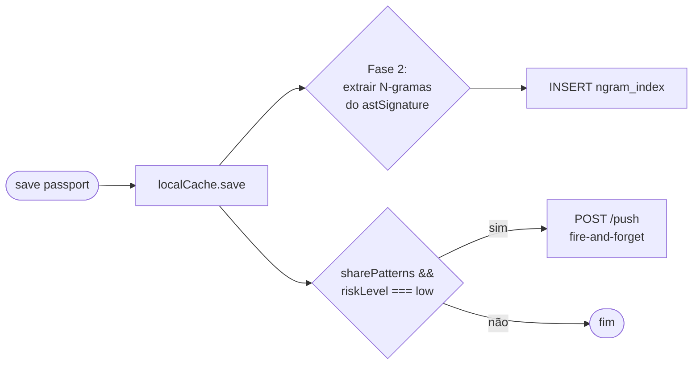
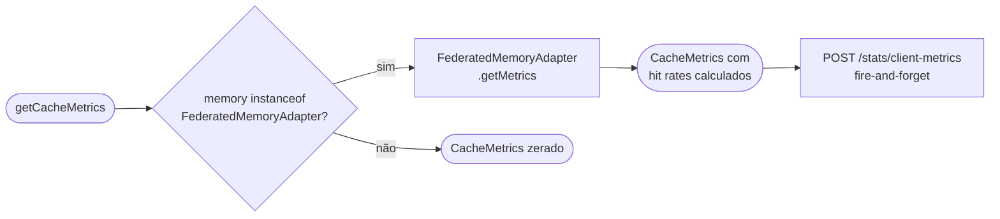

# Design Document — Engram Cache

## Visão Geral

O Engram Cache introduz um lookup determinístico O(1) por hash exato como primeiro nível de cache no sistema CodeMemória Governance. Inspirado no conceito de engrama da DeepSeek, o componente elimina o custo de full scan + computação de similaridade para código idêntico, adicionando métricas de hit rate por nível e (Fase 2) cache parcial por N-gramas de AST.

A feature é puramente aditiva: nenhuma assinatura de método existente é alterada. O `HybridMemoryAdapter` ganha `recallExact`; o `FederatedMemoryAdapter` passa a orquestrar três níveis de cache e expõe `getMetrics()`; o `GovernanceEngine` delega `getCacheMetrics()`; o servidor Python ganha dois endpoints novos.

---

## Arquitetura

### Hierarquia de Cache — Fluxo de Recall

```mermaid
flowchart TD
    A([recall chamado]) --> B{recallExact\nfingerprint_hash = ?}
    B -->|EngramHit\n≥1 passaporte| C([retorna imediatamente\nengramHits++])
    B -->|EngramMiss\narray vazio| D[engramMisses++]
    D --> E{Fase 2:\nrecallByNgrams\nminOverlap}
    E -->|NgramHit| F([retorna passaportes\nngramHits++])
    E -->|NgramMiss ou\nFase 2 desabilitada| G{localCache.recall\nsimilaridade vetorial}
    G -->|vectorHit\n≥1 passaporte| H([retorna passaportes\nvectorHits++])
    G -->|vectorMiss\narray vazio| I[vectorMisses++]
    I --> J{GET /query\nservidor federado}
    J -->|confidence ≥ 0.7| K([converte → passaportes\nfederatedHits++])
    J -->|vazio ou falha| L([retorna []\nfederatedMisses++])
```

### Fluxo de Save



### Fluxo de Métricas



---

## Componentes e Interfaces

### Novo tipo: `CacheMetrics` (em `src/governance/types.ts`)

```typescript
export interface CacheMetrics {
  engramHits: number;
  engramMisses: number;
  engramHitRate: number;    // engramHits / (engramHits + engramMisses), ou 0 se total = 0
  vectorHits: number;
  vectorMisses: number;
  vectorHitRate: number;
  federatedHits: number;
  federatedMisses: number;
  federatedHitRate: number;
}
```

### Novo tipo: `ClientMetricsPayload` (em `src/governance/types.ts`)

```typescript
export interface ClientMetricsPayload {
  engramHitRate: number;   // [0, 1]
  vectorHitRate: number;   // [0, 1]
  federatedHitRate: number; // [0, 1]
}
```

### Fase 2 — `ASTNgramExtractor` (novo arquivo `src/governance/utils/ngram.ts`)

```typescript
export interface NgramExtractorOptions {
  n?: number; // padrão: 3
}

export class ASTNgramExtractor {
  constructor(options?: NgramExtractorOptions);
  extract(astSignature: string): string[];
  // Tokeniza por espaço, retorna N-gramas consecutivos como strings "t1|t2|t3"
}
```

### Mudanças em `HybridMemoryAdapter`

| Adição | Descrição |
|--------|-----------|
| `recallExact(fingerprint)` | `SELECT * FROM governance_passports WHERE fingerprint_hash = ?` — usa índice existente |
| Schema Fase 2: tabela `ngram_index` | `ngram TEXT, passport_id TEXT, fingerprint_hash TEXT` com índice em `ngram` |
| `recallByNgrams(fingerprint, minOverlap)` | Fase 2 — busca por sobreposição de N-gramas |

Nenhum método existente é alterado.

### Mudanças em `FederatedMemoryAdapter`

| Adição | Descrição |
|--------|-----------|
| Contadores privados | `_engramHits`, `_engramMisses`, `_vectorHits`, `_vectorMisses`, `_federatedHits`, `_federatedMisses` — inicializados em 0 |
| `getMetrics(): CacheMetrics` | Calcula hit rates com proteção contra divisão por zero |
| Lógica de recall atualizada | Chama `recallExact` antes de `recall`; Fase 2 chama `recallByNgrams` entre os dois |

O método `recall()` existente mantém assinatura idêntica; a orquestração interna é expandida.

### Mudanças em `GovernanceEngine`

| Adição | Descrição |
|--------|-----------|
| `getCacheMetrics(): CacheMetrics` | Delega para `FederatedMemoryAdapter.getMetrics()` se `this.memory instanceof FederatedMemoryAdapter`; caso contrário retorna `CacheMetrics` zerado |

### Mudanças no servidor Python (`federated-server/main.py`)

| Adição | Descrição |
|--------|-----------|
| `ClientMetricsRequest` (Pydantic) | Campos: `engram_hit_rate`, `vector_hit_rate`, `federated_hit_rate` — todos `float` em `[0, 1]` |
| `POST /stats/client-metrics` | Recebe e armazena as métricas do cliente TypeScript em variável de módulo |
| `StatsResponse` expandido | Adiciona `client_engram_hit_rate`, `client_vector_hit_rate`, `client_federated_hit_rate` |
| `GET /stats` atualizado | Inclui os três campos de métricas de cliente (padrão `0.0` se nenhum POST recebido) |

---

## Modelos de Dados

### Schema SQLite — tabela existente (sem alteração)

```sql
CREATE TABLE IF NOT EXISTS governance_passports (
  id               TEXT PRIMARY KEY,
  fingerprint_hash TEXT NOT NULL,   -- SHA-256, já indexado
  risk_level       TEXT NOT NULL,
  passport_json    TEXT NOT NULL,
  created_at       TEXT NOT NULL
);
CREATE INDEX IF NOT EXISTS idx_fingerprint_hash
  ON governance_passports(fingerprint_hash);
```

### Schema SQLite — nova tabela Fase 2

```sql
CREATE TABLE IF NOT EXISTS ngram_index (
  ngram            TEXT NOT NULL,
  passport_id      TEXT NOT NULL,
  fingerprint_hash TEXT NOT NULL
);
CREATE INDEX IF NOT EXISTS idx_ngram
  ON ngram_index(ngram);
```

### Payload `POST /stats/client-metrics`

```json
{
  "engram_hit_rate": 0.85,
  "vector_hit_rate": 0.12,
  "federated_hit_rate": 0.03
}
```

### Response `GET /stats` (campos adicionados)

```json
{
  "total_patterns": 42,
  "patterns_by_rule_type": { "LGPD-art13": 10 },
  "avg_success_rate": 0.91,
  "top_sectors": [],
  "client_engram_hit_rate": 0.85,
  "client_vector_hit_rate": 0.12,
  "client_federated_hit_rate": 0.03
}
```

---

## Propriedades de Corretude

*Uma propriedade é uma característica ou comportamento que deve ser verdadeiro em todas as execuções válidas de um sistema — essencialmente, uma declaração formal sobre o que o sistema deve fazer. Propriedades servem como ponte entre especificações legíveis por humanos e garantias de corretude verificáveis por máquina.*

### Propriedade 1: Filtragem exata por hash

*Para qualquer* fingerprint consultado via `recallExact`, todos os passaportes retornados devem ter `codeFingerprint.hash` igual ao `fingerprint.hash` consultado — nenhum passaporte com hash diferente pode aparecer no resultado.

**Valida: Requisito 1.1**

### Propriedade 2: Round-trip save → recallExact

*Para qualquer* passaporte salvo via `save()`, uma chamada subsequente a `recallExact` com o mesmo `fingerprint_hash` deve incluir aquele passaporte no resultado retornado.

**Valida: Requisitos 1.2, 4.5**

### Propriedade 3: Curto-circuito no EngramHit

*Para qualquer* fingerprint cujo hash existe na base local, o `FederatedMemoryAdapter` deve retornar os passaportes sem realizar nenhuma chamada HTTP ao servidor federado.

**Valida: Requisito 1.5**

### Propriedade 4: Consistência dos contadores de métricas

*Para qualquer* sequência de N chamadas a `recall()` no `FederatedMemoryAdapter`, a soma `engramHits + engramMisses` deve ser igual a N; analogamente `vectorHits + vectorMisses` deve ser igual ao número de chamadas que chegaram ao nível vetorial, e `federatedHits + federatedMisses` ao número de chamadas que chegaram ao nível federado.

**Valida: Requisitos 2.2, 2.3, 2.4, 2.5, 2.6, 2.7**

### Propriedade 5: Round-trip POST → GET /stats para métricas de cliente

*Para qualquer* `CacheMetrics` válido enviado via `POST /stats/client-metrics`, uma chamada subsequente a `GET /stats` deve retornar os mesmos valores de `client_engram_hit_rate`, `client_vector_hit_rate` e `client_federated_hit_rate`.

**Valida: Requisito 3.4**

### Propriedade 6: Rejeição de payload inválido em /stats/client-metrics

*Para qualquer* payload onde algum campo de hit rate seja um número fora do intervalo `[0, 1]` ou não seja numérico, `POST /stats/client-metrics` deve retornar HTTP 422.

**Valida: Requisito 3.6**

### Propriedade 7: Contagem correta de N-gramas

*Para qualquer* `astSignature` com K tokens (separados por espaço) e extrator configurado com N, o número de N-gramas retornados deve ser `max(0, K - N + 1)`.

**Valida: Requisito 5.1**

### Propriedade 8: Round-trip de extração de N-gramas

*Para qualquer* sequência de tokens T₁, T₂, ..., Tₖ, os N-gramas extraídos devem cobrir todos os tokens na ordem original — ou seja, o primeiro token de cada N-grama consecutivo deve avançar exatamente uma posição na sequência original.

**Valida: Requisito 5.7**

### Propriedade 9: Filtragem por sobreposição mínima em recallByNgrams

*Para qualquer* resultado retornado por `recallByNgrams(fingerprint, minOverlap)`, a contagem de N-gramas em comum entre o fingerprint consultado e o passaporte retornado deve ser maior ou igual a `minOverlap`.

**Valida: Requisito 5.5**

---

## Tratamento de Erros

| Cenário | Comportamento |
|---------|---------------|
| `recallExact` com hash inexistente | Retorna `[]` sem exceção |
| `recallByNgrams` com `astSignature` com menos tokens que N | Retorna `[]` sem exceção |
| Servidor federado timeout ou HTTP ≥ 500 | `federatedMisses++`, retorna `[]`, log de warn (comportamento existente preservado) |
| `getMetrics()` com `hits + misses = 0` em qualquer nível | `hitRate = 0` sem divisão por zero |
| `POST /stats/client-metrics` com hit rate fora de `[0, 1]` | HTTP 422 com mensagem descritiva (Pydantic `field_validator`) |
| `GovernanceEngine` com `HybridMemoryAdapter` direto chamando `getCacheMetrics()` | Retorna `CacheMetrics` zerado sem exceção |
| `save()` com passaporte duplicado | `DuplicatePassportError` (comportamento existente preservado) |

---

## Estratégia de Testes

### Abordagem Dual

Os testes combinam **testes unitários** (exemplos específicos, edge cases, integrações) e **testes baseados em propriedades** (cobertura universal via geração aleatória). Ambos são complementares e necessários.

**Testes unitários** focam em:
- Exemplos concretos de EngramHit e EngramMiss
- Verificação de que `recall()` existente não regride
- Inicialização de contadores em zero
- Estrutura de `CacheMetrics` (todos os campos presentes e numéricos)
- Edge cases: hash inexistente, `astSignature` vazia, divisão por zero em hit rate

**Testes baseados em propriedades** focam em:
- Propriedades universais que devem valer para qualquer entrada gerada
- Mínimo de 100 iterações por propriedade

### Biblioteca de Property-Based Testing

**TypeScript**: [`fast-check`](https://github.com/dubzzz/fast-check) — já compatível com Vitest.

**Python**: [`hypothesis`](https://hypothesis.readthedocs.io/) — já compatível com pytest.

### Mapeamento Propriedade → Teste

Cada propriedade de corretude deve ser implementada por **um único** teste de propriedade com a tag:

```
// Feature: engram-cache, Property N: <texto da propriedade>
```

| Propriedade | Arquivo de teste | Biblioteca |
|-------------|-----------------|------------|
| P1: Filtragem exata por hash | `tests/governance/HybridMemoryAdapter.test.ts` | fast-check |
| P2: Round-trip save → recallExact | `tests/governance/HybridMemoryAdapter.test.ts` | fast-check |
| P3: Curto-circuito no EngramHit | `tests/governance/FederatedMemoryAdapter.test.ts` | fast-check |
| P4: Consistência dos contadores | `tests/governance/FederatedMemoryAdapter.test.ts` | fast-check |
| P5: Round-trip POST → GET /stats | `federated-server/tests/test_stats.py` | hypothesis |
| P6: Rejeição de payload inválido | `federated-server/tests/test_stats.py` | hypothesis |
| P7: Contagem de N-gramas | `tests/governance/ngram.test.ts` | fast-check |
| P8: Round-trip de N-gramas | `tests/governance/ngram.test.ts` | fast-check |
| P9: Filtragem por sobreposição | `tests/governance/HybridMemoryAdapter.test.ts` | fast-check |

### Configuração de Propriedades (fast-check)

```typescript
import fc from 'fast-check';

// Feature: engram-cache, Property 2: Round-trip save → recallExact
it('P2: passaporte salvo é encontrado por recallExact', async () => {
  await fc.assert(
    fc.asyncProperty(arbitraryPassport(), async (passport) => {
      await adapter.save(passport);
      const results = await adapter.recallExact(passport.codeFingerprint);
      return results.some(p => p.passportId === passport.passportId);
    }),
    { numRuns: 100 }
  );
});
```

### Configuração de Propriedades (hypothesis)

```python
from hypothesis import given, settings
from hypothesis import strategies as st

# Feature: engram-cache, Property 5: Round-trip POST → GET /stats
@given(
    engram=st.floats(min_value=0.0, max_value=1.0),
    vector=st.floats(min_value=0.0, max_value=1.0),
    federated=st.floats(min_value=0.0, max_value=1.0),
)
@settings(max_examples=100)
def test_p5_stats_round_trip(engram, vector, federated):
    client.post("/stats/client-metrics", json={
        "engram_hit_rate": engram,
        "vector_hit_rate": vector,
        "federated_hit_rate": federated,
    })
    resp = client.get("/stats")
    assert resp.json()["client_engram_hit_rate"] == pytest.approx(engram)
```
