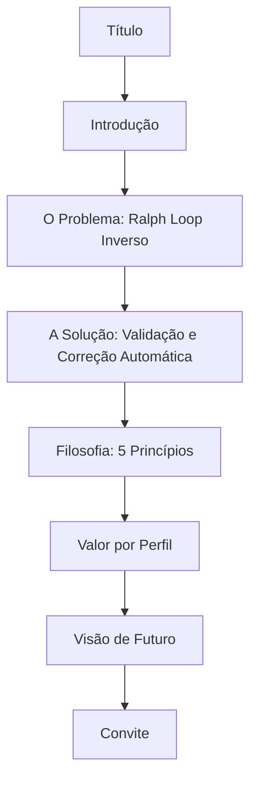

# Design Document — MANIFESTO.md

## Overview

O `MANIFESTO.md` é o documento fundacional do EscapeKit. Seu objetivo é comunicar, de forma clara e inspiradora, o problema que o projeto resolve, como ele resolve, a filosofia por trás das decisões e o convite à comunidade — tudo em português brasileiro.

Este design descreve a estrutura, o conteúdo, as decisões editoriais e as propriedades de corretude do manifesto. O artefato final é um arquivo Markdown estático na raiz do repositório.

**Decisão de design central**: o manifesto não é documentação técnica nem marketing. É um texto fundacional que deve ser honesto, concreto e inspirador ao mesmo tempo. Cada afirmação filosófica tem correspondência com uma funcionalidade real do EscapeKit.

---

## Architecture

O manifesto é um documento Markdown estático. Não há componentes de software envolvidos na sua criação — a "arquitetura" aqui é editorial: a estrutura de seções, a hierarquia de headings e o fluxo narrativo.



O fluxo narrativo segue a estrutura clássica de manifesto: **problema → solução → filosofia → valor → visão → ação**. Cada seção prepara o leitor para a próxima.

---

## Components and Interfaces

### Seções do Manifesto

| Seção | Heading | Propósito |
|---|---|---|
| Título | `#` | Identidade do projeto |
| Introdução | `##` | Contexto e razão de existir |
| O Problema | `##` | Ralph Loop Inverso e suas manifestações |
| A Solução | `##` | Como o EscapeKit resolve o problema |
| Filosofia | `##` | Cinco princípios com sub-headings `###` |
| Valor por Perfil | `##` | Benefícios concretos por audiência |
| Visão de Futuro | `##` | Direção estratégica sem promessas |
| Convite | `##` | Call to action inclusivo |

### Restrições de Formato

- Headings de seção principal: `##`
- Sub-seções da Filosofia: `###` numerados (1–5)
- Listas de problemas: bullet points com **negrito** no termo técnico
- Comprimento alvo: 600–1200 palavras (excluindo formatação Markdown)
- Idioma: português brasileiro

### Termos Técnicos com Definição Obrigatória

Os seguintes termos devem ser explicados na primeira ocorrência:

- **Ralph Loop Inverso** — ciclo de dependência do ambiente de geração
- **Ghost dependency** — import de pacote inexistente no npm
- **Mock API** — chamada a serviço que só existe no sandbox
- **Fixer** — módulo especializado de correção
- **Guardrail** — restrição que delimita o espaço de código válido

---

## Data Models

O manifesto não possui modelos de dados no sentido de software. O "modelo de dados" aqui é o esquema editorial do documento:

```
ManifestoDocument {
  titulo: string                    // "Manifesto EscapeKit"
  secoes: Secao[]                   // 7 seções principais (##)
  contagem_palavras: number         // 600 ≤ n ≤ 1200
  idioma: "pt-BR"
  superlativos_proibidos: string[]  // ["melhor", "revolucionário", "único", ...]
}

Secao {
  heading: string    // texto do heading ##
  conteudo: string   // corpo da seção
  nivel: 2 | 3       // ## ou ###
}

FilosofiaSecao extends Secao {
  principios: Principio[]  // exatamente 5
}

Principio {
  numero: 1 | 2 | 3 | 4 | 5
  titulo: string
  descricao: string
  funcionalidade_correspondente: string  // referência à feature real do EscapeKit
}

ValorPorPerfil {
  perfis: ["desenvolvedor solo", "times de desenvolvimento", "empresas", "não-técnicos"]
  beneficio_por_perfil: Record<string, string>  // pelo menos 1 benefício concreto cada
}
```

---

## Correctness Properties

*A property is a characteristic or behavior that should hold true across all valid executions of a system — essentially, a formal statement about what the system should do. Properties serve as the bridge between human-readable specifications and machine-verifiable correctness guarantees.*

Como o manifesto é um documento estático, as propriedades de corretude são verificadas sobre o conteúdo do arquivo `MANIFESTO.md`. A maioria dos critérios de aceitação é verificável como exemplos concretos (o documento existe e contém determinado conteúdo), não como propriedades universais sobre coleções de valores.

Após o prework e a reflexão sobre redundância, os critérios foram consolidados nas seguintes propriedades:

---

### Property 1: Estrutura de seções completa e ordenada

*Para o documento* `MANIFESTO.md`, ele deve conter todas as oito seções obrigatórias (Título, Introdução, O Problema, A Solução, Filosofia, Valor por Perfil, Visão de Futuro, Convite) na ordem especificada, cada seção principal marcada com heading `##`.

**Validates: Requirements 1.1, 1.2**

---

### Property 2: Comprimento dentro dos limites

*Para o documento* `MANIFESTO.md`, a contagem de palavras do conteúdo textual (excluindo sintaxe Markdown como `#`, `**`, `-`, backticks) deve estar entre 600 e 1200 palavras.

**Validates: Requirements 1.3**

---

### Property 3: Cobertura completa do problema

*Para o documento* `MANIFESTO.md`, a seção "O Problema" deve conter: o termo "Ralph Loop Inverso" com sua definição, pelo menos quatro categorias de problemas (ghost dependencies, mock APIs, polyfills ausentes, configurações obsoletas), e menção explícita ao risco de typosquatting ou supply-chain attack.

**Validates: Requirements 2.1, 2.2, 2.3**

---

### Property 4: Solução descrita com todos os elementos

*Para o documento* `MANIFESTO.md`, a seção "A Solução" deve descrever o EscapeKit como camada de validação e correção automática, mencionar o modelo de roteamento de erros com Fixers especializados, descrever TypeScript/lint/package.json como guardrails, e posicionar o EscapeKit como camada de governança e rastreabilidade.

**Validates: Requirements 3.1, 3.2, 3.3, 3.4**

---

### Property 5: Cinco princípios filosóficos presentes

*Para o documento* `MANIFESTO.md`, a seção "Filosofia" deve conter exatamente cinco princípios numerados: (1) Erro como motor de melhoria, (2) Governança e rastreabilidade, (3) Roteamento e emergência, (4) Linguagem como guardrail, (5) Adaptação ao novo paradigma.

**Validates: Requirements 4.1, 4.2, 4.3, 4.4, 4.5**

---

### Property 6: Todos os perfis de usuário endereçados

*Para o documento* `MANIFESTO.md`, a seção de valor deve endereçar explicitamente os quatro perfis: desenvolvedor solo (com benefício concreto), times de desenvolvimento (com benefício concreto), empresas (com benefício de governança/compliance), e não-técnicos/gestores (com benefício de redução de risco ou previsibilidade).

**Validates: Requirements 5.1, 5.2, 5.3, 5.4**

---

### Property 7: Visão de futuro sem promessas específicas

*Para o documento* `MANIFESTO.md`, a seção "Visão de Futuro" deve mencionar código gerado por IA como portável e auditável, citar Google AI Studio e Antigravity como direção estratégica, e não conter datas de entrega nem promessas de features específicas.

**Validates: Requirements 6.1, 6.2, 6.3**

---

### Property 8: Convite com call to action e frase de encerramento

*Para o documento* `MANIFESTO.md`, a seção "Convite" deve conter os três verbos de ação (usar, contribuir, compartilhar) e o documento deve encerrar com uma frase de impacto que sintetize a missão.

**Validates: Requirements 7.1, 7.3**

---

### Property 9: Qualidade de linguagem verificável

*Para o documento* `MANIFESTO.md`, o texto deve estar em português brasileiro e não deve conter os superlativos proibidos sem evidência: "melhor", "revolucionário", "único", "incrível", "perfeito" (quando usados como adjetivos absolutos sem contexto comparativo).

**Validates: Requirements 8.1, 8.2**

---

## Error Handling

Como o manifesto é um documento estático, "erros" são desvios dos critérios de aceitação. Os cenários de falha e suas mitigações:

| Cenário | Mitigação |
|---|---|
| Seção ausente ou fora de ordem | Revisão manual contra o checklist de seções |
| Contagem de palavras fora do intervalo | Expansão ou condensação do conteúdo |
| Termo técnico sem definição | Adicionar explicação na primeira ocorrência |
| Superlativo proibido presente | Substituir por linguagem concreta com evidência |
| Promessa de feature ou data | Reformular como direção estratégica |
| Afirmação filosófica sem correspondência funcional | Remover ou reformular com base em feature existente |

---

## Testing Strategy

### Abordagem Dual

O manifesto é um documento estático, mas suas propriedades de corretude são verificáveis automaticamente. A estratégia combina:

- **Testes de exemplo**: verificam a presença de conteúdo específico no documento
- **Testes de propriedade**: verificam invariantes estruturais que devem valer para qualquer versão do documento

### Testes de Exemplo (Unit Tests)

Verificam casos concretos e condições de borda:

1. O arquivo `MANIFESTO.md` existe na raiz do projeto
2. Cada seção obrigatória está presente com o heading correto
3. Os termos técnicos obrigatórios estão presentes (Ralph Loop Inverso, ghost dependency, Fixer, guardrail)
4. Os quatro perfis de usuário estão explicitamente nomeados
5. Google AI Studio e Antigravity são mencionados na seção de visão
6. Os verbos "use", "contribua" e "compartilhe" (ou equivalentes) estão na seção de convite

### Testes de Propriedade (Property-Based Tests)

Biblioteca recomendada: **fast-check** (TypeScript/JavaScript) ou **hypothesis** (Python), dependendo do toolchain do projeto.

Cada teste deve rodar mínimo 100 iterações (onde aplicável — para o manifesto estático, os testes de propriedade verificam invariantes sobre o conteúdo parseado).

**Configuração de tags**:
```
// Feature: escapekit-manifesto, Property {N}: {texto da propriedade}
```

| Propriedade | Teste | Tag |
|---|---|---|
| Property 2 | Contagem de palavras ∈ [600, 1200] | `Feature: escapekit-manifesto, Property 2: word count bounds` |
| Property 3 | Presença de todos os elementos do problema | `Feature: escapekit-manifesto, Property 3: problem coverage` |
| Property 5 | Exatamente 5 princípios numerados | `Feature: escapekit-manifesto, Property 5: five principles` |
| Property 6 | Todos os 4 perfis presentes | `Feature: escapekit-manifesto, Property 6: all profiles` |
| Property 9 | Ausência de superlativos proibidos | `Feature: escapekit-manifesto, Property 9: no forbidden superlatives` |

### Exemplo de Teste (TypeScript)

```typescript
import * as fc from 'fast-check';
import * as fs from 'fs';

const manifesto = fs.readFileSync('MANIFESTO.md', 'utf-8');

// Feature: escapekit-manifesto, Property 2: word count bounds
test('Property 2: comprimento dentro dos limites', () => {
  const stripped = manifesto.replace(/^#+\s/gm, '').replace(/\*\*/g, '').replace(/^-\s/gm, '');
  const wordCount = stripped.trim().split(/\s+/).length;
  expect(wordCount).toBeGreaterThanOrEqual(600);
  expect(wordCount).toBeLessThanOrEqual(1200);
});

// Feature: escapekit-manifesto, Property 9: no forbidden superlatives
test('Property 9: ausência de superlativos proibidos', () => {
  const forbidden = ['revolucionário', 'único', 'incrível'];
  forbidden.forEach(term => {
    expect(manifesto.toLowerCase()).not.toContain(term);
  });
});
```

### Revisão Manual

Além dos testes automatizados, uma revisão editorial deve verificar:
- Tom visionário mas concreto (cada afirmação filosófica tem correspondência funcional)
- Linguagem acessível para não-técnicos nos termos técnicos
- Ausência de barreiras de entrada no convite
