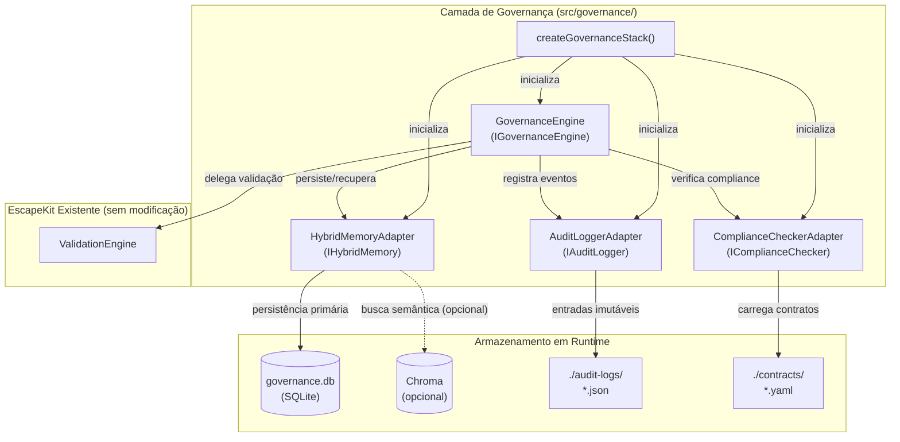
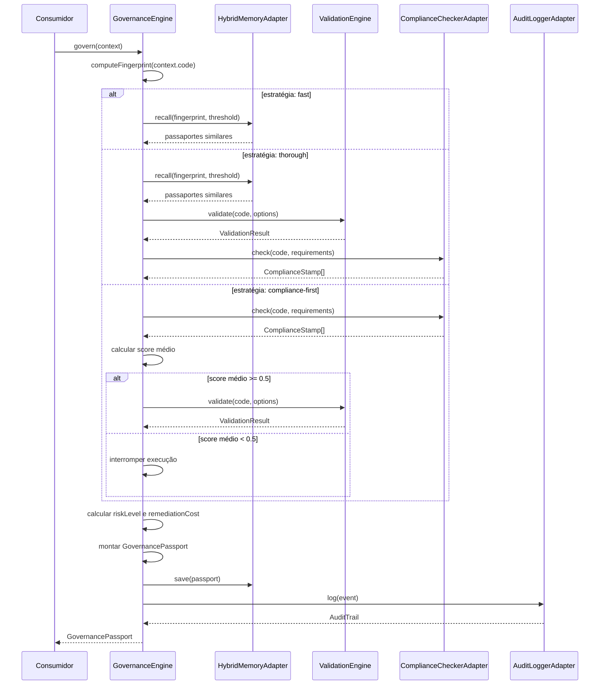

# Design: CodeMemória Governance Pivot

## Visão Geral

O EscapeKit já possui um `ValidationEngine` funcional e um pipeline `qwen-escapekit` que transforma papers acadêmicos em contratos YAML. Esta feature adiciona a camada **CodeMemória Governance** — um pivot estratégico que reposiciona o EscapeKit como plataforma de governança de código gerado por IA.

A camada é adicionada **sem modificar nenhum arquivo existente**. Ela compõe (encapsula) os componentes atuais e estende suas funcionalidades a partir de `src/governance/`. O princípio central é composição, não herança ou modificação.

### Decisões de Design Fundamentais

**SQLite como backend primário**: `better-sqlite3` oferece persistência zero-config, sem servidor externo, com performance adequada para o volume esperado. É uma dependência leve e confiável para armazenamento estruturado de passaportes.

**Chroma como opcional**: A busca vetorial semântica agrega valor mas não é crítica para o funcionamento básico. Torná-la opcional garante que o sistema funcione em qualquer ambiente sem dependências externas obrigatórias.

**Cadeia de hashes SHA-256**: Garante imutabilidade auditável sem necessidade de banco de dados especializado. Cada entrada referencia a anterior, tornando adulterações detectáveis por recálculo.

**Injeção de dependência no GovernanceEngine**: Permite testabilidade isolada com mocks, sem acoplamento a implementações concretas.

**Factory `createGovernanceStack()`**: Simplifica a integração para o consumidor, escondendo a complexidade de inicialização e ordem de dependências.

---

## Arquitetura

### Diagrama de Componentes



### Fluxo de Execução do `govern()`



---

## Componentes e Interfaces

### Interfaces Públicas

```typescript
// src/governance/interfaces.ts

export interface IGovernanceEngine {
  govern(context: GovernanceContext): Promise<GovernancePassport>;
  recallSimilar(fingerprint: CodeFingerprint): Promise<GovernancePassport[]>;
}

export interface IHybridMemory {
  save(passport: GovernancePassport): Promise<void>;
  recall(fingerprint: CodeFingerprint, threshold: number): Promise<GovernancePassport[]>;
  getSuccessRate(fingerprint: CodeFingerprint): Promise<number>;
}

export interface IComplianceChecker {
  check(code: string, requirements: string[]): Promise<ComplianceStamp[]>;
  loadContract(contractPath: string): Promise<void>;
}

export interface IAuditLogger {
  log(event: AuditEvent): Promise<AuditTrail>;
  getChain(passportId: string): Promise<AuditTrail[]>;
  verifyIntegrity(passportId: string): Promise<boolean>;
}
```

### GovernanceEngine

**Responsabilidade**: Orquestrador principal. Coordena os três adaptadores e o `ValidationEngine` existente para produzir um `GovernancePassport` completo.

**Justificativa técnica**: Recebe as dependências via construtor (injeção de dependência), permitindo substituição por mocks em testes. Não estende nem modifica o `ValidationEngine` — apenas o instancia e chama `validate()`.

**Cálculo de riskLevel**:
- `critical`: ValidationResult contém pelo menos um issue com `severity: "error"`
- `high`: ValidationResult contém issues com `severity: "warning"` e score de compliance < 0.7
- `medium`: ValidationResult contém issues com `severity: "warning"`
- `low`: ValidationResult sem erros e sem warnings

**Cálculo de estimatedRemediationCost**: `Math.round(issues.length * 0.5 * 10) / 10` horas

### HybridMemoryAdapter

**Responsabilidade**: Persistência e recuperação de passaportes com busca por similaridade de fingerprint.

**Justificativa técnica**: SQLite via `better-sqlite3` é síncrono e embutido — zero configuração de servidor. Chroma é opcional porque requer um servidor externo e Python, o que aumenta a complexidade de deploy. A similaridade de fingerprint é calculada como média ponderada de três métricas com peso 1/3 cada:

```
similaridade = (1/3 * hashMatch) + (1/3 * jaccardDeps) + (1/3 * complexityScore)

onde:
  hashMatch = 1.0 se hash igual, 0.0 caso contrário
  jaccardDeps = |A ∩ B| / |A ∪ B| (coeficiente de Jaccard das dependências)
  complexityScore = 1 - (|complexA - complexB| / max(complexA, complexB, 1))
```

### ComplianceCheckerAdapter

**Responsabilidade**: Carregar contratos YAML do `qwen-escapekit` e verificar conformidade do código.

**Justificativa técnica**: Usa o mesmo formato YAML já estabelecido pelo `qwen-escapekit` (seções `source`, `facts`, `patterns`, `rules`, `cases`). A verificação de compliance mapeia os `requirements` fornecidos para `rules` dos contratos carregados, avaliando cada cláusula como satisfeita ou não.

**Lógica de score**: Para cada contrato avaliado, `score = cláusulas_satisfeitas / total_cláusulas`. Uma cláusula é satisfeita quando o código atende ao `principle` da regra correspondente (verificação por análise estática simples ou pattern matching).

### AuditLoggerAdapter

**Responsabilidade**: Manter uma cadeia de hashes imutável para rastreabilidade de todas as ações de governança.

**Justificativa técnica**: Arquivos JSON individuais por entrada permitem auditoria sem banco de dados. A cadeia de hashes garante que qualquer adulteração é detectável por recálculo. O formato de nome `{timestamp_iso8601}_{chainHash[:8]}.json` garante ordenação lexicográfica natural.

**Fórmula do chainHash**:
```
chainHash = SHA-256(parentHash + "|" + timestamp.toISOString() + "|" + action + "|" + actor + "|" + inputHash + "|" + resultHash)
```

---

## Modelos de Dados

### Entidades TypeScript

```typescript
// src/governance/types.ts

export type RiskLevel = 'low' | 'medium' | 'high' | 'critical';
export type GovernanceStrategy = 'fast' | 'thorough' | 'compliance-first';

export interface CodeFingerprint {
  hash: string;           // SHA-256 do código-fonte
  astSignature: string;   // string derivada da estrutura AST
  dependencies: string[]; // lista de dependências detectadas
  complexity: number;     // complexidade ciclomática (inteiro >= 0)
}

export interface ComplianceStamp {
  regulationId: string;   // identificador do contrato/regulação
  clauses: string[];      // cláusulas verificadas
  score: number;          // proporção de cláusulas satisfeitas [0, 1]
  verifiedAt: Date;
  verifiedBy: string;     // identificador do componente verificador
}

export interface AuditTrail {
  chainHash: string;      // SHA-256 desta entrada
  parentHash: string | null; // null para a primeira entrada
  timestamp: Date;
  action: string;
  actor: string;
  inputHash: string;      // SHA-256 do input da ação
  resultHash: string;     // SHA-256 do resultado da ação
}

export interface AuditEvent {
  passportId: string;
  action: string;
  actor: string;
  inputHash: string;
  resultHash: string;
}

export interface GovernancePassport {
  passportId: string;                    // UUID v4
  codeFingerprint: CodeFingerprint;
  validations: ValidationResult[];       // resultados do ValidationEngine
  complianceStamps: ComplianceStamp[];
  auditTrail: AuditTrail[];
  memoryEnriched: boolean;               // true se recall() retornou passaportes similares
  riskLevel: RiskLevel;
  estimatedRemediationCost: number;      // horas (>= 0)
}

export interface GovernanceContext {
  code: string;
  origin: 'copilot' | 'claude' | 'bolt' | 'cursor' | 'unknown';
  projectId: string;
  requirements: string[];                // IDs de contratos/regulações a verificar
  strategy?: GovernanceStrategy;         // padrão: 'thorough'
  actor: string;
}

export interface GovernanceStackOptions {
  sqlitePath?: string;      // padrão: './governance.db'
  contractsDir?: string;    // padrão: './contracts'
  auditLogsDir?: string;    // padrão: './audit-logs'
  enableChroma?: boolean;   // padrão: false
}
```

### Esquema da Tabela SQLite

```sql
-- Criada automaticamente pelo HybridMemoryAdapter na primeira inicialização
CREATE TABLE IF NOT EXISTS governance_passports (
  id          TEXT PRIMARY KEY,           -- passportId (UUID v4)
  fingerprint_hash TEXT NOT NULL,         -- CodeFingerprint.hash (índice para recall)
  risk_level  TEXT NOT NULL,              -- RiskLevel
  passport_json TEXT NOT NULL,            -- GovernancePassport serializado em JSON
  created_at  TEXT NOT NULL               -- ISO 8601
);

CREATE INDEX IF NOT EXISTS idx_fingerprint_hash
  ON governance_passports(fingerprint_hash);
```

### Formato dos Arquivos JSON de Auditoria

Cada entrada é um arquivo individual em `./audit-logs/`:

```
Nome: {timestamp_iso8601_sanitizado}_{chainHash[:8]}.json
Exemplo: 2025-01-15T14-30-00-000Z_a3f7b2c1.json
```

```json
{
  "chainHash": "a3f7b2c1d4e5f6a7b8c9d0e1f2a3b4c5d6e7f8a9b0c1d2e3f4a5b6c7d8e9f0a1",
  "parentHash": "b4c5d6e7f8a9b0c1d2e3f4a5b6c7d8e9f0a1b2c3d4e5f6a7b8c9d0e1f2a3b4c5",
  "timestamp": "2025-01-15T14:30:00.000Z",
  "action": "govern",
  "actor": "ci-pipeline",
  "inputHash": "c5d6e7f8a9b0c1d2e3f4a5b6c7d8e9f0a1b2c3d4e5f6a7b8c9d0e1f2a3b4c5d6",
  "resultHash": "d6e7f8a9b0c1d2e3f4a5b6c7d8e9f0a1b2c3d4e5f6a7b8c9d0e1f2a3b4c5d6e7",
  "passportId": "550e8400-e29b-41d4-a716-446655440000"
}
```

### Formato dos Contratos YAML Esperados

O `ComplianceCheckerAdapter` usa o mesmo formato gerado pelo `qwen-escapekit`. As seções relevantes para verificação de compliance são `source`, `rules` e `metadata`:

```yaml
source:
  title: "Título do Paper"
  authors: "Autores"
  year: 2024
  doi: "10.xxxx/xxxxx"

facts:
  - id: "F001"
    statement: "Afirmação verificável do paper"
    type: "fact"          # fact | claim | observation
    relevance: "security" # security | portability | performance | compatibility

patterns:
  - id: "P001"
    description: "Padrão observado"
    evidence: ["F001"]
    confidence: "high"    # high | medium | low

rules:
  - id: "R001"
    principle: "Princípio de implementação verificável"
    derived_from: ["P001"]
    action: "implement_detector"  # implement_detector | add_test | create_polyfill
    detector_name: "NomeDoDetector"
    priority: "high"      # high | medium | low

cases:
  - id: "C001"
    description: "Caso concreto"
    attack_vector: "prompt_injection"
    mitigation: "Mitigação proposta"
    related_facts: ["F001"]
    related_rules: ["R001"]

metadata:
  version: "1.0"
  status: "reviewed"      # draft | reviewed | approved
  tags: ["security", "ai-safety"]
```

O `ComplianceCheckerAdapter` mapeia `requirements` (IDs de contratos) para os arquivos YAML carregados, avalia cada `rule` do contrato contra o código fornecido, e gera um `ComplianceStamp` com `regulationId = source.title`, `clauses = rules[].principle` e `score = satisfeitas / total`.

---

## Estrutura de Arquivos

```
src/governance/
├── index.ts                    # Exportações públicas + createGovernanceStack()
├── types.ts                    # Entidades: CodeFingerprint, ComplianceStamp, etc.
├── interfaces.ts               # Interfaces: IGovernanceEngine, IHybridMemory, etc.
├── GovernanceEngine.ts         # Orquestrador principal
├── adapters/
│   ├── HybridMemoryAdapter.ts  # SQLite + Chroma opcional
│   ├── ComplianceCheckerAdapter.ts  # Contratos YAML
│   └── AuditLoggerAdapter.ts   # Cadeia de hashes
└── utils/
    ├── fingerprint.ts          # computeFingerprint(), similaridade
    └── hash.ts                 # sha256(), chainHash()

tests/governance/
├── GovernanceEngine.test.ts    # Testes unitários + propriedades
├── HybridMemoryAdapter.test.ts # Testes unitários + propriedades
├── ComplianceCheckerAdapter.test.ts
├── AuditLoggerAdapter.test.ts
└── integration.test.ts         # Teste de integração com createGovernanceStack()
```

### Dependências Necessárias

| Dependência | Uso | Verificar existência |
|---|---|---|
| `better-sqlite3` | Backend SQLite do HybridMemoryAdapter | `ls node_modules/better-sqlite3` |
| `@types/better-sqlite3` | Tipos TypeScript | `ls node_modules/@types/better-sqlite3` |
| `chromadb` | Busca vetorial (opcional) | `ls node_modules/chromadb` |
| `uuid` | Geração de UUID v4 para passportId | `ls node_modules/uuid` |
| `@types/uuid` | Tipos TypeScript | `ls node_modules/@types/uuid` |
| `js-yaml` | Parser YAML para contratos | `ls node_modules/js-yaml` (já existe via qwen-escapekit) |
| `yaml` | Parser YAML alternativo | já em `package.json` como dependência de dev |
| `fast-check` | Property-based testing | já em `package.json` como dependência de dev |
| `vitest` | Framework de testes | já em `package.json` como dependência de dev |

**Dependências a adicionar** (não presentes no `package.json` atual):
```bash
npm install better-sqlite3 uuid
npm install --save-dev @types/better-sqlite3 @types/uuid
# chromadb apenas se enableChroma for usado:
npm install chromadb
```

O módulo `crypto` (para SHA-256) é nativo do Node.js >= 18 e não requer instalação.

---

## Propriedades de Corretude

*Uma propriedade é uma característica ou comportamento que deve ser verdadeiro em todas as execuções válidas de um sistema — essencialmente, uma afirmação formal sobre o que o sistema deve fazer. Propriedades servem como ponte entre especificações legíveis por humanos e garantias de corretude verificáveis por máquina.*

### Propriedade 1: Estrutura completa das entidades

*Para qualquer* `GovernancePassport` gerado pelo `GovernanceEngine`, o passaporte deve conter todos os campos obrigatórios com os tipos corretos: `passportId` (string UUID), `codeFingerprint` (com `hash`, `astSignature`, `dependencies`, `complexity >= 0`), `complianceStamps` (array com `score` em [0,1]), `auditTrail` (array), `memoryEnriched` (boolean), `riskLevel` (um de `low|medium|high|critical`) e `estimatedRemediationCost` (número >= 0).

**Valida: Requisitos 1.1, 1.2, 1.3, 1.4**

### Propriedade 2: Rejeição de campos inválidos

*Para qualquer* `ComplianceStamp` com `score < 0` ou `score > 1`, e *para qualquer* `CodeFingerprint` com `complexity < 0`, o `GovernanceEngine` deve rejeitar a entidade com um erro de validação descritivo.

**Valida: Requisitos 1.5, 1.6**

### Propriedade 3: Unicidade de passportId

*Para qualquer* sequência de N chamadas a `govern()` na mesma instância do `GovernanceEngine`, todos os `passportId`s gerados devem ser distintos entre si.

**Valida: Requisito 1.7**

### Propriedade 4: Mapeamento de riskLevel baseado em severidade

*Para qualquer* resultado do `ValidationEngine`, se o resultado contém pelo menos um issue com `severity: "error"`, o `GovernancePassport` resultante deve ter `riskLevel: "critical"`; se contém apenas issues com `severity: "warning"` e nenhum erro, deve ter `riskLevel: "low"`.

**Valida: Requisitos 2.6, 2.7**

### Propriedade 5: govern() sempre registra no AuditLogger

*Para qualquer* `GovernanceContext` válido, após a execução de `govern()` (com sucesso ou falha controlada), o `AuditLogger` deve ter recebido exatamente uma chamada de `log()` com o `passportId` correspondente.

**Valida: Requisito 2.8**

### Propriedade 6: compliance-first interrompe com score médio baixo

*Para qualquer* conjunto de `ComplianceStamp`s cujo score médio seja estritamente menor que 0.5, a estratégia `compliance-first` deve interromper a execução antes de chamar o `ValidationEngine`.

**Valida: Requisito 2.4**

### Propriedade 7: Fórmula de estimatedRemediationCost

*Para qualquer* lista de issues retornada pelo `ValidationEngine` com comprimento N, o `estimatedRemediationCost` do passaporte resultante deve ser igual a `Math.round(N * 0.5 * 10) / 10`.

**Valida: Requisito 2.10**

### Propriedade 8: recall() respeita threshold de similaridade

*Para qualquer* conjunto de passaportes salvos e *para qualquer* threshold T em [0, 1], `recall(fingerprint, T)` deve retornar apenas passaportes cuja similaridade de fingerprint com o fingerprint consultado seja maior ou igual a T.

**Valida: Requisito 3.5**

### Propriedade 9: Similaridade de fingerprint está em [0, 1]

*Para qualquer* par de `CodeFingerprint`s, a função de similaridade deve retornar um valor no intervalo [0, 1] inclusive.

**Valida: Requisito 3.6**

### Propriedade 10: getSuccessRate() retorna proporção correta em [0, 1]

*Para qualquer* conjunto arbitrário de passaportes com o mesmo `fingerprint.hash`, `getSuccessRate()` deve retornar a proporção de passaportes com `riskLevel: "low"` sobre o total, e o resultado deve estar sempre em [0, 1] inclusive.

**Valida: Requisitos 3.7, 8.9**

### Propriedade 11: Round-trip JSON do GovernancePassport

*Para qualquer* `GovernancePassport` gerado pelo `GovernanceEngine`, serializar o passaporte em JSON e desserializar deve produzir um objeto equivalente (todos os campos com os mesmos valores, incluindo arrays e datas).

**Valida: Requisitos 3.10, 8.4**

### Propriedade 12: check() produz ComplianceStamp por contrato avaliado

*Para qualquer* conjunto de contratos carregados e *para qualquer* código e lista de requirements, `check()` deve produzir exatamente um `ComplianceStamp` por contrato cujo `regulationId` corresponda a um dos requirements fornecidos.

**Valida: Requisito 4.4**

### Propriedade 13: Score de ComplianceStamp é proporção de cláusulas satisfeitas

*Para qualquer* contrato com N cláusulas (rules), onde K cláusulas são satisfeitas pelo código avaliado, o `score` do `ComplianceStamp` resultante deve ser igual a `K / N`.

**Valida: Requisito 4.7**

### Propriedade 14: Round-trip do parser YAML de contratos

*Para qualquer* contrato YAML válido, parsear o YAML, serializar de volta para YAML e parsear novamente deve produzir o mesmo conjunto de regras (facts, patterns, rules, cases com os mesmos IDs e conteúdos).

**Valida: Requisito 4.8**

### Propriedade 15: chainHash calculado corretamente pela fórmula

*Para qualquer* `AuditTrail` gerada pelo `AuditLoggerAdapter`, o `chainHash` armazenado deve ser igual ao SHA-256 da concatenação `parentHash + "|" + timestamp.toISOString() + "|" + action + "|" + actor + "|" + inputHash + "|" + resultHash`.

**Valida: Requisito 5.3**

### Propriedade 16: Encadeamento correto de parentHash

*Para qualquer* sequência de N eventos registrados para o mesmo `passportId`, a entrada na posição i (i > 0) deve ter `parentHash` igual ao `chainHash` da entrada na posição i-1, e a entrada na posição 0 deve ter `parentHash: null`.

**Valida: Requisito 5.5**

### Propriedade 17: Integridade da cadeia de auditoria

*Para qualquer* cadeia de auditoria não adulterada, `verifyIntegrity()` deve retornar `true`; *para qualquer* cadeia onde pelo menos uma entrada foi adulterada (qualquer campo modificado), `verifyIntegrity()` deve retornar `false` sem lançar exceção.

**Valida: Requisitos 5.6, 5.7, 8.5, 8.6**

### Propriedade 18: getChain() retorna N entradas em ordem cronológica

*Para qualquer* sequência de N eventos registrados para um `passportId`, `getChain(passportId)` deve retornar exatamente N entradas ordenadas por `timestamp` crescente, na mesma ordem de inserção.

**Valida: Requisitos 5.9, 8.11**

### Propriedade 19: Sensibilidade temporal do chainHash

*Para qualquer* par de eventos com os mesmos valores de `action`, `actor`, `inputHash`, `resultHash` e `parentHash`, mas com `timestamp`s diferentes, os `chainHash`s resultantes devem ser distintos.

**Valida: Requisito 5.10**

### Propriedade 20: Round-trip de persistência de passaporte

*Para qualquer* `GovernancePassport`, após `save(passport)`, `recall(passport.codeFingerprint, 1.0)` deve retornar um array contendo um passaporte equivalente ao salvo.

**Valida: Requisito 8.7**

### Propriedade 21: check() é idempotente

*Para qualquer* código, lista de requirements e conjunto de contratos carregados, chamar `check(code, requirements)` múltiplas vezes deve produzir o mesmo resultado em todas as chamadas.

**Valida: Requisito 8.8**

### Propriedade 22: createGovernanceStack() é idempotente

*Para qualquer* conjunto de `GovernanceStackOptions`, chamar `createGovernanceStack(options)` múltiplas vezes deve retornar pilhas funcionalmente equivalentes, sem estado compartilhado entre instâncias.

**Valida: Requisito 6.7**

---

## Tratamento de Erros

### Erros Esperados e Estratégias

| Situação | Componente | Comportamento |
|---|---|---|
| YAML inválido em `./contracts/` | ComplianceCheckerAdapter | Log de aviso, contrato ignorado, inicialização continua |
| `./contracts/` inexistente ou vazio | ComplianceCheckerAdapter | Log de aviso, `check()` retorna `[]` |
| Chroma indisponível na inicialização | HybridMemoryAdapter | Log de aviso, fallback para SQLite exclusivo |
| Falha de I/O ao escrever arquivo de auditoria | AuditLoggerAdapter | Lança `AuditWriteError` com mensagem descritiva |
| Falha de adaptador em `createGovernanceStack()` | Factory | Lança `GovernanceInitError` indicando qual componente falhou |
| `score` fora de [0,1] ou `complexity` negativo | GovernanceEngine | Lança `GovernanceValidationError` com campo e valor inválido |
| `ValidationEngine` lança exceção | GovernanceEngine | Propaga como `GovernanceValidationError`, registra no AuditLogger antes de propagar |
| `passportId` duplicado (colisão UUID) | HybridMemoryAdapter | Lança `DuplicatePassportError` (probabilidade astronomicamente baixa com UUID v4) |

### Hierarquia de Erros

```typescript
// src/governance/errors.ts
export class GovernanceError extends Error {}
export class GovernanceValidationError extends GovernanceError {}
export class GovernanceInitError extends GovernanceError {}
export class AuditWriteError extends GovernanceError {}
export class DuplicatePassportError extends GovernanceError {}
```

---

## Estratégia de Testes

### Abordagem Dual

A estratégia combina testes unitários (exemplos específicos e casos de borda) com testes baseados em propriedades (verificação universal via `fast-check`). Os dois são complementares: testes unitários capturam bugs concretos e comportamentos específicos; testes de propriedade verificam corretude geral para entradas arbitrárias.

### Testes Unitários

Focados em:
- Comportamento específico de cada estratégia (`fast`, `thorough`, `compliance-first`) com mocks
- Casos de borda: diretório `./contracts/` vazio, Chroma indisponível, primeira entrada da cadeia de auditoria
- Integração entre componentes via `createGovernanceStack()` com SQLite em memória
- Compatibilidade com contratos YAML gerados pelo `qwen-escapekit`

### Testes Baseados em Propriedades (fast-check)

Cada propriedade de corretude listada na seção anterior deve ser implementada como um teste `fast-check` com **mínimo de 100 iterações**.

**Biblioteca**: `fast-check` (já presente em `package.json` como devDependency)

**Configuração padrão**:
```typescript
import { fc } from 'fast-check';

// Cada teste de propriedade deve usar:
fc.assert(fc.property(...), { numRuns: 100 });
```

**Tag de rastreabilidade** (comentário obrigatório em cada teste de propriedade):
```typescript
// Feature: governance-pivot, Property N: <texto da propriedade>
```

**Arbitrários necessários**:
- `arbitraryCodeFingerprint()`: gera `CodeFingerprint` com hash SHA-256 aleatório, astSignature, dependencies e complexity >= 0
- `arbitraryComplianceStamp()`: gera `ComplianceStamp` com score em [0,1]
- `arbitraryGovernancePassport()`: gera `GovernancePassport` completo
- `arbitraryAuditEvent()`: gera `AuditEvent` com strings arbitrárias
- `arbitraryContractYaml()`: gera YAML de contrato válido com N facts, patterns, rules

**Mapeamento propriedade → teste**:

| Propriedade | Arquivo de teste | Tipo |
|---|---|---|
| P1: Estrutura completa | `GovernanceEngine.test.ts` | property |
| P2: Rejeição de campos inválidos | `GovernanceEngine.test.ts` | property |
| P3: Unicidade de passportId | `GovernanceEngine.test.ts` | property |
| P4: Mapeamento de riskLevel | `GovernanceEngine.test.ts` | property |
| P5: govern() registra no AuditLogger | `GovernanceEngine.test.ts` | property |
| P6: compliance-first interrompe | `GovernanceEngine.test.ts` | property |
| P7: Fórmula de remediationCost | `GovernanceEngine.test.ts` | property |
| P8: recall() respeita threshold | `HybridMemoryAdapter.test.ts` | property |
| P9: Similaridade em [0,1] | `HybridMemoryAdapter.test.ts` | property |
| P10: getSuccessRate() em [0,1] | `HybridMemoryAdapter.test.ts` | property |
| P11: Round-trip JSON do Passport | `HybridMemoryAdapter.test.ts` | property |
| P12: check() por contrato | `ComplianceCheckerAdapter.test.ts` | property |
| P13: Score = proporção de cláusulas | `ComplianceCheckerAdapter.test.ts` | property |
| P14: Round-trip YAML | `ComplianceCheckerAdapter.test.ts` | property |
| P15: chainHash pela fórmula | `AuditLoggerAdapter.test.ts` | property |
| P16: Encadeamento de parentHash | `AuditLoggerAdapter.test.ts` | property |
| P17: Integridade da cadeia | `AuditLoggerAdapter.test.ts` | property |
| P18: getChain() ordenado | `AuditLoggerAdapter.test.ts` | property |
| P19: Sensibilidade temporal | `AuditLoggerAdapter.test.ts` | property |
| P20: Round-trip de persistência | `HybridMemoryAdapter.test.ts` | property |
| P21: check() idempotente | `ComplianceCheckerAdapter.test.ts` | property |
| P22: createGovernanceStack() idempotente | `integration.test.ts` | property |

### Isolamento de Testes

- `HybridMemoryAdapter`: usar `better-sqlite3` com `:memory:` para evitar I/O de disco
- `AuditLoggerAdapter`: usar `os.tmpdir()` + diretório único por teste para evitar conflitos
- `GovernanceEngine`: injetar mocks de `IHybridMemory`, `IComplianceChecker` e `IAuditLogger` via construtor
- `ComplianceCheckerAdapter`: usar diretório temporário com contratos YAML de fixture
