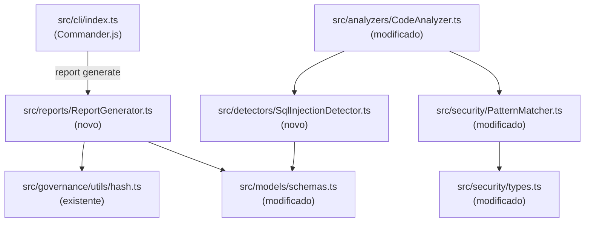

# Design Document — mvp-demo-gaps

## Overview

Este documento descreve o design técnico para os três gaps que bloqueiam a primeira demo enterprise do CodeMemória:

1. **Comando `report generate`** — novo subcomando CLI que exporta um `Compliance_Report` JSON com hash SHA-256 de integridade, timestamp ISO 8601, lista de issues e referências normativas LGPD/OWASP.
2. **Detecção de secrets hardcoded em objetos literais** — extensão do `PatternMatcher` com novos patterns regex para propriedades como `apiKey`, `password`, `secret`, `token` e prefixos `sk_live_`/`sk_test_`.
3. **Detecção de SQL injection por template string** — novo `SqlInjectionDetector` integrado ao `CodeAnalyzer` que detecta template literals e concatenações com palavras-chave SQL.

Os três gaps são independentes entre si e podem ser implementados em paralelo. Todos os novos módulos seguem os padrões ESM, TypeScript strict e a convenção de injeção de dependências já estabelecida no projeto.

---

## Architecture



### Fluxo do `report generate`

```
CLI recebe: report generate <analysis_file> [--output <path>] [--format json]
  → lê e valida o arquivo JSON de análise
  → ReportGenerator.generate(analysisResult)
      → mapeia issues para ComplianceIssue[]
      → adiciona normativeRefs por tipo de issue
      → serializa sem integrityHash
      → calcula sha256(serialized)
      → retorna ComplianceReport completo
  → escreve no --output ou imprime no stdout
```

### Fluxo do `PatternMatcher` (hardcoded secrets)

```
PatternMatcher.detectPatterns(script)
  → itera SUSPICIOUS_PATTERNS (existentes + novos hardcoded_secret)
  → para cada match: calcula posição (linha/coluna)
  → retorna DetectedPattern[]
```

### Fluxo do `SqlInjectionDetector`

```
CodeAnalyzer.analyze(code, options)
  → SqlInjectionDetector.detect(code)
      → regex para template literals com SQL keywords + ${...}
      → regex para concatenação string + variável com SQL keywords
      → retorna Issue[]
  → issues de sql_injection somados em summary.securityRisks
```

---

## Components and Interfaces

### 1. `ReportGenerator` (novo — `src/reports/ReportGenerator.ts`)

```typescript
export interface ComplianceIssue {
  id: string;
  type: string;
  severity: string;
  message: string;
  location: { file?: string; line: number; column?: number };
  normativeRefs: NormativeRef[];
}

export interface NormativeRef {
  standard: 'LGPD' | 'OWASP';
  reference: string;
  description: string;
}

export interface ComplianceReport {
  reportVersion: '1.0';
  generatedAt: string;          // ISO 8601
  analysisId: string;
  issues: ComplianceIssue[];
  integrityHash: string;        // SHA-256 do conteúdo sem este campo
}

export class ReportGenerator {
  generate(analysis: AnalysisResult): ComplianceReport;
}
```

O método `generate` segue esta ordem:
1. Mapeia `analysis.issues` para `ComplianceIssue[]`, adicionando `normativeRefs` por tipo.
2. Monta o objeto parcial (sem `integrityHash`).
3. Serializa com `JSON.stringify(partial, null, 2)`.
4. Calcula `sha256(serialized)`.
5. Retorna o objeto completo com `integrityHash`.

### Mapeamento de `normativeRefs` por tipo de issue

| `issue.type`        | Standard | Referência                                      |
|---------------------|----------|-------------------------------------------------|
| `security_risk`     | OWASP    | OWASP Top 10 A05:2021 – Security Misconfiguration |
| `hardcoded_secret`  | OWASP    | OWASP Top 10 A07:2021 – Identification and Authentication Failures |
| `hardcoded_secret`  | LGPD     | LGPD Art. 46 – Medidas de segurança             |
| `sql_injection`     | OWASP    | OWASP Top 10 A03:2021 – Injection               |
| `postinstall_risk`  | OWASP    | OWASP Top 10 A08:2021 – Software and Data Integrity Failures |
| `unicode_risk`      | OWASP    | OWASP Top 10 A08:2021 – Software and Data Integrity Failures |
| outros              | —        | (sem refs normativas)                           |

### 2. Subcomando `report generate` (modificação — `src/cli/index.ts`)

```typescript
program
  .command('report')
  .description('Compliance report commands')
  .addCommand(
    new Command('generate')
      .argument('<analysis_file>', 'Path to analysis result JSON file')
      .option('--output <path>', 'Output file path')
      .option('--format <format>', 'Output format (json)', 'json')
      .action(async (analysisFile, options) => { ... })
  );
```

### 3. `PatternMatcher` — novos patterns (modificação — `src/security/PatternMatcher.ts`)

Dois novos `PatternDefinition` adicionados ao array `SUSPICIOUS_PATTERNS`:

```typescript
// Hardcoded secrets — property names (weight: 50)
{
  type: 'hardcoded_secret',
  regex: /\b(stripeKey|apiKey|api_key|password|secret|token)\s*:\s*['"][^'"]+['"]/gi,
  weight: 50,
},
// Hardcoded secrets — sk_live_ / sk_test_ prefixes (weight: 50)
{
  type: 'hardcoded_secret',
  regex: /['"]sk_(live|test)_[^'"]+['"]/gi,
  weight: 50,
},
```

`PatternType` em `src/security/types.ts` recebe `'hardcoded_secret'` na union.

### 4. `SqlInjectionDetector` (novo — `src/detectors/SqlInjectionDetector.ts`)

```typescript
export class SqlInjectionDetector {
  detect(code: string): Issue[];
}
```

Dois patterns de detecção:

- **Template literal**: `` /`[^`]*(SELECT|INSERT|UPDATE|DELETE|DROP|EXEC)[^`]*\$\{[^}]+\}[^`]*`/gi ``
- **Concatenação**: `/['"][^'"]*\b(SELECT|INSERT|UPDATE|DELETE|DROP|EXEC)\b[^'"]*['"]\s*\+\s*\S/gi`

Cada match gera um `Issue` com:
- `type: 'sql_injection'`
- `severity: 'error'`
- `location`: linha e coluna calculadas via split de `\n`
- `suggestion`: "Use prepared statements or parameterized queries instead of string interpolation."

### 5. `CodeAnalyzer` — integração (modificação — `src/analyzers/CodeAnalyzer.ts`)

- Instancia `SqlInjectionDetector` no construtor.
- No método `analyze()`, chama `this.sqlDetector.detect(code)` e adiciona os issues ao array `securityIssues` (independente do flag `enableSecurityAnalysis`, pois SQL injection é sempre relevante).
- `calculateSummary` já conta `sql_injection` via o case `security_risk` — mas `sql_injection` não está no `IssueType` atual; será adicionado a `schemas.ts`.

### 6. `IssueType` (modificação — `src/models/schemas.ts`)

```typescript
export type IssueType =
  | 'ghost_import'
  | 'mock_api'
  | 'unrealistic_assumption'
  | 'security_risk'
  | 'infinite_loop'
  | 'postinstall_risk'
  | 'slopsquat_risk'
  | 'unicode_risk'
  | 'hardcoded_secret'   // novo
  | 'sql_injection';     // novo
```

`calculateSummary` em `CodeAnalyzer` precisa mapear `'hardcoded_secret'` e `'sql_injection'` para `summary.securityRisks`.

---

## Data Models

### `ComplianceReport`

```typescript
{
  reportVersion: "1.0",
  generatedAt: "2024-01-15T10:30:00.000Z",   // ISO 8601
  analysisId: "analysis-1234567890-abc123",
  issues: [
    {
      id: "issue-...",
      type: "sql_injection",
      severity: "error",
      message: "SQL injection via template literal",
      location: { line: 12, column: 5 },
      normativeRefs: [
        {
          standard: "OWASP",
          reference: "OWASP Top 10 A03:2021 – Injection",
          description: "Direct variable interpolation in SQL queries enables injection attacks."
        }
      ]
    }
  ],
  integrityHash: "e3b0c44298fc1c149afb..."   // SHA-256
}
```

### `DetectedPattern` (sem alteração de estrutura)

```typescript
{
  type: 'hardcoded_secret',
  pattern: "...",
  match: "apiKey: 'sk_live_abc123'",
  position: { line: 5, column: 3 }
}
```

### `Issue` (sem alteração de estrutura, apenas novos valores de `type`)

```typescript
{
  id: "issue-...",
  type: "sql_injection",
  severity: "error",
  location: { line: 8, column: 1 },
  message: "SQL injection via template literal detected",
  description: "Template literal interpolates a variable directly into a SQL query.",
  suggestion: "Use prepared statements or parameterized queries instead of string interpolation.",
  autoFixable: false
}
```

---


## Correctness Properties

*A property is a characteristic or behavior that should hold true across all valid executions of a system — essentially, a formal statement about what the system should do. Properties serve as the bridge between human-readable specifications and machine-verifiable correctness guarantees.*

### Property 1: Report structure invariant

*For any* valid `AnalysisResult`, the `ComplianceReport` gerado por `ReportGenerator.generate()` deve conter: campo `reportVersion` igual a `"1.0"`, campo `generatedAt` em formato ISO 8601 válido, campo `analysisId` igual ao `analysisId` da análise de entrada, array `issues` com o mesmo número de issues da análise, e campo `integrityHash` não vazio. O JSON serializado deve ter indentação de 2 espaços.

**Validates: Requirements 1.2, 1.6, 1.7**

### Property 2: Integrity hash round-trip

*For any* valid `AnalysisResult`, gerar o `ComplianceReport`, remover o campo `integrityHash` do objeto resultante, serializar com `JSON.stringify(_, null, 2)`, e calcular `sha256` sobre essa string deve produzir um valor idêntico ao campo `integrityHash` do relatório original.

**Validates: Requirements 1.8**

### Property 3: Write-to-file round-trip

*For any* valid `AnalysisResult` e qualquer caminho de arquivo válido, gerar o relatório e gravá-lo no caminho especificado, depois ler o arquivo e fazer `JSON.parse`, deve produzir um objeto estruturalmente equivalente ao `ComplianceReport` retornado por `generate()`.

**Validates: Requirements 1.4**

### Property 4: Detecção de secret por nome de propriedade

*For any* fragmento de código contendo uma propriedade de objeto literal cujo nome pertence ao conjunto `{stripeKey, apiKey, api_key, password, secret, token}` com valor de string literal não vazia, `PatternMatcher.detectPatterns()` deve retornar ao menos um `DetectedPattern` com `type === 'hardcoded_secret'` e `position` com `line >= 1` e `column >= 1`.

**Validates: Requirements 2.1, 2.5**

### Property 5: Detecção de secret por prefixo sk_live_/sk_test_

*For any* fragmento de código contendo um valor de string literal que começa com `sk_live_` ou `sk_test_` (independentemente do nome da propriedade), `PatternMatcher.detectPatterns()` deve retornar ao menos um `DetectedPattern` com `type === 'hardcoded_secret'`.

**Validates: Requirements 2.2**

### Property 6: Sem falsos positivos para valores não-literais

*For any* fragmento de código onde as propriedades do conjunto `{apiKey, password, secret, token}` têm como valor uma referência a variável (não string literal) ou uma string vazia, `PatternMatcher.detectPatterns()` não deve retornar nenhum `DetectedPattern` com `type === 'hardcoded_secret'`.

**Validates: Requirements 2.3, 2.4**

### Property 7: Contagem exata de secrets hardcoded

*For any* fragmento de código contendo exatamente N ocorrências de secrets hardcoded em objetos literais (combinando detecção por nome de propriedade e por prefixo), `PatternMatcher.detectPatterns()` deve retornar exatamente N `DetectedPattern`s com `type === 'hardcoded_secret'`.

**Validates: Requirements 2.6**

### Property 8: Detecção de SQL injection via template literal

*For any* fragmento de código contendo um template literal que inclui ao menos uma palavra-chave SQL (`SELECT`, `INSERT`, `UPDATE`, `DELETE`, `DROP`, `EXEC`) e ao menos uma interpolação `${...}`, `SqlInjectionDetector.detect()` deve retornar ao menos um `Issue` com `type === 'sql_injection'`, `severity === 'error'`, `suggestion` não vazio mencionando prepared statements, e `location.line >= 1`.

**Validates: Requirements 3.1, 3.4, 3.5**

### Property 9: Detecção de SQL injection via concatenação

*For any* fragmento de código contendo concatenação de string com operador `+` onde um operando contém palavra-chave SQL e o outro é uma variável ou expressão, `SqlInjectionDetector.detect()` deve retornar ao menos um `Issue` com `type === 'sql_injection'` e `severity === 'error'`.

**Validates: Requirements 3.2**

### Property 10: Sem falsos positivos para SQL estático

*For any* fragmento de código contendo queries SQL completamente estáticas (sem interpolação `${...}` e sem concatenação com variáveis), `SqlInjectionDetector.detect()` não deve retornar nenhum `Issue` com `type === 'sql_injection'`.

**Validates: Requirements 3.3**

### Property 11: Contagem exata de SQL injections no CodeAnalyzer

*For any* fragmento de código contendo exatamente N template literals SQL com interpolação, `CodeAnalyzer.analyze()` deve retornar um `AnalysisResult` onde o número de issues com `type === 'sql_injection'` é exatamente N e `summary.securityRisks` inclui esses N issues na contagem.

**Validates: Requirements 3.6, 3.7**

---

## Error Handling

### `report generate`

| Situação | Comportamento |
|---|---|
| Arquivo de análise não encontrado | Mensagem `Error: Analysis file not found: <path>` + exit code 1 |
| Arquivo não é JSON válido | Mensagem `Error: Could not parse analysis file: <reason>` + exit code 1 |
| Falha ao gravar arquivo de saída | Mensagem `Error: Could not write report to <path>: <reason>` + exit code 1 |
| `AnalysisResult` sem campo `issues` | Trata como array vazio; relatório gerado normalmente |

### `PatternMatcher` (novos patterns)

- Regex com flag `gi` — `lastIndex` é resetado antes de cada uso (já implementado no loop existente).
- Nenhuma exceção esperada; patterns inválidos são silenciados pelo try/catch do caller.

### `SqlInjectionDetector`

- Código `null` ou `undefined`: retorna `[]` sem lançar exceção.
- Regex com flag `gi` — `lastIndex` resetado antes de cada uso.
- Erros de parsing de posição (linha/coluna) retornam `{ line: 0, column: 0 }` como fallback.

### `CodeAnalyzer` — integração

- `SqlInjectionDetector.detect()` é chamado dentro do bloco `try/catch` existente; falhas são logadas e não interrompem a análise.

---

## Testing Strategy

### Abordagem dual

Cada gap requer tanto testes unitários (exemplos específicos e casos de borda) quanto testes de propriedade (cobertura universal via geração aleatória de inputs).

**Biblioteca de property-based testing**: [`fast-check`](https://github.com/dubzzz/fast-check) (já presente no ecossistema TypeScript/Node.js, compatível com ESM).

### Testes unitários

Localização: `tests/security/`, `tests/detectors/`, `tests/cli/`

- `ReportGenerator`: exemplos com 0 issues, 1 issue de cada tipo, verificação de campos obrigatórios.
- `PatternMatcher`: exemplos com cada nome de propriedade sensível, prefixos `sk_live_`/`sk_test_`, variáveis (não-literal), string vazia.
- `SqlInjectionDetector`: exemplos com cada keyword SQL, template literal, concatenação, query estática.
- CLI `report generate`: exemplo com arquivo válido, arquivo inexistente, JSON inválido, `--output`.

### Testes de propriedade

Cada propriedade do design deve ser implementada como um único teste `fast-check`. Configuração mínima: **100 iterações** por teste.

Tag format: `// Feature: mvp-demo-gaps, Property N: <property_text>`

| Propriedade | Arquivo de teste | Arbitrários necessários |
|---|---|---|
| P1 — Report structure invariant | `tests/reports/ReportGenerator.property.test.ts` | `fc.record({ analysisId, issues: fc.array(...) })` |
| P2 — Integrity hash round-trip | `tests/reports/ReportGenerator.property.test.ts` | mesmo acima |
| P3 — Write-to-file round-trip | `tests/reports/ReportGenerator.property.test.ts` | mesmo + `fc.string()` para path temporário |
| P4 — Secret por nome de propriedade | `tests/security/PatternMatcher.property.test.ts` | `fc.constantFrom(...propertyNames)` + `fc.string({ minLength: 1 })` |
| P5 — Secret por prefixo sk_ | `tests/security/PatternMatcher.property.test.ts` | `fc.constantFrom('sk_live_', 'sk_test_')` + `fc.string({ minLength: 1 })` |
| P6 — Sem falsos positivos | `tests/security/PatternMatcher.property.test.ts` | `fc.identifier()` para nomes de variável |
| P7 — Contagem exata de secrets | `tests/security/PatternMatcher.property.test.ts` | `fc.array(...)` de N secrets |
| P8 — SQL injection template literal | `tests/detectors/SqlInjectionDetector.property.test.ts` | `fc.constantFrom(...sqlKeywords)` + `fc.identifier()` |
| P9 — SQL injection concatenação | `tests/detectors/SqlInjectionDetector.property.test.ts` | mesmo |
| P10 — Sem falsos positivos SQL | `tests/detectors/SqlInjectionDetector.property.test.ts` | `fc.constantFrom(...sqlKeywords)` sem interpolação |
| P11 — Contagem exata SQL no CodeAnalyzer | `tests/analyzers/CodeAnalyzer.property.test.ts` | `fc.array(...)` de N template literals SQL |

**Configuração fast-check**:
```typescript
fc.assert(fc.property(...arbitraries, (...args) => { /* assertion */ }), {
  numRuns: 100,
  verbose: true,
});
```
