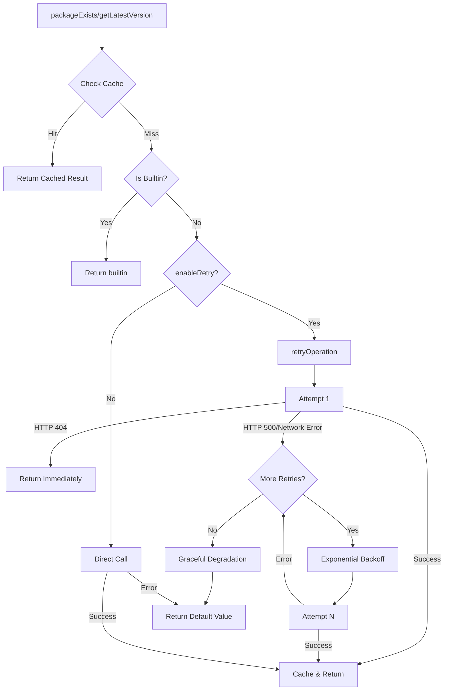
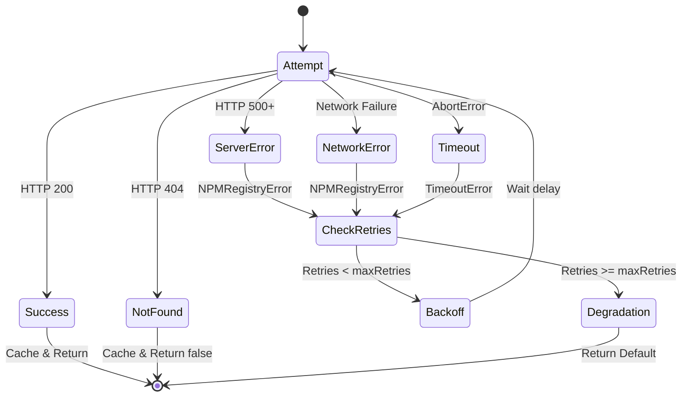

# Design Document: NPM Registry Retry Fix

## Overview

Este documento especifica o design técnico para corrigir e melhorar a lógica de retry do serviço NPMRegistry. O objetivo principal é garantir que erros HTTP 500 sejam retentados corretamente com exponential backoff, enquanto erros HTTP 404 não sejam retentados, e que o sistema degrade graciosamente após todas as tentativas falharem.

O NPMRegistry é um serviço crítico que verifica a existência de pacotes npm e obtém suas versões mais recentes. A lógica de retry inadequada pode resultar em falsos negativos (pacotes existentes sendo marcados como inexistentes devido a falhas temporárias) ou desperdício de recursos (tentando repetidamente encontrar pacotes que definitivamente não existem).

### Objetivos do Design

1. Implementar retry correto para erros HTTP 500 (erros de servidor temporários)
2. Evitar retry desnecessário para erros HTTP 404 (pacotes não encontrados)
3. Implementar exponential backoff adequado entre tentativas
4. Garantir graceful degradation quando todas as tentativas falharem
5. Diferenciar entre tipos de erro para decisões de retry apropriadas
6. Rastrear status de verificações para diagnóstico
7. Implementar caching inteligente (apenas resultados definitivos)

## Architecture

### Componentes Principais

O design envolve modificações em três áreas principais do NPMRegistry:

1. **Retry Logic (`retryOperation` method)**
   - Implementa a lógica central de retry com exponential backoff
   - Diferencia entre erros retryable e non-retryable
   - Gerencia contagem de tentativas e delays
   - Implementa graceful degradation

2. **HTTP Request Handlers (`checkPackageExistence` e `fetchPackageVersion`)**
   - Fazem requisições HTTP ao registro npm
   - Lançam erros apropriados baseados em status codes
   - Convertem AbortError em TimeoutError
   - Implementam timeout handling

3. **Cache Management**
   - Cacheia apenas resultados definitivos (200 OK e 404 Not Found)
   - Não cacheia erros temporários (500, network errors, timeouts)
   - Rastreia status de cada pacote (FOUND, NOT_FOUND, UNVERIFIED_NETWORK_ERROR, etc.)

### Fluxo de Execução



### Error Classification

Os erros são classificados em duas categorias para decisões de retry:

**Retryable Errors:**
- HTTP 500+ (Server errors)
- Network errors (connection refused, DNS failure)
- Timeout errors (AbortError convertido para TimeoutError)
- Erro type: `NPMRegistryError`, `TimeoutError`

**Non-Retryable Errors:**
- HTTP 404 (Package not found)
- Erro type: `PackageNotFoundError`

## Components and Interfaces

### Modified Methods

#### 1. `retryOperation<T>` (Private Method)

```typescript
private async retryOperation<T>(
  operation: () => Promise<T>,
  packageName: string,
  operationName: string
): Promise<T>
```

**Responsabilidades:**
- Executar operação com retry logic
- Implementar exponential backoff
- Diferenciar entre erros retryable e non-retryable
- Implementar graceful degradation
- Logging de tentativas e falhas

**Modificações Necessárias:**
- Corrigir detecção de erros HTTP 500 (atualmente não está sendo retentado corretamente)
- Implementar lógica para não retentar PackageNotFoundError
- Garantir que o número total de tentativas seja `maxRetries + 1`
- Implementar graceful degradation retornando valores padrão ao invés de lançar exceções
- Adicionar logging apropriado

#### 2. `checkPackageExistence` (Private Method)

```typescript
private async checkPackageExistence(packageName: string): Promise<boolean>
```

**Responsabilidades:**
- Fazer requisição HEAD ao registro npm
- Lançar NPMRegistryError para HTTP 500+
- Lançar PackageNotFoundError para HTTP 404
- Converter AbortError em TimeoutError
- Cachear apenas resultados definitivos

**Modificações Necessárias:**
- Garantir que HTTP 500 lance NPMRegistryError (já implementado)
- Garantir que HTTP 404 lance PackageNotFoundError para evitar retry
- Não cachear resultados quando erros temporários ocorrem

#### 3. `fetchPackageVersion` (Private Method)

```typescript
private async fetchPackageVersion(packageName: string): Promise<string>
```

**Responsabilidades:**
- Fazer requisição GET ao registro npm
- Lançar NPMRegistryError para HTTP 500+
- Lançar PackageNotFoundError para HTTP 404
- Converter AbortError em TimeoutError
- Cachear apenas resultados definitivos

**Modificações Necessárias:**
- Garantir que HTTP 500 lance NPMRegistryError (já implementado)
- Garantir que HTTP 404 lance PackageNotFoundError (já implementado)
- Não cachear resultados quando erros temporários ocorrem

#### 4. `checkPackages` (Public Method)

```typescript
async checkPackages(packageNames: string[]): Promise<Map<string, PackageInfo>>
```

**Responsabilidades:**
- Verificar múltiplos pacotes em paralelo
- Retornar PackageInfo com status apropriado
- Continuar processamento mesmo quando alguns pacotes falham

**Modificações Necessárias:**
- Melhorar lógica de determinação de status
- Garantir que UNVERIFIED_TIMEOUT seja usado para timeout errors
- Garantir que UNVERIFIED_NETWORK_ERROR seja usado para network errors persistentes

### Data Structures

#### PackageInfo Interface

```typescript
interface PackageInfo {
  name: string;
  version: string;
  exists: boolean;
  status: 'FOUND' | 'NOT_FOUND' | 'UNVERIFIED_NETWORK_ERROR' | 'UNVERIFIED_TIMEOUT' | 'BUILTIN';
}
```

**Status Values:**
- `FOUND`: Pacote encontrado com sucesso
- `NOT_FOUND`: Pacote definitivamente não existe (HTTP 404)
- `UNVERIFIED_NETWORK_ERROR`: Falha de rede após todas as tentativas
- `UNVERIFIED_TIMEOUT`: Timeout após todas as tentativas
- `BUILTIN`: Módulo builtin do Node.js

### Configuration

```typescript
interface NPMRegistryConfig {
  registryUrl: string;
  cacheTTL: number;
  existenceCheckTimeout: number;
  versionQueryTimeout: number;
  maxRetries: number;
  initialRetryDelay: number;
  enableRetry: boolean;
}
```

**Parâmetros de Retry:**
- `maxRetries`: Número de tentativas adicionais após a tentativa inicial (padrão: 2)
- `initialRetryDelay`: Delay base em ms para primeira retry (padrão: 100)
- `enableRetry`: Flag para habilitar/desabilitar retry logic (padrão: true)

## Data Models

### Error Hierarchy

```
Error
└── EscapeKitError
    └── NetworkError
        ├── NPMRegistryError (retryable)
        │   └── PackageNotFoundError (non-retryable)
        └── TimeoutError (retryable)
```

### Cache Entry Structure

```typescript
interface CacheEntry {
  data: PackageInfo;
  timestamp: number;
}
```

**Caching Rules:**
- Cache apenas quando `status === 'FOUND'` ou `status === 'NOT_FOUND'`
- Não cache quando `status === 'UNVERIFIED_NETWORK_ERROR'` ou `status === 'UNVERIFIED_TIMEOUT'`
- Respeitar `cacheTTL` para expiração

### Retry State Machine



## Correctness Properties

*A property is a characteristic or behavior that should hold true across all valid executions of a system-essentially, a formal statement about what the system should do. Properties serve as the bridge between human-readable specifications and machine-verifiable correctness guarantees.*

### Property 1: HTTP 500 Errors Trigger Retry

*For any* package name and operation (existence check or version query), when an HTTP 500 error occurs, the system should retry the operation up to maxRetries times before returning a default value.

**Validates: Requirements 1.1, 1.2**

### Property 2: HTTP 500 Errors Throw NPMRegistryError

*For any* HTTP 500 response, the system should throw an NPMRegistryError (not PackageNotFoundError) to signal that the error is retryable.

**Validates: Requirements 1.3**

### Property 3: Graceful Degradation After HTTP 500 Retries

*For any* package name, when HTTP 500 errors persist after all retry attempts, the system should return false for existence checks and 'unknown' for version queries without throwing an exception.

**Validates: Requirements 1.4, 1.5, 6.1, 6.2**

### Property 4: HTTP 404 Errors Do Not Trigger Retry

*For any* package name and operation (existence check or version query), when an HTTP 404 error occurs, the system should return immediately without retrying (exactly 1 attempt).

**Validates: Requirements 2.1, 2.2**

### Property 5: HTTP 404 Errors Throw PackageNotFoundError

*For any* HTTP 404 response, the system should throw a PackageNotFoundError to signal that the error is non-retryable.

**Validates: Requirements 2.3**

### Property 6: HTTP 404 Results Are Cached

*For any* package name that returns HTTP 404, the cache should contain an entry with status 'NOT_FOUND' after the operation completes.

**Validates: Requirements 2.4, 8.1**

### Property 7: Network Errors Trigger Retry

*For any* package name and operation, when a network error (connection refused, DNS failure, etc.) occurs, the system should retry the operation up to maxRetries times.

**Validates: Requirements 3.1, 3.2**

### Property 8: AbortError Converted to TimeoutError

*For any* operation that times out (AbortError), the system should convert it to a TimeoutError and retry the operation.

**Validates: Requirements 3.3**

### Property 9: Graceful Degradation After Network Errors

*For any* package name, when network errors persist after all retry attempts, the system should return false for existence checks and 'unknown' for version queries without throwing an exception.

**Validates: Requirements 3.4, 3.5**

### Property 10: Exponential Backoff Formula

*For any* retry attempt number n (where n >= 0), the delay before that retry should be `initialRetryDelay * Math.pow(2, n)` milliseconds.

**Validates: Requirements 4.3, 4.5**

### Property 11: Total Attempt Count

*For any* operation with retry enabled, the total number of attempts should be exactly `maxRetries + 1` (initial attempt plus maxRetries additional attempts).

**Validates: Requirements 4.4**

### Property 12: Status Tracking for Found Packages

*For any* package that is successfully found (HTTP 200), the PackageInfo should have status 'FOUND'.

**Validates: Requirements 5.1**

### Property 13: Status Tracking for Not Found Packages

*For any* package that returns HTTP 404, the PackageInfo should have status 'NOT_FOUND'.

**Validates: Requirements 5.2**

### Property 14: Status Tracking for Network Errors

*For any* package where network errors persist after all retries, the PackageInfo should have status 'UNVERIFIED_NETWORK_ERROR'.

**Validates: Requirements 5.3**

### Property 15: Status Tracking for Timeout Errors

*For any* package where timeout errors persist after all retries, the PackageInfo should have status 'UNVERIFIED_TIMEOUT'.

**Validates: Requirements 5.4**

### Property 16: Status Tracking for Builtin Modules

*For any* Node.js builtin module name, the PackageInfo should have status 'BUILTIN'.

**Validates: Requirements 5.5**

### Property 17: PackageInfo Contains Status

*For any* package checked via checkPackages method, the returned PackageInfo object should include a status field with one of the valid status values.

**Validates: Requirements 5.6**

### Property 18: Graceful Degradation Logging

*For any* operation where graceful degradation occurs, a warning should be logged containing the operation name, package name, and error details.

**Validates: Requirements 6.3**

### Property 19: Failed Results Not Cached

*For any* package where graceful degradation occurs (network errors, timeouts, or HTTP 500 after retries), the cache should not contain an entry for that package.

**Validates: Requirements 6.4**

### Property 20: Continue Processing After Failure

*For any* list of packages in checkPackages, if some packages fail, the system should continue processing all remaining packages and return results for all of them.

**Validates: Requirements 6.5**

### Property 21: EnableRetry Configuration

*For any* operation, when enableRetry is true, retries should occur on retryable errors; when enableRetry is false, no retries should occur (exactly 1 attempt).

**Validates: Requirements 7.1, 7.2**

### Property 22: MaxRetries Configuration

*For any* two different maxRetries values (n1 and n2 where n1 < n2), operations with maxRetries=n2 should make more total attempts than operations with maxRetries=n1.

**Validates: Requirements 7.3**

### Property 23: InitialRetryDelay Configuration

*For any* two different initialRetryDelay values (d1 and d2 where d1 < d2), the first retry delay with initialRetryDelay=d2 should be longer than with initialRetryDelay=d1.

**Validates: Requirements 7.4**

### Property 24: Immediate Return When Retry Disabled

*For any* operation with enableRetry=false, when an error occurs, the system should return a default value (false or 'unknown') immediately without any retry attempts.

**Validates: Requirements 7.5**

### Property 25: Cache Only Definitive Results

*For any* package, the cache should contain an entry only when the result is definitive (HTTP 200 or HTTP 404), and should not contain an entry for temporary errors (network errors, timeouts, HTTP 500).

**Validates: Requirements 8.2, 8.3, 8.4, 8.5**

### Property 26: Timeout Errors Throw TimeoutError

*For any* operation that times out, the system should throw a TimeoutError (after converting from AbortError).

**Validates: Requirements 9.3**

### Property 27: Generic Network Errors Throw NPMRegistryError

*For any* generic network error (not timeout, not HTTP 404), the system should throw an NPMRegistryError.

**Validates: Requirements 9.4**

### Property 28: Error Type Determines Retry

*For any* error, if it is a PackageNotFoundError, no retry should occur; if it is an NPMRegistryError or TimeoutError, retry should occur (when enableRetry is true).

**Validates: Requirements 9.5**

### Property 29: Retry Attempt Logging

*For any* retry attempt, a warning should be logged containing the attempt number and the delay until the next attempt.

**Validates: Requirements 10.1**

### Property 30: Final Failure Logging

*For any* operation where all retries fail, a warning should be logged containing the final error details.

**Validates: Requirements 10.2**

### Property 31: Non-Retryable Error Logging

*For any* non-retryable error (PackageNotFoundError), a debug message should be logged explaining why the error is not being retried.

**Validates: Requirements 10.4**

### Property 32: Error Messages in Logs

*For any* error log entry, the log should include the error message for debugging purposes.

**Validates: Requirements 10.5**

## Error Handling

### Error Types and Handling Strategy

| Error Type | HTTP Status | Retryable | Action | Cache Result |
|------------|-------------|-----------|--------|--------------|
| PackageNotFoundError | 404 | No | Return immediately | Yes (NOT_FOUND) |
| NPMRegistryError | 500+ | Yes | Retry with backoff | No |
| TimeoutError | N/A (timeout) | Yes | Retry with backoff | No |
| NetworkError | N/A (network) | Yes | Retry with backoff | No |

### Graceful Degradation Strategy

Quando todas as tentativas falharem:

1. **Não lançar exceção** - retornar valor padrão
2. **Log warning** com detalhes do erro
3. **Não cachear** o resultado (pode ser temporário)
4. **Retornar valores padrão:**
   - `packageExists`: retorna `false`
   - `getLatestVersion`: retorna `'unknown'`
   - `checkPackages`: retorna PackageInfo com status apropriado

### Error Context

Todos os erros devem incluir contexto relevante:

```typescript
{
  packageName: string;
  operation: 'existence check' | 'version query';
  attemptNumber?: number;
  totalAttempts?: number;
  error?: string;
}
```

## Testing Strategy

### Dual Testing Approach

A estratégia de testes combina unit tests e property-based tests:

**Unit Tests:**
- Casos específicos de sucesso e falha
- Edge cases (builtin modules, cache expiration)
- Integração entre componentes
- Configuração e inicialização

**Property-Based Tests:**
- Propriedades universais que devem valer para todos os inputs
- Geração aleatória de package names, error types, e configurações
- Verificação de invariantes (retry count, exponential backoff, graceful degradation)
- Mínimo 100 iterações por teste

### Property-Based Testing Configuration

**Framework:** fast-check (TypeScript/JavaScript property-based testing library)

**Test Configuration:**
```typescript
fc.assert(
  fc.property(
    // generators
    fc.string(), // package names
    fc.integer({ min: 0, max: 5 }), // maxRetries
    fc.integer({ min: 50, max: 500 }), // initialRetryDelay
    // test implementation
    async (packageName, maxRetries, initialRetryDelay) => {
      // test logic
    }
  ),
  { numRuns: 100 } // minimum 100 iterations
);
```

**Property Test Tags:**
Cada property test deve incluir um comentário referenciando a propriedade do design:

```typescript
// Feature: npm-registry-retry-fix, Property 1: HTTP 500 Errors Trigger Retry
test('HTTP 500 errors should trigger retry', async () => {
  // test implementation
});
```

### Test Coverage Requirements

1. **Retry Logic:**
   - HTTP 500 errors são retentados
   - HTTP 404 errors não são retentados
   - Network errors são retentados
   - Timeout errors são retentados
   - Número correto de tentativas
   - Exponential backoff correto

2. **Graceful Degradation:**
   - Retorna valores padrão após falhas
   - Não lança exceções
   - Logs apropriados
   - Não cacheia resultados temporários

3. **Status Tracking:**
   - Status correto para cada tipo de resultado
   - Status incluído em PackageInfo
   - Status diferencia entre tipos de erro

4. **Configuration:**
   - enableRetry funciona corretamente
   - maxRetries controla número de tentativas
   - initialRetryDelay controla delays

5. **Cache Behavior:**
   - Cacheia apenas resultados definitivos
   - Não cacheia erros temporários
   - Respeita TTL

### Unit Test Balance

Os unit tests devem focar em:
- Exemplos específicos que demonstram comportamento correto
- Edge cases (empty strings, special characters, very long names)
- Integração entre métodos (packageExists + getLatestVersion)
- Condições de erro específicas

Os property tests devem focar em:
- Propriedades universais (retry count, backoff formula)
- Cobertura ampla de inputs através de randomização
- Invariantes que devem sempre valer

Evitar escrever muitos unit tests para casos que property tests já cobrem.

### Mock Strategy

Para testes, usar mocks do `fetch` global:

```typescript
const mockFetch = vi.fn();
global.fetch = mockFetch;

// Mock HTTP 500
mockFetch.mockResolvedValue({
  ok: false,
  status: 500,
});

// Mock HTTP 404
mockFetch.mockResolvedValue({
  ok: false,
  status: 404,
});

// Mock network error
mockFetch.mockRejectedValue(new Error('Network error'));

// Mock timeout
const timeoutError = new Error('The operation was aborted.');
timeoutError.name = 'AbortError';
mockFetch.mockRejectedValue(timeoutError);
```

### Test Execution

- Unit tests: executar com `vitest --run`
- Property tests: executar com `vitest --run` (mínimo 100 iterações configuradas)
- Coverage: alvo de 90%+ para código modificado
- CI/CD: todos os testes devem passar antes de merge

