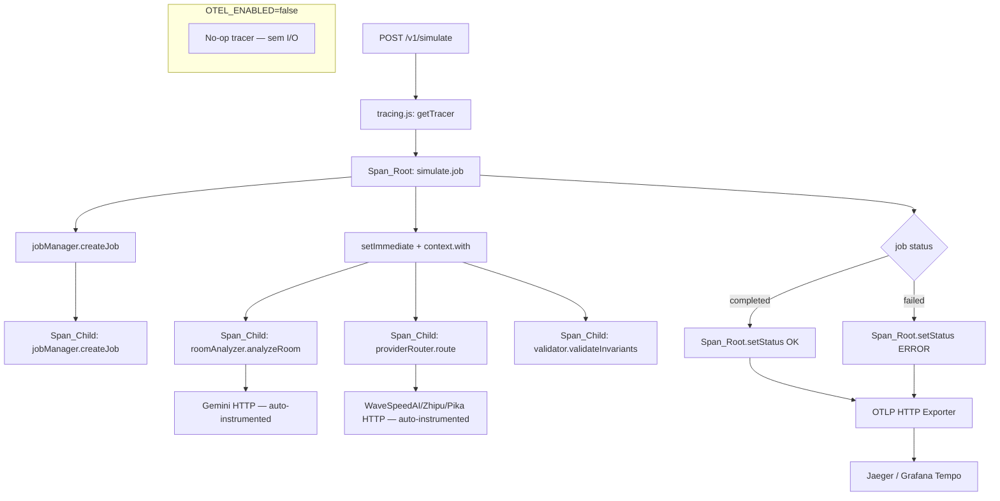

# Design Document — OpenTelemetry Distributed Tracing

## Overview

Esta feature adiciona observabilidade distribuída ao backend Node.js do PisoRealView Pro via OpenTelemetry. O objetivo é instrumentar os 5 pontos críticos do pipeline de simulação assíncrona com spans manuais, propagar contexto através do `setImmediate` do JobManager, correlacionar logs JSON com traceId/spanId, e exportar traces para Jaeger via OTLP HTTP.

A instrumentação é controlada pela variável `OTEL_ENABLED`. Quando `false` (padrão), o sistema opera em modo completamente no-op: nenhum pacote `@opentelemetry/*` é importado, nenhuma conexão de rede é estabelecida, e os 159 testes existentes continuam passando sem modificação.

### Decisões de Design

**No-op por padrão via importação condicional**: Em vez de importar o SDK e desabilitar via configuração, o módulo `tracing.js` usa importação dinâmica (`import()`) apenas quando `OTEL_ENABLED=true`. Isso garante zero overhead e zero dependência de rede em desenvolvimento e testes.

**Propagação de contexto explícita no setImmediate**: O contexto OpenTelemetry não é propagado automaticamente através de `setImmediate`. A solução usa `context.with(activeCtx, callback)` para capturar e restaurar o contexto antes do callback assíncrono ser agendado.

**Span raiz de longa duração**: O `simulate.job` span cobre desde o recebimento do POST até o fim do processamento em background — não apenas até o retorno do 202. Isso requer que o span seja criado antes do `setImmediate` e encerrado dentro do callback.

**Truncamento de cacheKey**: O atributo `cache.key` usa apenas os primeiros 8 caracteres do cacheKey para evitar exposição de dados derivados da imagem em sistemas de telemetria externos.

---

## Architecture



### Hierarquia de Spans

```
POST /v1/simulate
└── simulate.job [Span_Root]
    ├── jobManager.createJob [Span_Child]
    ├── roomAnalyzer.analyzeRoom [Span_Child]
    │   └── (Gemini HTTP call — auto-instrumented)
    ├── providerRouter.route [Span_Child]
    │   └── (WaveSpeedAI/Zhipu/Pika HTTP call — auto-instrumented)
    └── validator.validateInvariants [Span_Child]
```

---

## Components and Interfaces

### `backend/tracing.js` (novo)

Módulo central de inicialização e acesso ao tracer. Exporta três funções públicas:

```javascript
// Inicializa o SDK OpenTelemetry. Chamado como primeira instrução de server.js.
// Quando OTEL_ENABLED=false: retorna imediatamente sem efeito colateral.
// Quando OTEL_ENABLED=true: inicializa NodeSDK com OTLPTraceExporter e auto-instrumentations.
export async function initTracing(): Promise<void>

// Retorna o tracer ativo (real ou no-op).
// Quando OTEL_ENABLED=false: retorna objeto com startSpan/startActiveSpan no-op.
export function getTracer(): Tracer | NoopTracer

// Helper que cria span, executa fn(span), encerra span com status correto.
// Captura exceções, define status ERROR, e re-lança.
export async function withSpan(
  name: string,
  attributes: Record<string, string | number | boolean>,
  fn: (span: Span) => Promise<T>
): Promise<T>
```

**Comportamento condicional por `OTEL_ENABLED`**:

| `OTEL_ENABLED` | Importações `@opentelemetry/*` | Conexões de rede | Tracer retornado |
|---|---|---|---|
| `false` / ausente | Nenhuma | Nenhuma | No-op object |
| `true` | `sdk-node`, `api`, `exporter-trace-otlp-http`, `auto-instrumentations-node` | OTLP HTTP para `OTEL_EXPORTER_OTLP_ENDPOINT` | SDK Tracer real |

### `backend/server.js` (modificado)

Adicionar como primeiras duas linhas, antes de qualquer outro import:

```javascript
import { initTracing } from './tracing.js';
await initTracing();
```

> Nota: `server.js` usa ESM top-level await, compatível com `"type": "module"`.

### `backend/services/gateway/logger.js` (modificado)

A função `log()` é modificada para incluir correlação de trace quando há span ativo:

```javascript
// Adicionado ao corpo de log(), após construir `entry`:
if (process.env.OTEL_ENABLED === 'true') {
  // Import dinâmico em tempo de execução — só ocorre quando OTEL_ENABLED=true
  const { trace } = await import('@opentelemetry/api');
  const span = trace.getActiveSpan();
  if (span) {
    const ctx = span.spanContext();
    entry.traceId = ctx.traceId;
    entry.spanId = ctx.spanId;
  }
}
```

Quando `OTEL_ENABLED=false`: os campos `traceId` e `spanId` são omitidos, preservando o formato JSON existente.

### `backend/routes/simulate.js` (modificado)

Instrumentação dos 5 pontos críticos no modo assíncrono:

```javascript
import { getTracer, withSpan } from '../tracing.js';
import { context, SpanStatusCode } from '@opentelemetry/api';

// No handler POST, modo assíncrono:
const tracer = getTracer();
const rootSpan = tracer.startSpan('simulate.job', {
  attributes: { 'job.id': jobId, 'client.id': clientId, 'client.plan': req.client?.planId || 'unknown' }
});

const activeCtx = context.active();
setImmediate(context.with(activeCtx, async () => {
  try {
    // Span filho: jobManager.createJob
    await withSpan('jobManager.createJob', {
      'cache.key': cacheKey.slice(0, 8),
      'webhook.present': !!webhookUrl
    }, async () => { /* ... */ });

    // Span filho: roomAnalyzer.analyzeRoom
    const roomCtx = await withSpan('roomAnalyzer.analyzeRoom', {}, async (span) => {
      const result = await analyzeRoom(imageBase64);
      span.setAttributes({
        'room.geometry': result.geometry,
        'room.obstacles_count': result.obstacles?.length ?? 0,
        'room.lighting': result.lighting
      });
      return result;
    });

    // Span filho: providerRouter.route
    // Span filho: validator.validateInvariants
    // ...

    rootSpan.setStatus({ code: SpanStatusCode.OK });
  } catch (err) {
    rootSpan.setStatus({ code: SpanStatusCode.ERROR, message: err.message });
    rootSpan.setAttribute('error.message', err.message);
  } finally {
    rootSpan.end();
  }
}));
```

---

## Data Models

### Atributos de Span por Operação

| Span | Atributo | Tipo | Fonte |
|---|---|---|---|
| `simulate.job` | `job.id` | string | `job.id` |
| `simulate.job` | `client.id` | string | `req.client.clientId` |
| `simulate.job` | `client.plan` | string | `req.client.planId` |
| `simulate.job` | `error.message` | string | `err.message` (só em falha) |
| `jobManager.createJob` | `cache.key` | string | `cacheKey.slice(0, 8)` |
| `jobManager.createJob` | `webhook.present` | boolean | `!!webhookUrl` |
| `jobManager.deduplicated` | `job.existing_id` | string | `activeJob.id` |
| `roomAnalyzer.analyzeRoom` | `room.geometry` | string | `result.geometry` |
| `roomAnalyzer.analyzeRoom` | `room.obstacles_count` | number | `result.obstacles.length` |
| `roomAnalyzer.analyzeRoom` | `room.lighting` | string | `result.lighting` |
| `providerRouter.route` | `provider.id` | string | `result.provider` |
| `providerRouter.route` | `provider.difficulty` | string | `result.difficulty` |
| `providerRouter.route` | `provider.fidelity` | number | `result.fidelity` (0.0–1.0) |
| `providerRouter.route` | `provider.fallback` | boolean | `result.fallback` |
| `validator.validateInvariants` | `validation.overall_score` | number | `result.overallScore` (0.0–1.0) |
| `validator.validateInvariants` | `validation.violated` | boolean | `result.violated` |
| `validator.validateInvariants` | `validation.invariant` | string | `result.invariant` (só se violated) |

### Variáveis de Ambiente

| Variável | Padrão | Descrição |
|---|---|---|
| `OTEL_ENABLED` | `false` | Ativa instrumentação OpenTelemetry |
| `OTEL_EXPORTER_OTLP_ENDPOINT` | `http://localhost:4318` | Endpoint do coletor OTLP (Jaeger, Grafana Tempo) |
| `OTEL_SERVICE_NAME` | `pisosrealview-backend` | Nome do serviço nos traces |
| `OTEL_SERVICE_VERSION` | `1.0.0` | Versão do serviço nos traces |

### Formato de Log com Correlação (quando OTEL_ENABLED=true e span ativo)

```json
{
  "timestamp": "2024-01-15T10:30:00.000Z",
  "level": "info",
  "component": "simulate",
  "event": "async_job_completed",
  "clientId": "client-123",
  "jobId": "job-abc",
  "traceId": "4bf92f3577b34da6a3ce929d0e0e4736",
  "spanId": "00f067aa0ba902b7"
}
```

### Dependências a Instalar

```bash
npm install \
  @opentelemetry/sdk-node \
  @opentelemetry/auto-instrumentations-node \
  @opentelemetry/exporter-trace-otlp-http \
  @opentelemetry/api
```

---

## Correctness Properties

*A property is a characteristic or behavior that should hold true across all valid executions of a system — essentially, a formal statement about what the system should do. Properties serve as the bridge between human-readable specifications and machine-verifiable correctness guarantees.*

### Property 1: No-op quando OTEL_ENABLED é false

*For any* invocação de `initTracing()`, `getTracer()`, ou `withSpan()` com `OTEL_ENABLED` ausente ou `false`, nenhum pacote `@opentelemetry/*` deve ser importado, nenhuma conexão de rede deve ser estabelecida, e o tracer retornado deve executar operações sem efeito colateral observável.

**Validates: Requirements 1.2, 2.5, 7.3, 8.1, 8.2, 10.1**

### Property 2: Span raiz criado com atributos corretos

*For any* requisição válida ao `POST /v1/simulate` no modo assíncrono, o span `simulate.job` deve ser criado com os atributos `job.id`, `client.id` e `client.plan` preenchidos com os valores correspondentes da requisição.

**Validates: Requirements 2.1, 2.2**

### Property 3: Status do span raiz reflete resultado do job

*For any* job de simulação, o status do span `simulate.job` deve ser `OK` se e somente se o job atingir o status `completed`; deve ser `ERROR` com `error.message` preenchido para qualquer outro desfecho de falha.

**Validates: Requirements 2.3, 2.4**

### Property 4: Span de createJob com atributos corretos

*For any* chamada a `jobManager.createJob`, o span filho `jobManager.createJob` deve conter o atributo `cache.key` com exatamente os primeiros 8 caracteres do cacheKey, e o atributo `webhook.present` com valor booleano que reflete corretamente a presença ou ausência de `webhookUrl`.

**Validates: Requirements 3.1, 3.2, 3.3**

### Property 5: Span de analyzeRoom com atributos corretos

*For any* chamada a `analyzeRoom`, o span filho `roomAnalyzer.analyzeRoom` deve conter os atributos `room.geometry`, `room.obstacles_count` e `room.lighting` com os valores retornados pelo RoomAnalyzer.

**Validates: Requirements 4.1, 4.2, 4.3, 4.4**

### Property 6: Spans encerrados com ERROR em exceções

*For any* exceção lançada por `analyzeRoom`, `ProviderRouter.route` ou `validateInvariants`, o span filho correspondente deve ser encerrado com status `ERROR` e o atributo `error.message` preenchido com a mensagem da exceção, antes de a exceção ser propagada.

**Validates: Requirements 4.6, 5.7, 6.6**

### Property 7: Span de route com atributos corretos e fidelity no intervalo válido

*For any* chamada a `ProviderRouter.route`, o span filho `providerRouter.route` deve conter os atributos `provider.id`, `provider.difficulty`, `provider.fidelity` e `provider.fallback`; e o valor de `provider.fidelity` deve estar no intervalo [0.0, 1.0].

**Validates: Requirements 5.1, 5.2, 5.3, 5.4**

### Property 8: Span de validateInvariants reflete resultado de violação

*For any* resultado de `validateInvariants`, o atributo `validation.violated` do span deve ser `true` se e somente se `result.violated` for `true`; quando `true`, o atributo `validation.invariant` deve estar presente com o nome da invariante violada.

**Validates: Requirements 6.1, 6.2, 6.3, 6.4**

### Property 9: Propagação de contexto preserva hierarquia de spans

*For any* execução do callback do `setImmediate` em `routes/simulate.js`, os spans filhos criados dentro do callback devem ter o `simulate.job` span como pai, confirmando que o contexto ativo no momento do POST foi corretamente propagado.

**Validates: Requirements 7.1, 7.4**

### Property 10: Logger inclui traceId e spanId quando span está ativo

*For any* chamada à função `log()` durante a execução de um span ativo com `OTEL_ENABLED=true`, o objeto JSON emitido deve conter os campos `traceId` e `spanId` com os valores do span ativo, sem alterar nenhum dos campos existentes.

**Validates: Requirements 9.1, 9.2, 9.4**

### Property 11: Logger omite campos de trace quando sem span ativo

*For any* chamada à função `log()` com `OTEL_ENABLED=false` ou sem span ativo, o objeto JSON emitido não deve conter os campos `traceId` nem `spanId`, preservando o formato de log existente.

**Validates: Requirements 9.3, 9.4**

### Property 12: Transparência comportamental com OTEL_ENABLED=false

*For any* entrada fornecida a `JobManager`, `ProviderRouter`, `RoomAnalyzer` ou `Validator`, o resultado retornado deve ser idêntico independentemente do valor de `OTEL_ENABLED`, confirmando que a instrumentação não altera o comportamento observável dos serviços.

**Validates: Requirements 10.2**

---

## Error Handling

### Falha na inicialização do SDK

Quando `OTEL_ENABLED=true` e o SDK falha ao inicializar (ex: endpoint inválido, pacote ausente), `initTracing()` captura a exceção, registra via `console.error`, e retorna sem lançar. O servidor continua operando sem instrumentação.

```javascript
try {
  const { NodeSDK } = await import('@opentelemetry/sdk-node');
  // ... configuração e start
} catch (err) {
  console.error('[tracing] Falha ao inicializar OpenTelemetry SDK:', err.message);
  // servidor continua sem tracing
}
```

### Exceções em spans filhos

O helper `withSpan` usa try/catch/finally para garantir que o span seja sempre encerrado, mesmo em caso de exceção:

```javascript
export async function withSpan(name, attributes, fn) {
  const tracer = getTracer();
  const span = tracer.startSpan(name, { attributes });
  try {
    return await fn(span);
  } catch (err) {
    span.setStatus({ code: SpanStatusCode.ERROR, message: err.message });
    span.setAttribute('error.message', err.message);
    throw err;
  } finally {
    span.end();
  }
}
```

### Endpoint OTLP ausente

Quando `OTEL_ENABLED=true` e `OTEL_EXPORTER_OTLP_ENDPOINT` não está definido, o módulo usa `http://localhost:4318` como padrão e emite `console.warn` para alertar o operador.

### Falha de exportação OTLP

Falhas de exportação (Jaeger indisponível, timeout de rede) são tratadas internamente pelo SDK OpenTelemetry e não propagam exceções para a aplicação. O servidor continua operando normalmente.

---

## Testing Strategy

### Abordagem Dual

A suite de testes usa duas abordagens complementares:

- **Testes unitários**: verificam exemplos específicos, casos de borda e condições de erro
- **Testes de propriedade**: verificam propriedades universais usando [fast-check](https://github.com/dubzzz/fast-check) (biblioteca PBT para JavaScript/TypeScript)

### Testes Unitários

Localização: `backend/__tests__/tracing.test.js`

Casos de teste específicos:
- `initTracing()` com `OTEL_ENABLED=false` não importa nenhum pacote `@opentelemetry/*`
- `initTracing()` com `OTEL_ENABLED=true` configura SDK com `service.name=pisosrealview-backend`
- `initTracing()` com SDK falhando registra `console.error` e não lança exceção
- `getTracer()` com `OTEL_ENABLED=false` retorna objeto com métodos `startSpan` e `startActiveSpan`
- Deduplicação cria span `jobManager.deduplicated` com atributo `job.existing_id`
- Fallback de provider cria span com `provider.fallback=true` e `provider.id=local-fallback`
- `OTEL_EXPORTER_OTLP_ENDPOINT` ausente usa `http://localhost:4318` e emite `console.warn`
- Imports de `simulate.js` e `JobManager.js` não causam erros com `OTEL_ENABLED=false`
- Módulo usa apenas sintaxe ESM (`import`/`export`), sem `require()`

### Testes de Propriedade

Localização: `backend/__tests__/tracing.property.test.js`

Biblioteca: **fast-check** — `npm install --save-dev fast-check`

Configuração: mínimo 100 iterações por propriedade (`{ numRuns: 100 }`).

Cada teste de propriedade referencia a propriedade do design via comentário:
```javascript
// Feature: opentelemetry-tracing, Property N: <texto da propriedade>
```

**Propriedades a implementar:**

```javascript
// Feature: opentelemetry-tracing, Property 1: No-op quando OTEL_ENABLED é false
it('getTracer() retorna no-op para qualquer valor falsy de OTEL_ENABLED', () => {
  fc.assert(fc.property(
    fc.oneof(fc.constant(undefined), fc.constant('false'), fc.constant('0'), fc.constant('')),
    (otelEnabled) => {
      process.env.OTEL_ENABLED = otelEnabled;
      const tracer = getTracer();
      expect(typeof tracer.startSpan).toBe('function');
      // span no-op não lança exceção
      const span = tracer.startSpan('test');
      expect(() => span.end()).not.toThrow();
    }
  ), { numRuns: 100 });
});

// Feature: opentelemetry-tracing, Property 2: Span raiz criado com atributos corretos
it('simulate.job span contém job.id, client.id e client.plan para qualquer requisição válida', () => {
  fc.assert(fc.property(
    fc.record({
      jobId: fc.uuid(),
      clientId: fc.string({ minLength: 1 }),
      planId: fc.constantFrom('basic', 'pro', 'enterprise')
    }),
    ({ jobId, clientId, planId }) => {
      const capturedAttrs = captureSpanAttributes('simulate.job', jobId, clientId, planId);
      expect(capturedAttrs['job.id']).toBe(jobId);
      expect(capturedAttrs['client.id']).toBe(clientId);
      expect(capturedAttrs['client.plan']).toBe(planId);
    }
  ), { numRuns: 100 });
});

// Feature: opentelemetry-tracing, Property 4: Span de createJob com atributos corretos
it('cache.key contém exatamente os primeiros 8 chars do cacheKey', () => {
  fc.assert(fc.property(
    fc.string({ minLength: 8 }),
    fc.boolean(),
    (cacheKey, hasWebhook) => {
      const attrs = buildCreateJobSpanAttrs(cacheKey, hasWebhook ? 'https://example.com/hook' : null);
      expect(attrs['cache.key']).toBe(cacheKey.slice(0, 8));
      expect(attrs['webhook.present']).toBe(hasWebhook);
    }
  ), { numRuns: 100 });
});

// Feature: opentelemetry-tracing, Property 7: fidelity no intervalo válido
it('provider.fidelity está sempre no intervalo [0.0, 1.0]', () => {
  fc.assert(fc.property(
    fc.record({
      provider: fc.constantFrom('wavespeed-ai', 'zhipu-cogview', 'pika-labs'),
      difficulty: fc.constantFrom('easy', 'medium', 'hard'),
      fidelity: fc.float({ min: 0.0, max: 1.0 }),
      fallback: fc.boolean()
    }),
    (routeResult) => {
      const attrs = buildRouteSpanAttrs(routeResult);
      expect(attrs['provider.fidelity']).toBeGreaterThanOrEqual(0.0);
      expect(attrs['provider.fidelity']).toBeLessThanOrEqual(1.0);
    }
  ), { numRuns: 100 });
});

// Feature: opentelemetry-tracing, Property 8: validation.violated reflete resultado
it('validation.violated no span reflete corretamente result.violated', () => {
  fc.assert(fc.property(
    fc.record({
      violated: fc.boolean(),
      invariant: fc.string({ minLength: 1 }),
      overallScore: fc.float({ min: 0.0, max: 1.0 })
    }),
    (validationResult) => {
      const attrs = buildValidatorSpanAttrs(validationResult);
      expect(attrs['validation.violated']).toBe(validationResult.violated);
      if (validationResult.violated) {
        expect(attrs['validation.invariant']).toBe(validationResult.invariant);
      } else {
        expect(attrs['validation.invariant']).toBeUndefined();
      }
    }
  ), { numRuns: 100 });
});

// Feature: opentelemetry-tracing, Property 10: Logger inclui traceId e spanId com span ativo
it('log() inclui traceId e spanId para qualquer mensagem com span ativo', () => {
  fc.assert(fc.property(
    fc.record({
      level: fc.constantFrom('debug', 'info', 'warn', 'error'),
      component: fc.string({ minLength: 1 }),
      event: fc.string({ minLength: 1 }),
      traceId: fc.hexaString({ minLength: 32, maxLength: 32 }),
      spanId: fc.hexaString({ minLength: 16, maxLength: 16 })
    }),
    ({ level, component, event, traceId, spanId }) => {
      const output = captureLogWithActiveSpan(level, component, event, traceId, spanId);
      expect(output.traceId).toBe(traceId);
      expect(output.spanId).toBe(spanId);
    }
  ), { numRuns: 100 });
});

// Feature: opentelemetry-tracing, Property 11: Logger omite campos de trace sem span ativo
it('log() não inclui traceId nem spanId quando OTEL_ENABLED=false', () => {
  fc.assert(fc.property(
    fc.record({
      level: fc.constantFrom('debug', 'info', 'warn', 'error'),
      component: fc.string({ minLength: 1 }),
      event: fc.string({ minLength: 1 }),
      data: fc.object()
    }),
    ({ level, component, event, data }) => {
      process.env.OTEL_ENABLED = 'false';
      const output = captureLog(level, component, event, data);
      expect(output.traceId).toBeUndefined();
      expect(output.spanId).toBeUndefined();
    }
  ), { numRuns: 100 });
});

// Feature: opentelemetry-tracing, Property 12: Transparência comportamental
it('resultado de JobManager é idêntico com e sem OTEL_ENABLED', () => {
  fc.assert(fc.property(
    fc.record({
      clientId: fc.string({ minLength: 1 }),
      cacheKey: fc.string({ minLength: 8 }),
      webhookUrl: fc.option(fc.webUrl(), { nil: null })
    }),
    ({ clientId, cacheKey, webhookUrl }) => {
      const resultWithOtel = createJobWithOtel(clientId, cacheKey, webhookUrl);
      const resultWithoutOtel = createJobWithoutOtel(clientId, cacheKey, webhookUrl);
      expect(resultWithOtel.id).toBeDefined();
      expect(resultWithoutOtel.id).toBeDefined();
      // Estrutura do job é idêntica independente de OTEL_ENABLED
      expect(Object.keys(resultWithOtel)).toEqual(Object.keys(resultWithoutOtel));
    }
  ), { numRuns: 100 });
});
```

### Como Visualizar Localmente

```bash
# Iniciar Jaeger all-in-one
docker run -d --name jaeger \
  -p 16686:16686 \
  -p 4318:4318 \
  jaegertracing/all-in-one:latest

# Iniciar backend com tracing ativo
OTEL_ENABLED=true node server.js

# Abrir UI do Jaeger
open http://localhost:16686
```
