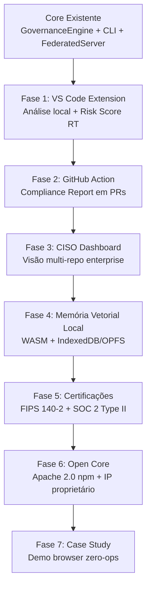
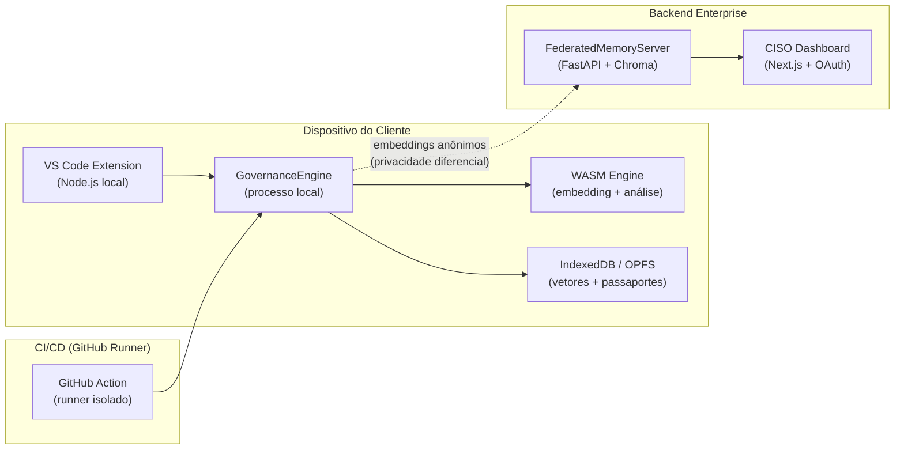
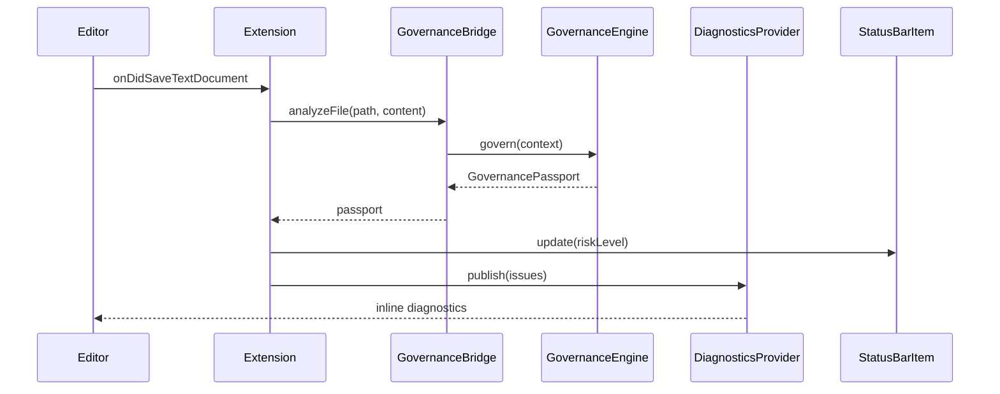
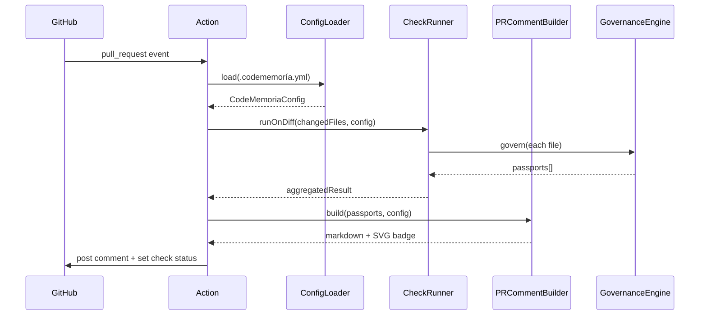
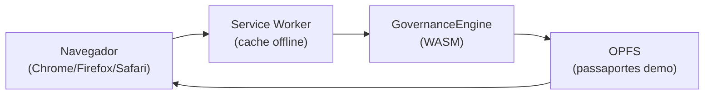

# Design Técnico — Cadeia de Periodização CodeMemória

## Visão Geral

O CodeMemória é uma plataforma de governança de código gerado por IA posicionada como "anti-Copilot": vende responsabilidade e compliance em vez de velocidade. A cadeia de periodização define 7 fases sequenciais que evoluem o produto de uma extensão de editor até um ecossistema certificado com estratégia Open Core.

A arquitetura central é **zero-ops com soberania**: o navegador (ou processo local) vira o datacenter do cliente usando WASM + WebGPU + IndexedDB/OPFS + Service Workers. Zero dados de código saem do dispositivo do cliente.

O núcleo técnico já existe:
- `GovernanceEngine` — orquestrador principal (`src/governance/GovernanceEngine.ts`)
- `ComplianceCheckerAdapter` — verificação via contratos YAML
- `HybridMemoryAdapter` — persistência SQLite + Chroma opcional
- `AuditLoggerAdapter` — cadeia de hashes imutável em arquivos JSON
- `FederatedMemoryAdapter` — memória federada com privacidade diferencial
- `FederatedMemoryServer` — servidor Python FastAPI (`federated-server/main.py`)
- CLI existente com comandos `govern`, `validate`, `audit`

Cada fase constrói sobre os artefatos da fase anterior, com gates de entrada/saída formais.

---

## Arquitetura

### Diagrama de Fases e Dependências



### Arquitetura de Soberania de Dados



---

## Componentes e Interfaces

### Fase 1 — VS Code Extension

**Novo componente:** `packages/vscode-extension/`

```
packages/vscode-extension/
├── src/
│   ├── extension.ts          # Ponto de entrada (activate/deactivate)
│   ├── GovernanceBridge.ts   # Wrapper que invoca GovernanceEngine via Node.js child process
│   ├── DiagnosticsProvider.ts # Mapeia issues → VS Code Diagnostics API
│   ├── StatusBarItem.ts      # Exibe Risk Score na barra de status
│   └── PassportPanel.ts      # WebviewPanel com GovernancePassport completo
├── package.json              # engines: vscode ^1.85.0
└── tsconfig.json
```

**Interface `GovernanceBridge`:**
```typescript
interface GovernanceBridge {
  analyzeFile(filePath: string, content: string): Promise<GovernancePassport>;
  getLastPassport(filePath: string): GovernancePassport | null;
}
```

A extensão invoca o GovernanceEngine no processo Node.js local da extensão (sem servidor externo). O `GovernanceBridge` reutiliza `createGovernanceStack()` de `src/governance/index.ts` diretamente — mesma lógica da CLI, garantindo equivalência de passaportes (Requisito 1.8).

**Fluxo de análise:**


### Fase 2 — GitHub Action

**Novo componente:** `packages/github-action/`

```
packages/github-action/
├── action.yml                # Metadados da action (inputs/outputs)
├── src/
│   ├── main.ts               # Entrypoint (@actions/core)
│   ├── PRCommentBuilder.ts   # Monta comentário Markdown + badge SVG
│   ├── ConfigLoader.ts       # Lê .codememoría.yml com defaults
│   └── CheckRunner.ts        # Executa GovernanceEngine nos arquivos diff
├── dist/                     # Bundle compilado (ncc)
└── package.json
```

**Interface `ConfigLoader`:**
```typescript
interface CodeMemoriaConfig {
  ignorePatterns: string[];       // default: []
  failureThreshold: RiskLevel;    // default: 'high'
  contractIds: string[];          // default: contratos do diretório ./contracts
}
```

**Fluxo do PR:**


O badge SVG é gerado inline (sem serviço externo) usando template SVG parametrizado com a cor do risk level.

### Fase 3 — CISO Dashboard

**Novo componente:** `packages/ciso-dashboard/` (Next.js 14 App Router)

```
packages/ciso-dashboard/
├── app/
│   ├── api/
│   │   ├── passports/route.ts    # Proxy para FederatedMemoryServer
│   │   └── auth/[...nextauth]/   # NextAuth.js com GitHub OAuth
│   ├── dashboard/page.tsx        # Visão consolidada multi-repo
│   └── layout.tsx
├── components/
│   ├── RiskTrendChart.tsx        # Recharts — tendência histórica
│   ├── IssueTable.tsx            # Tabela filtrada de issues
│   └── PDFExporter.tsx           # react-pdf para relatório executivo
└── lib/
    └── federatedClient.ts        # Cliente HTTP para FederatedMemoryServer
```

**Extensão do FederatedMemoryServer** para suportar o dashboard:

```python
# Novos endpoints em federated-server/main.py
GET  /passports?repo={id}&since={iso}&severity={level}
GET  /passports/{passport_id}
GET  /repos                    # Lista repositórios com passaportes
GET  /repos/{id}/trend         # Tendência histórica de 90 dias
```

**Autenticação:** NextAuth.js com provider GitHub OAuth. O middleware Next.js valida o JWT em todas as rotas `/dashboard/*` e `/api/*`.

### Fase 4 — Memória Vetorial Local

**Novo componente:** `packages/vector-memory/`

```
packages/vector-memory/
├── src/
│   ├── VectorMemoryAdapter.ts    # Implementa IHybridMemory para browser
│   ├── WasmEmbeddingEngine.ts    # Carrega modelo ONNX via onnxruntime-web
│   ├── IndexedDBStore.ts         # Persistência de vetores quantizados
│   ├── QuantizationCodec.ts      # Float32 → Int8 (quantização 8-bit)
│   └── LRUEvictionPolicy.ts      # Eviction quando storage < 100MB
├── wasm/
│   └── embedding-model.onnx      # Modelo quantizado (< 5MB)
└── package.json
```

**Interface `VectorMemoryAdapter`** (implementa `IHybridMemory`):
```typescript
class VectorMemoryAdapter implements IHybridMemory {
  async save(passport: GovernancePassport): Promise<void>;
  async recall(fingerprint: CodeFingerprint, threshold: number): Promise<GovernancePassport[]>;
  async getSuccessRate(fingerprint: CodeFingerprint): Promise<number>;
}
```

**Estratégia de quantização:**
- Vetores float32 (384 dims × 4 bytes = 1.536 bytes) → Int8 (384 bytes) = redução de 75%
- Fórmula: `q = clamp(round(v / scale + zero_point), -128, 127)`
- `scale` e `zero_point` armazenados por vetor para dequantização fiel

**Fallback WebGPU → WASM:**
```typescript
const backend = (await navigator.gpu?.requestAdapter()) ? 'webgpu' : 'wasm';
await ort.InferenceSession.create(modelPath, { executionProviders: [backend] });
```

### Fase 5 — Certificações Regulatórias

**Modificações nos componentes existentes:**

| Componente | Modificação |
|---|---|
| `AuditLoggerAdapter` | Adicionar política de retenção configurável (mínimo 1 ano) |
| `GovernanceEngine` | Validar que apenas SHA-256/384/512 são usados (rejeitar MD5/SHA-1) |
| `HybridMemoryAdapter` | Criptografia AES-256-GCM em repouso para passaportes |
| Novo: `RBACMiddleware` | Controle de acesso por papel (viewer/analyst/admin) |
| Novo: `SOC2EvidenceExporter` | Exporta logs de acesso no formato exigido por auditores |

**Novo componente `RBACMiddleware`:**
```typescript
type Role = 'viewer' | 'analyst' | 'admin';

interface RBACMiddleware {
  authorize(actor: string, operation: Operation): boolean;
  getRole(actor: string): Role;
}
```

**Criptografia em repouso (AES-256-GCM):**
```typescript
// Em HybridMemoryAdapter.save()
const { ciphertext, iv, tag } = await crypto.subtle.encrypt(
  { name: 'AES-GCM', iv },
  key,
  new TextEncoder().encode(JSON.stringify(passport))
);
```

### Fase 6 — Open Core Estratégico

**Estrutura do pacote npm público:**

```
@codememoría/governance/          # Apache 2.0
├── src/
│   ├── GovernanceEngine.ts       # Engine principal (open)
│   ├── interfaces.ts             # IGovernanceEngine, IHybridMemory, etc.
│   ├── types.ts                  # Tipos públicos
│   └── telemetry/
│       └── OptInTelemetry.ts     # Telemetria opt-in (versão, risk level agregado)
└── package.json

@codememoría/enterprise/          # Proprietário (não publicado)
├── PaperToContract.ts            # IP proprietário
├── ComponentPool.ts              # IP proprietário
└── index.ts                      # Retorna erro descritivo se acessado sem licença
```

**Telemetria opt-in:**
```typescript
interface TelemetryEvent {
  version: string;
  analysisType: 'fast' | 'thorough' | 'compliance-first';
  riskLevel: RiskLevel;  // sem código, sem fingerprint
}
```

**Verificação de licença para módulos proprietários:**
```typescript
// Em @codememoría/enterprise/index.ts
export function getPaperToContract(): never {
  throw new EnterpriseFeatureError(
    'PaperToContract requer assinatura enterprise. Acesse: https://codememoría.dev/upgrade'
  );
}
```

### Fase 7 — Case Study e Demo Browser

**Novo componente:** `packages/demo-browser/` (Vite + WASM)

```
packages/demo-browser/
├── src/
│   ├── main.ts                   # Inicializa GovernanceEngine no browser
│   ├── DemoScenario.ts           # Código sintético equivalente ao caso real
│   ├── PassportViewer.ts         # Renderiza GovernancePassport no DOM
│   └── IntegrityVerifier.ts      # Verifica hash do passaporte anonimizado
├── public/
│   └── anonymized-passport.json  # Passaporte anonimizado do case study
└── vite.config.ts                # WASM + OPFS + Service Worker
```

**Arquitetura zero-ops do demo:**


O `GovernancePassport` do case study é distribuído como arquivo estático com hash SHA-256 verificável pela CLI: `npx @codememoría/governance verify --passport anonymized-passport.json`.

---

## Modelos de Dados

### GovernancePassport (existente, sem alteração)

```typescript
interface GovernancePassport {
  passportId: string;           // UUID v4
  codeFingerprint: CodeFingerprint;
  validations: ValidationResult[];
  complianceStamps: ComplianceStamp[];
  auditTrail: AuditTrail[];
  memoryEnriched: boolean;
  riskLevel: RiskLevel;         // 'low' | 'medium' | 'high' | 'critical'
  estimatedRemediationCost: number;
}
```

### CodeMemoriaConfig (Fase 2 — novo)

```typescript
interface CodeMemoriaConfig {
  ignorePatterns: string[];
  failureThreshold: RiskLevel;
  contractIds: string[];
  reportFormat: 'summary' | 'full';
}
```

### QuantizedVector (Fase 4 — novo)

```typescript
interface QuantizedVector {
  passportId: string;
  data: Int8Array;              // 384 dimensões quantizadas
  scale: number;                // fator de escala para dequantização
  zeroPoint: number;
  lastAccessedAt: number;       // timestamp para LRU eviction
}
```

### RBACPolicy (Fase 5 — novo)

```typescript
interface RBACPolicy {
  actor: string;
  role: 'viewer' | 'analyst' | 'admin';
  grantedAt: Date;
  grantedBy: string;
}

type Operation =
  | 'read:report'
  | 'execute:analysis'
  | 'export:evidence'
  | 'configure:system';
```

### TelemetryEvent (Fase 6 — novo)

```typescript
interface TelemetryEvent {
  version: string;
  analysisType: GovernanceStrategy;
  riskLevel: RiskLevel;
  timestamp: string;            // ISO 8601, sem timezone local
}
```

### DemoScenario (Fase 7 — novo)

```typescript
interface DemoScenario {
  scenarioId: string;
  title: string;
  syntheticCode: string;        // código sintético equivalente
  expectedRiskLevel: RiskLevel;
  expectedViolations: string[]; // IDs de cláusulas violadas
  anonymizedPassportHash: string;
}
```

---

## Propriedades de Correção

*Uma propriedade é uma característica ou comportamento que deve ser verdadeiro em todas as execuções válidas de um sistema — essencialmente, uma declaração formal sobre o que o sistema deve fazer. Propriedades servem como ponte entre especificações legíveis por humanos e garantias de correção verificáveis por máquina.*

### Propriedade 1: Equivalência CLI/Extensão

*Para qualquer* arquivo de código, o `GovernancePassport` produzido pela VS Code Extension deve ser idêntico ao produzido pela CLI para o mesmo arquivo, mesma estratégia e mesmos contratos — especificamente: mesmo `riskLevel`, mesmo conjunto de `complianceStamps` e mesmo `codeFingerprint.hash`.

**Valida: Requisito 1.8**

### Propriedade 2: Verificabilidade Cross-Ambiente do Hash

*Para qualquer* pull request processado pela GitHub Action, o hash de integridade do `Compliance_Report` postado no PR deve ser verificável localmente usando a CLI com o comando `govern --output json` no mesmo conjunto de arquivos modificados.

**Valida: Requisito 2.9**

### Propriedade 3: Risk Level Determina Check Status

*Para qualquer* conjunto de arquivos processados pela GitHub Action, se o `riskLevel` médio for `high` ou `critical` então o check status deve ser `failure`; se for `low` ou `medium` então deve ser `success` — e essa relação deve ser bidirecional e exaustiva.

**Valida: Requisitos 2.4, 2.5**

### Propriedade 4: Configuração Padrão é Identidade

*Para qualquer* repositório sem arquivo `.codememoría.yml`, o comportamento da GitHub Action deve ser idêntico ao comportamento com um arquivo `.codememoría.yml` contendo `failureThreshold: high`, `ignorePatterns: []` e `contractIds: []`.

**Valida: Requisito 2.8**

### Propriedade 5: Rastreabilidade dos Dados do Dashboard

*Para qualquer* dado exibido no CISO Dashboard (contagem de issues, risk score, tendência), o valor deve ser derivável exclusivamente de `GovernancePassports` cujo `auditTrail` contenha pelo menos uma entrada com `chainHash` verificável.

**Valida: Requisito 3.9**

### Propriedade 6: Fidelidade de Quantização

*Para qualquer* embedding float32 de 384 dimensões, a similaridade de cosseno calculada com o vetor quantizado em 8-bit deve diferir da similaridade calculada com o vetor original em no máximo 0.001.

**Valida: Requisito 4.8**

### Propriedade 7: Soberania Vetorial

*Para qualquer* operação de `save` ou `recall` no `VectorMemoryAdapter`, nenhuma chamada de rede externa deve ser realizada — todos os embeddings devem ser gerados e armazenados exclusivamente no processo local ou no armazenamento do dispositivo (IndexedDB/OPFS).

**Valida: Requisitos 4.1, 4.2, 4.4**

### Propriedade 8: Compressão de Vetores

*Para qualquer* vetor float32 de 384 dimensões, o tamanho em bytes do vetor quantizado em 8-bit deve ser menor ou igual a 40% do tamanho do vetor original (redução de pelo menos 60%).

**Valida: Requisito 4.6**

### Propriedade 9: Eviction LRU Libera Espaço

*Para qualquer* estado do `VectorMemoryAdapter` onde o armazenamento disponível é inferior a 100MB, após a execução da política de eviction LRU, o espaço ocupado pelos vetores deve ser estritamente menor que o espaço ocupado antes da eviction.

**Valida: Requisito 4.7**

### Propriedade 10: Conformidade Criptográfica FIPS

*Para qualquer* operação criptográfica executada pelo GovernanceEngine ou AuditLoggerAdapter, o algoritmo usado deve estar na lista aprovada FIPS 140-2 (SHA-256, SHA-384, SHA-512, AES-256-GCM) — verificável por inspeção estática do código-fonte.

**Valida: Requisitos 5.1, 5.9**

### Propriedade 11: RBAC — Autorização por Papel

*Para qualquer* par (ator, operação), o `RBACMiddleware` deve autorizar a operação se e somente se o papel do ator inclui aquela operação na sua lista de permissões — e essa relação deve ser consistente para todos os papéis (`viewer`, `analyst`, `admin`) e todas as operações definidas.

**Valida: Requisito 5.3**

### Propriedade 12: Completude do Log de Auditoria

*Para qualquer* operação de acesso a dados sensíveis executada pelo sistema, a entrada correspondente no `AuditLoggerAdapter` deve conter todos os campos obrigatórios: identidade do ator, timestamp, operação realizada, recurso acessado e resultado (sucesso/falha).

**Valida: Requisito 5.4**

### Propriedade 13: Criptografia em Repouso Round-Trip

*Para qualquer* `GovernancePassport`, criptografar com AES-256-GCM e depois descriptografar com a mesma chave deve produzir um passaporte estruturalmente idêntico ao original.

**Valida: Requisito 5.6**

### Propriedade 14: Extensibilidade via Injeção de Dependência

*Para qualquer* implementação válida das interfaces públicas (`IHybridMemory`, `IComplianceChecker`, `IAuditLogger`), o `GovernanceEngine` deve aceitar o adaptador via injeção de dependência e produzir um `GovernancePassport` válido sem modificação do core.

**Valida: Requisitos 6.4, 6.5**

### Propriedade 15: Privacidade da Telemetria

*Para qualquer* evento de telemetria emitido pelo pacote open source, o payload deve conter apenas os campos permitidos (`version`, `analysisType`, `riskLevel`) e não deve conter código-fonte, `codeFingerprint`, `passportId` ou qualquer dado identificável do usuário.

**Valida: Requisito 6.7**

### Propriedade 16: Retrocompatibilidade da API Pública

*Para qualquer* chamada de API válida na versão N do pacote `@codememoría/governance`, a mesma chamada deve compilar e executar sem erros na versão N+1 (sem breaking changes em minor versions).

**Valida: Requisito 6.9**

### Propriedade 17: Rastreabilidade de Claims Quantitativos

*Para qualquer* afirmação quantitativa no Case Study (tempo de detecção, número de violações, risk score, custo estimado), o valor deve ser derivável de um `GovernancePassport` com `auditTrail` cujo `chainHash` corresponde ao hash SHA-256 publicado no artefato do case study.

**Valida: Requisito 7.8**

---

## Tratamento de Erros

### Fase 1 — VS Code Extension

| Cenário | Comportamento |
|---|---|
| GovernanceEngine lança exceção | Exibe notificação não-bloqueante; mantém último Risk Score conhecido na status bar |
| Arquivo sem contratos carregados | Exibe aviso "Nenhum contrato YAML encontrado em ./contracts" na status bar |
| Timeout de análise (> 3s) | Cancela análise; exibe "⏱ Análise cancelada (timeout)" |

### Fase 2 — GitHub Action

| Cenário | Comportamento |
|---|---|
| `.codememoría.yml` malformado | Loga aviso e usa configuração padrão; não falha o workflow |
| GovernanceEngine falha em arquivo específico | Registra erro no log da action; continua com demais arquivos; inclui nota no comentário do PR |
| GitHub API indisponível para postar comentário | Falha com exit code 1 e mensagem descritiva |

### Fase 3 — CISO Dashboard

| Cenário | Comportamento |
|---|---|
| FederatedMemoryServer indisponível | Exibe banner "Dados podem estar desatualizados" com timestamp do último sync |
| OAuth GitHub falha | Redireciona para página de erro com instrução de reautenticação |
| Repositório sem passaportes nos últimos 30 dias | Exibe alerta "Repositório sem auditoria recente" (Requisito 3.7) |

### Fase 4 — Memória Vetorial Local

| Cenário | Comportamento |
|---|---|
| WebGPU não disponível | Fallback automático para WASM (Requisito 4.5) |
| Storage < 100MB | Ativa política LRU eviction (Requisito 4.7) |
| Modelo ONNX corrompido | Lança `WasmLoadError` com instrução de reinstalação |

### Fase 5 — Certificações

| Cenário | Comportamento |
|---|---|
| Tentativa de uso de MD5/SHA-1 | `GovernanceEngine` lança `FIPSViolationError` antes de executar |
| Acesso não autorizado detectado | Bloqueia operação, registra no `AuditLoggerAdapter`, notifica admin (Requisito 5.7) |
| Falha na criptografia AES-256-GCM | Lança `EncryptionError`; passaporte não é persistido |

### Fase 6 — Open Core

| Cenário | Comportamento |
|---|---|
| Acesso a módulo proprietário sem licença | Lança `EnterpriseFeatureError` com link de upgrade (Requisito 6.8) |
| Adaptador customizado não implementa interface | TypeScript compile error (verificação em tempo de compilação) |

### Fase 7 — Case Study / Demo

| Cenário | Comportamento |
|---|---|
| OPFS não disponível no browser | Fallback para IndexedDB |
| Hash do passaporte anonimizado não bate | Exibe aviso "Integridade do passaporte não verificada" |

---

## Estratégia de Testes

### Abordagem Dual

Cada fase usa **testes unitários** para exemplos concretos e casos de borda, e **testes baseados em propriedades** para validar invariantes universais.

- Testes unitários: exemplos específicos, integrações entre componentes, casos de erro
- Testes de propriedade: invariantes que devem valer para qualquer entrada gerada

### Biblioteca de Testes de Propriedade

**TypeScript/Node.js:** `fast-check` (já presente no ecossistema do projeto)
**Python (FederatedMemoryServer):** `hypothesis`

Cada teste de propriedade deve rodar com mínimo de **100 iterações**.

### Testes por Fase

**Fase 1 — VS Code Extension**
- Unitário: `GovernanceBridge` invoca `createGovernanceStack()` com os mesmos parâmetros que a CLI
- Unitário: Notificação não-bloqueante é exibida quando GovernanceEngine lança exceção (Req 1.6)
- Propriedade (P1): `fc.property(fc.string(), code => passport_extension(code) deepEquals passport_cli(code))`
  - Tag: `Feature: periodization-roadmap, Property 1: Equivalência CLI/Extensão`

**Fase 2 — GitHub Action**
- Unitário: `ConfigLoader` retorna defaults quando `.codememoría.yml` não existe
- Unitário: Badge SVG é gerado inline sem chamada de rede externa
- Propriedade (P2): `fc.property(fc.array(fc.string()), files => hash_in_pr_comment === hash_from_cli(files))`
  - Tag: `Feature: periodization-roadmap, Property 2: Verificabilidade Cross-Ambiente do Hash`
- Propriedade (P3): `fc.property(passportArrayArb, passports => check_status(avg_risk(passports)) === expected_status(avg_risk(passports)))`
  - Tag: `Feature: periodization-roadmap, Property 3: Risk Level Determina Check Status`
- Propriedade (P4): `fc.property(repoWithoutConfigArb, repo => behavior(repo, no_config) === behavior(repo, default_config))`
  - Tag: `Feature: periodization-roadmap, Property 4: Configuração Padrão é Identidade`

**Fase 3 — CISO Dashboard**
- Unitário: Alerta de "repositório sem auditoria recente" aparece quando último passaporte > 30 dias (Req 3.7)
- Unitário: Rotas protegidas retornam 401 sem token OAuth válido (Req 3.6)
- Propriedade (P5): `fc.property(fc.array(passportArb), passports => all_dashboard_values_derived_from_verified_passports(passports))`
  - Tag: `Feature: periodization-roadmap, Property 5: Rastreabilidade dos Dados do Dashboard`

**Fase 4 — Memória Vetorial Local**
- Unitário: `QuantizationCodec` round-trip para vetor de zeros e vetor de uns
- Unitário: Fallback WASM é ativado quando `navigator.gpu` é undefined (Req 4.5)
- Propriedade (P6): `fc.property(float32ArrayArb(384), v => Math.abs(cosine(v, dequantize(quantize(v))) - 1.0) < 0.001)`
  - Tag: `Feature: periodization-roadmap, Property 6: Fidelidade de Quantização`
- Propriedade (P7): `fc.property(codeArb, code => no_network_calls_during(vectorMemory.save(code)) && no_network_calls_during(vectorMemory.recall(code)))`
  - Tag: `Feature: periodization-roadmap, Property 7: Soberania Vetorial`
- Propriedade (P8): `fc.property(float32ArrayArb(384), v => byteSize(quantize(v)) <= 0.4 * byteSize(v))`
  - Tag: `Feature: periodization-roadmap, Property 8: Compressão de Vetores`
- Propriedade (P9): `fc.property(lowStorageStateArb, state => after_lru_eviction(state).usedBytes < state.usedBytes)`
  - Tag: `Feature: periodization-roadmap, Property 9: Eviction LRU Libera Espaço`

**Fase 5 — Certificações**
- Unitário: `AuditLoggerAdapter` rejeita configuração de retenção < 1 ano (Req 5.2)
- Unitário: Acesso não autorizado bloqueia operação e registra no audit log (Req 5.7)
- Exemplo: `SOC2EvidenceExporter` produz relatório com todas as seções obrigatórias (Req 5.8)
- Propriedade (P10): Inspeção estática via AST — `fc.property(sourceFileArb, src => no_forbidden_crypto_calls(src))`
  - Tag: `Feature: periodization-roadmap, Property 10: Conformidade Criptográfica FIPS`
- Propriedade (P11): `fc.property(fc.tuple(actorArb, operationArb), ([actor, op]) => rbac.authorize(actor, op) === role_allows(rbac.getRole(actor), op))`
  - Tag: `Feature: periodization-roadmap, Property 11: RBAC — Autorização por Papel`
- Propriedade (P12): `fc.property(sensitiveOperationArb, op => audit_entry(op).hasAllFields(['actor', 'timestamp', 'operation', 'resource', 'result']))`
  - Tag: `Feature: periodization-roadmap, Property 12: Completude do Log de Auditoria`
- Propriedade (P13): `fc.property(passportArb, p => deserialize(decrypt(encrypt(serialize(p)))) deepEquals p)`
  - Tag: `Feature: periodization-roadmap, Property 13: Criptografia em Repouso Round-Trip`

**Fase 6 — Open Core**
- Unitário: `EnterpriseFeatureError` é lançado ao acessar `PaperToContract` sem licença (Req 6.8)
- Unitário: Bundle npm não contém código de `PaperToContract` ou `ComponentPool` (Req 6.2, 6.3)
- Exemplo: Arquivos `CONTRIBUTING.md` e `CODE_OF_CONDUCT.md` existem no repositório (Req 6.6)
- Propriedade (P14): `fc.property(customAdapterArb, adapter => governanceEngine(adapter).govern(ctx) instanceof GovernancePassport)`
  - Tag: `Feature: periodization-roadmap, Property 14: Extensibilidade via Injeção de Dependência`
- Propriedade (P15): `fc.property(telemetryEventArb, event => Object.keys(event).every(k => ['version','analysisType','riskLevel'].includes(k)))`
  - Tag: `Feature: periodization-roadmap, Property 15: Privacidade da Telemetria`
- Propriedade (P16): `fc.property(apiCallArb, call => compiles_with_v_prev(call) implies compiles_with_v_current(call))`
  - Tag: `Feature: periodization-roadmap, Property 16: Retrocompatibilidade da API Pública`

**Fase 7 — Case Study**
- Unitário: `IntegrityVerifier` valida hash do passaporte anonimizado distribuído (Req 7.3)
- Unitário: Demo browser carrega e executa análise sem criar conta ou instalar software (Req 7.4)
- Propriedade (P17): `fc.property(passportArb, p => all_quantitative_claims_derivable_from_audit_trail(p))`
  - Tag: `Feature: periodization-roadmap, Property 17: Rastreabilidade de Claims Quantitativos`

### Testes de Integração por Fase

Cada fase deve ter um teste de integração end-to-end que valida o gate de saída mínimo:

| Fase | Teste de Integração |
|---|---|
| F1 | Extensão analisa arquivo TypeScript real e produz passaporte idêntico à CLI |
| F2 | Action processa diff simulado e posta comentário com hash verificável |
| F3 | Dashboard exibe dados de 3 repositórios com passaportes reais do FederatedServer |
| F4 | VectorMemoryAdapter busca 5 passaportes similares em base de 10.000 em < 500ms |
| F5 | GovernanceEngine rejeita código que tenta usar MD5 com `FIPSViolationError` |
| F6 | Pacote npm instalado em projeto externo aceita adaptador customizado via DI |
| F7 | Demo browser executa análise completa offline e verifica hash do passaporte |
