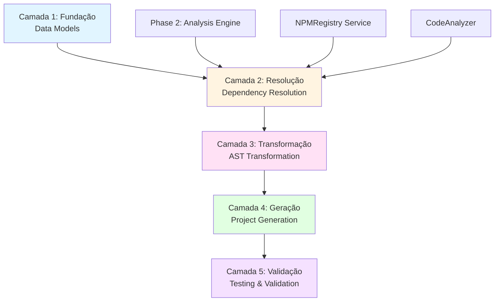
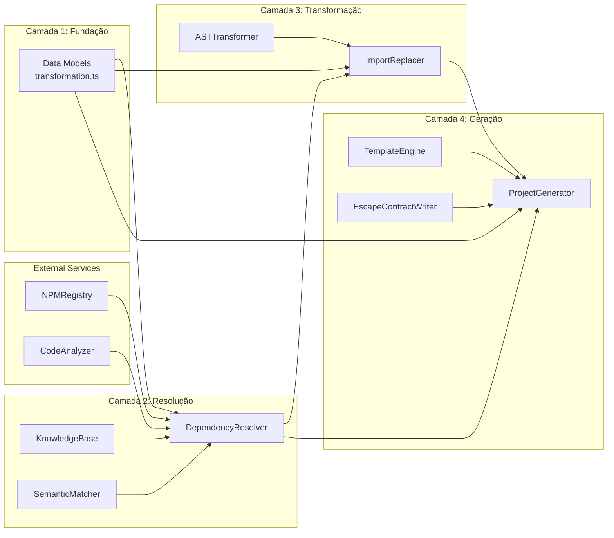
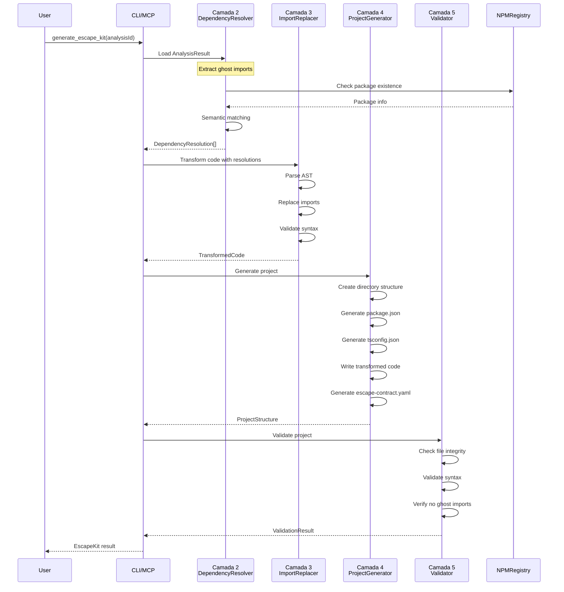
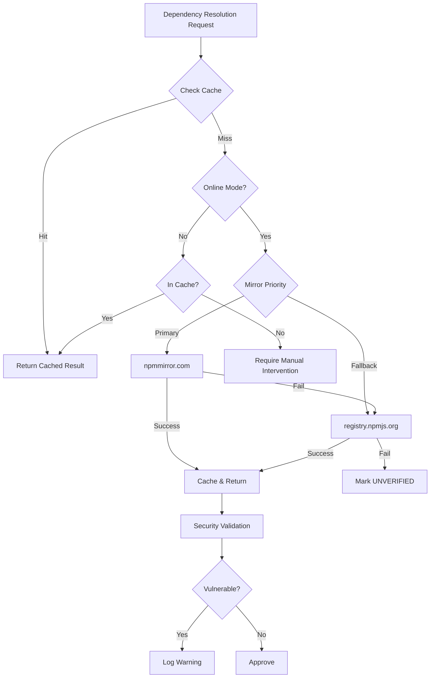
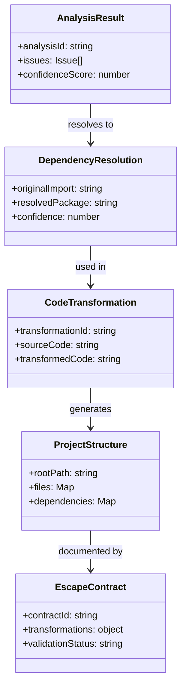
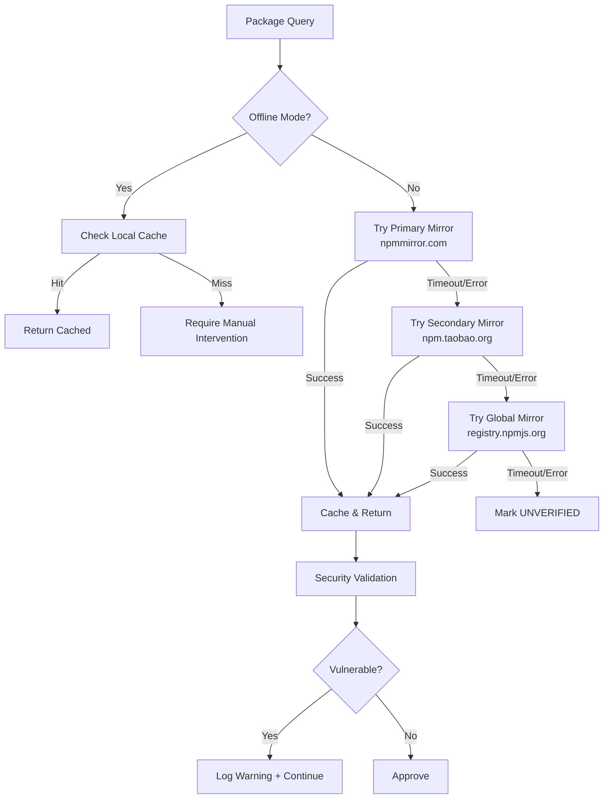

# Design Document: Phase 3 Transformation Engine

## Overview

The Phase 3 Transformation Engine implements a 5-layer procedural architecture (Camadas 1-5) for transforming analyzed sandbox code into production-ready projects. This engine is the core code generation component of EscapeKit MCP, converting ghost imports into real npm packages, transforming AST nodes, generating project scaffolding, and validating outputs.

The architecture follows Chinese technological sovereignty principles (自主创新 - Zizhu Chuangxin), emphasizing independence, security, and innovation through:
- Offline-capable operation with cached package data
- Support for Chinese npm mirrors (npmmirror.com)
- Supply chain security validation
- Air-gapped environment support
- Reproducible builds with locked dependencies

### Design Goals

1. **Layered Independence**: Each layer (Fundação, Resolução, Transformação, Geração, Validação) operates independently with clear boundaries
2. **Testability**: Property-based testing at each layer ensures correctness across all inputs
3. **Integration**: Seamless integration with Phase 2 components (CodeAnalyzer, NPMRegistry, detectors)
4. **Performance**: Sub-10-second transformation for typical projects with caching
5. **Auditability**: Complete transformation tracking via Escape Contracts
6. **Extensibility**: Template-based generation supporting multiple target platforms

### Key Components

- **Camada 1 (Fundação)**: Data models and type definitions
- **Camada 2 (Resolução)**: Dependency resolution with knowledge base and semantic matching
- **Camada 3 (Transformação)**: AST-based code transformation preserving formatting
- **Camada 4 (Geração)**: Project scaffolding and configuration file generation
- **Camada 5 (Validação)**: Automated validation and property-based testing

## Architecture

### 5-Layer Procedural Architecture

The transformation engine follows a strict layered architecture where each layer builds upon the previous:



### Layer Dependencies



### Data Flow Through Transformation Pipeline



### Chinese Technological Sovereignty Implementation (自主创新)

The transformation engine implements technological independence through:

1. **Mirror Support**: Prioritize Chinese npm mirrors with automatic fallback
2. **Offline Operation**: Full functionality with pre-populated cache
3. **Supply Chain Security**: Validate package integrity and detect vulnerabilities
4. **Audit Logging**: Track all external network requests
5. **Air-Gapped Support**: Enterprise deployment without internet access
6. **Reproducible Builds**: Lock dependency versions for consistency



## Components and Interfaces

### Camada 1: Fundação (Data Models)

Location: `src/models/transformation.ts`

This layer defines all data structures with zero dependencies on other layers.

#### Core Interfaces

```typescript
// Mapping strategies for ghost import resolution
export enum MappingStrategy {
  EXACT_MATCH = 'EXACT_MATCH',           // Direct 1:1 mapping
  SEMANTIC_MATCH = 'SEMANTIC_MATCH',     // Fuzzy/semantic similarity
  MANUAL_OVERRIDE = 'MANUAL_OVERRIDE',   // User-provided mapping
  FALLBACK = 'FALLBACK'                  // Default fallback option
}

// Methods for resolving dependencies
export enum ResolutionMethod {
  KNOWLEDGE_BASE = 'KNOWLEDGE_BASE',     // From built-in knowledge base
  NPM_SEARCH = 'NPM_SEARCH',             // From npm registry search
  SEMANTIC_ANALYSIS = 'SEMANTIC_ANALYSIS', // From semantic matching
  USER_PROVIDED = 'USER_PROVIDED'        // User-specified resolution
}

// Types of transformations applied
export enum TransformationType {
  IMPORT_REPLACEMENT = 'IMPORT_REPLACEMENT',     // Replace import statement
  POLYFILL_INJECTION = 'POLYFILL_INJECTION',     // Add polyfill code
  API_MIGRATION = 'API_MIGRATION',               // Migrate API calls
  CONFIGURATION_GENERATION = 'CONFIGURATION_GENERATION' // Generate config files
}

// Package mapping from ghost to real
export interface PackageMapping {
  ghostPackage: string;              // Original non-existent package
  realPackages: string[];            // Alternative real packages (ranked)
  confidence: number;                // Confidence score 0.0-1.0
  mappingStrategy: MappingStrategy;  // How mapping was determined
  metadata?: {
    reason?: string;                 // Why this mapping was chosen
    alternatives?: string[];         // Other considered options
    source?: string;                 // Source of mapping (KB, search, etc)
  };
}

// Transformation rule for code changes
export interface TransformationRule {
  ruleId: string;                    // Unique rule identifier
  ruleType: TransformationType;      // Type of transformation
  sourcePattern: string;             // Pattern to match (regex or literal)
  targetPattern: string;             // Replacement pattern
  metadata?: {
    description?: string;            // Human-readable description
    examples?: string[];             // Example transformations
    tags?: string[];                 // Categorization tags
  };
}

// Result of dependency resolution
export interface DependencyResolution {
  originalImport: string;            // Original ghost import
  resolvedPackage: string;           // Resolved real package
  version: string;                   // Package version
  resolutionMethod: ResolutionMethod; // How it was resolved
  confidence: number;                // Confidence score 0.0-1.0
  metadata?: {
    alternatives?: string[];         // Other options considered
    reasoning?: string;              // Why this was chosen
    npmInfo?: {                      // NPM registry metadata
      downloads?: number;
      lastUpdate?: string;
      deprecated?: boolean;
    };
  };
}

// Result of code transformation
export interface CodeTransformation {
  transformationId: string;          // Unique transformation ID
  sourceCode: string;                // Original code
  transformedCode: string;           // Transformed code
  appliedRules: TransformationRule[]; // Rules that were applied
  timestamp: string;                 // When transformation occurred
  metadata?: {
    diff?: string;                   // Unified diff of changes
    stats?: {                        // Transformation statistics
      linesChanged: number;
      importsReplaced: number;
      polyfillsAdded: number;
    };
  };
}

// Generated project structure
export interface ProjectStructure {
  rootPath: string;                  // Root directory path
  directories: string[];             // Created directories
  files: Map<string, string>;        // File path -> content
  dependencies: Map<string, string>; // Package -> version
  configuration: {                   // Project configuration
    packageJson: Record<string, unknown>;
    tsConfig?: Record<string, unknown>;
    eslintConfig?: Record<string, unknown>;
  };
}

// Escape contract document
export interface EscapeContract {
  contractId: string;                // Unique contract ID
  analysisId: string;                // Reference to analysis
  origin: {                          // Source information
    sandboxType?: string;
    originalCodeHash: string;        // SHA-256 of original code
    detectedIssues: number;
  };
  transformations: {                 // Applied transformations
    ghostImportResolutions: DependencyResolution[];
    codeTransformations: CodeTransformation[];
    appliedRules: TransformationRule[];
  };
  assumptions: string[];             // Manual interventions/assumptions
  validationStatus: 'PENDING' | 'PASSED' | 'FAILED';
  metadata: {                        // Generation metadata
    generatedBy: string;             // Tool name and version
    toolVersion: string;
    targetPlatform: string;
    timestamp: string;
  };
}
```


### Camada 2: Resolução (Dependency Resolution)

Location: `src/resolvers/`

This layer resolves ghost imports to real packages using knowledge base, semantic matching, and NPM registry validation.

#### DependencyResolver

Main orchestrator for dependency resolution.

```typescript
export class DependencyResolver {
  constructor(
    private npmRegistry: NPMRegistry,
    private knowledgeBase: KnowledgeBase,
    private semanticMatcher: SemanticMatcher,
    private config: ResolverConfig
  );

  /**
   * Resolve a single ghost import to real package(s)
   * Returns DependencyResolution with confidence score
   */
  async resolve(ghostImport: string): Promise<DependencyResolution>;

  /**
   * Resolve multiple ghost imports in batch
   * More efficient than individual calls
   */
  async resolveBatch(ghostImports: string[]): Promise<DependencyResolution[]>;

  /**
   * Add manual override mapping
   * Highest priority resolution method
   */
  addManualMapping(ghost: string, real: string): void;

  /**
   * Clear resolution cache
   */
  clearCache(): void;
}
```

**Resolution Algorithm**:
1. Check manual overrides (confidence: 1.0)
2. Check knowledge base for exact match (confidence: 0.95)
3. Perform semantic matching (confidence: 0.5-0.9)
4. Validate with NPM registry
5. Rank alternatives by confidence score

#### KnowledgeBase

Built-in mappings for common ghost imports.

```typescript
export class KnowledgeBase {
  /**
   * Get exact match from knowledge base
   */
  getMapping(ghostPackage: string): PackageMapping | null;

  /**
   * Add new mapping to knowledge base
   */
  addMapping(mapping: PackageMapping): void;

  /**
   * Load mappings from JSON file
   */
  loadFromFile(path: string): void;

  /**
   * Export mappings to JSON file
   */
  exportToFile(path: string): void;
}
```

**Initial Knowledge Base** (examples):
- `fake-api-client` → `axios`, `node-fetch`
- `mock-database` → `better-sqlite3`, `pg`
- `sandbox-canvas` → `canvas`, `node-canvas`
- `test-utils` → `@testing-library/react`, `vitest`

#### SemanticMatcher

Fuzzy matching for package names using Levenshtein distance and keyword analysis.

```typescript
export class SemanticMatcher {
  /**
   * Find semantically similar packages
   * Returns ranked list with confidence scores
   */
  async findSimilar(
    ghostPackage: string,
    options?: {
      minSimilarity?: number;  // Default: 0.7
      maxResults?: number;     // Default: 5
      includeDeprecated?: boolean; // Default: false
    }
  ): Promise<PackageMapping[]>;

  /**
   * Calculate similarity score between two package names
   * Uses Levenshtein distance + keyword overlap
   */
  calculateSimilarity(name1: string, name2: string): number;

  /**
   * Analyze package metadata for semantic matching
   */
  async analyzePackage(packageName: string): Promise<PackageMetadata>;
}
```

**Similarity Scoring**:
- Name similarity (Levenshtein): 50% weight
- Keyword overlap: 30% weight
- Download count (normalized): 10% weight
- Maintenance status: 10% weight

### Camada 3: Transformação (AST Transformation)

Location: `src/transformers/`

This layer performs AST-based code transformation while preserving formatting.

#### ImportReplacer

Replaces ghost imports with real packages in source code.

```typescript
export class ImportReplacer {
  constructor(
    private babelConfig: BabelConfig,
    private preserveFormatting: boolean = true
  );

  /**
   * Replace imports in source code
   * Returns transformed code with preserved formatting
   */
  replaceImports(
    sourceCode: string,
    resolutions: DependencyResolution[]
  ): CodeTransformation;

  /**
   * Validate transformed code syntax
   */
  validateSyntax(code: string): { valid: boolean; errors: string[] };

  /**
   * Generate diff between original and transformed code
   */
  generateDiff(original: string, transformed: string): string;
}
```

**Transformation Process**:
1. Parse source code to AST using Babel
2. Traverse AST to find import statements
3. Match imports against resolutions
4. Replace package names in AST
5. Generate code with recast (preserves formatting)
6. Validate syntax
7. Generate diff report

#### ASTTransformer

Low-level AST manipulation utilities.

```typescript
export class ASTTransformer {
  /**
   * Parse code to AST
   */
  parse(code: string, options?: ParserOptions): AST;

  /**
   * Generate code from AST
   */
  generate(ast: AST, options?: GeneratorOptions): string;

  /**
   * Traverse AST with visitor pattern
   */
  traverse(ast: AST, visitor: Visitor): void;

  /**
   * Find all import statements in AST
   */
  findImports(ast: AST): ImportNode[];

  /**
   * Replace import node with new package name
   */
  replaceImport(node: ImportNode, newPackage: string): void;
}
```

**Supported Import Syntax**:
- ES6: `import foo from 'package'`
- ES6 named: `import { foo, bar } from 'package'`
- ES6 namespace: `import * as foo from 'package'`
- CommonJS: `const foo = require('package')`
- Dynamic: `import('package')`
- TypeScript: `import type { Foo } from 'package'`

### Camada 4: Geração (Project Generation)

Location: `src/generators/`

This layer generates complete project scaffolding with configuration files.

#### ProjectGenerator

Main orchestrator for project generation.

```typescript
export class ProjectGenerator {
  constructor(
    private templateEngine: TemplateEngine,
    private fileSystem: FileSystemAdapter,
    private config: GeneratorConfig
  );

  /**
   * Generate complete project from analysis and transformations
   */
  async generate(
    analysisResult: AnalysisResult,
    resolutions: DependencyResolution[],
    transformedCode: CodeTransformation,
    options: GenerationOptions
  ): Promise<ProjectStructure>;

  /**
   * Create directory structure
   */
  async createDirectories(rootPath: string): Promise<string[]>;

  /**
   * Generate package.json
   */
  generatePackageJson(
    projectName: string,
    dependencies: Map<string, string>
  ): Record<string, unknown>;

  /**
   * Generate tsconfig.json
   */
  generateTsConfig(options: TsConfigOptions): Record<string, unknown>;

  /**
   * Generate escape contract YAML
   */
  generateEscapeContract(
    analysisResult: AnalysisResult,
    resolutions: DependencyResolution[],
    transformations: CodeTransformation[]
  ): EscapeContract;

  /**
   * Write all files to disk
   */
  async writeFiles(structure: ProjectStructure): Promise<void>;
}
```

**Generation Options**:
```typescript
interface GenerationOptions {
  projectName: string;
  targetPlatform: 'vercel' | 'netlify' | 'docker' | 'local';
  outputDir: string;
  includeDocker?: boolean;
  includeCI?: boolean;
  templatePath?: string;
  nodeVersion?: string;
}
```

#### TemplateEngine

Handlebars-based template rendering for configuration files.

```typescript
export class TemplateEngine {
  /**
   * Register custom Handlebars helpers
   */
  registerHelpers(): void;

  /**
   * Render template with data
   */
  render(templateName: string, data: Record<string, unknown>): string;

  /**
   * Load template from file
   */
  loadTemplate(path: string): string;

  /**
   * Compile and cache template
   */
  compileTemplate(source: string): HandlebarsTemplate;
}
```

**Available Templates**:
- `package.json.hbs`: Package manifest
- `tsconfig.json.hbs`: TypeScript configuration
- `README.md.hbs`: Project documentation
- `Dockerfile.hbs`: Docker container configuration
- `.github/workflows/ci.yml.hbs`: GitHub Actions CI

**Custom Helpers**:
- `{{camelCase str}}`: Convert to camelCase
- `{{kebabCase str}}`: Convert to kebab-case
- `{{upperCase str}}`: Convert to UPPER_CASE
- `{{json obj}}`: Stringify as JSON

#### EscapeContractWriter

Generates and validates escape contract YAML documents.

```typescript
export class EscapeContractWriter {
  /**
   * Generate escape contract from transformation data
   */
  generate(
    analysisResult: AnalysisResult,
    resolutions: DependencyResolution[],
    transformations: CodeTransformation[]
  ): EscapeContract;

  /**
   * Write contract to YAML file
   */
  async writeToFile(contract: EscapeContract, path: string): Promise<void>;

  /**
   * Parse contract from YAML file
   */
  async parseFromFile(path: string): Promise<EscapeContract>;

  /**
   * Validate contract against schema
   */
  validate(contract: EscapeContract): { valid: boolean; errors: string[] };

  /**
   * Calculate hash of original code
   */
  calculateCodeHash(code: string): string;
}
```

**Escape Contract Format** (YAML):
```yaml
contractId: contract-1234567890-abc123
analysisId: analysis-1234567890-xyz789
origin:
  sandboxType: claude-artifacts
  originalCodeHash: sha256:abc123...
  detectedIssues: 5
transformations:
  ghostImportResolutions:
    - originalImport: fake-api-client
      resolvedPackage: axios
      version: ^1.6.0
      resolutionMethod: KNOWLEDGE_BASE
      confidence: 0.95
  codeTransformations:
    - transformationId: transform-1234567890-def456
      appliedRules:
        - ruleId: import-replacement-001
          ruleType: IMPORT_REPLACEMENT
  appliedRules: []
assumptions:
  - "Assumed axios is suitable replacement for fake-api-client"
  - "Manual review required for API endpoint configuration"
validationStatus: PENDING
metadata:
  generatedBy: EscapeKit MCP
  toolVersion: 1.0.0
  targetPlatform: vercel
  timestamp: 2024-01-15T10:30:00Z
```

### Camada 5: Validação (Validation)

Location: `tests/` and `src/validators/`

This layer provides validation and property-based testing.

#### ProjectValidator

Validates generated projects for correctness.

```typescript
export class ProjectValidator {
  /**
   * Validate complete project structure
   */
  async validate(projectPath: string): Promise<ValidationResult>;

  /**
   * Check all required files exist
   */
  validateFileStructure(projectPath: string): ValidationCheck;

  /**
   * Validate package.json syntax and content
   */
  validatePackageJson(path: string): ValidationCheck;

  /**
   * Validate tsconfig.json syntax and content
   */
  validateTsConfig(path: string): ValidationCheck;

  /**
   * Validate escape contract YAML
   */
  validateEscapeContract(path: string): ValidationCheck;

  /**
   * Verify no ghost imports remain in code
   */
  validateNoGhostImports(
    projectPath: string,
    npmRegistry: NPMRegistry
  ): Promise<ValidationCheck>;

  /**
   * Validate all code files have valid syntax
   */
  validateCodeSyntax(projectPath: string): ValidationCheck;
}
```

**Validation Result**:
```typescript
interface ValidationCheck {
  passed: boolean;
  message: string;
  errors: Array<{
    file?: string;
    line?: number;
    message: string;
  }>;
}

interface ValidationResult {
  validationId: string;
  projectPath: string;
  overallPassed: boolean;
  checks: {
    fileStructure: ValidationCheck;
    packageJson: ValidationCheck;
    tsConfig: ValidationCheck;
    escapeContract: ValidationCheck;
    ghostImports: ValidationCheck;
    codeSyntax: ValidationCheck;
  };
  timestamp: string;
}
```

## Data Models

### Complete Type Definitions

All data models are defined in `src/models/transformation.ts` with comprehensive JSDoc documentation. See Camada 1 section above for detailed interface definitions.

### Type Relationships




## Correctness Properties

*A property is a characteristic or behavior that should hold true across all valid executions of a system—essentially, a formal statement about what the system should do. Properties serve as the bridge between human-readable specifications and machine-verifiable correctness guarantees.*

### Property Reflection

After analyzing all acceptance criteria, I identified the following redundancies and consolidations:

**Formatting Preservation Consolidation**: Requirements 6.2-6.6 and 6.8 all test formatting preservation. These can be consolidated into a single comprehensive property that verifies all formatting aspects are preserved.

**File Structure Validation Consolidation**: Requirements 7.1-7.8 test specific directory/file creation. These are better tested as examples rather than separate properties, as they test the same underlying mechanism.

**Configuration Field Consolidation**: Requirements 9.1-9.9 test specific tsconfig.json fields. These can be consolidated into properties that verify required fields exist and have valid values.

**Contract Field Validation Consolidation**: Requirements 10.2-10.8 test various required fields in escape contracts. These can be consolidated into properties about required field presence and valid values.

**Validation Check Consolidation**: Requirements 25.2-25.8 test various validation checks. These can be consolidated into properties about validation completeness.

### Property 1: Confidence Score Bounds

*For any* dependency resolution result, the confidence score must be between 0.0 and 1.0 inclusive.

**Validates: Requirements 2.5**

### Property 2: Knowledge Base Exact Match Priority

*For any* ghost import that exists in the knowledge base, the resolver must return the knowledge base mapping as the highest confidence result.

**Validates: Requirements 2.2, 2.8**

### Property 3: Semantic Analysis Fallback

*For any* ghost import not in the knowledge base, the resolver must perform semantic analysis and return at least one alternative (or confidence 0.0 if none found).

**Validates: Requirements 2.3, 2.10**

### Property 4: NPM Registry Validation

*For any* resolved real package with confidence > 0.0, the package must have been validated against NPM registry (or marked UNVERIFIED if validation failed).

**Validates: Requirements 2.4**

### Property 5: Resolution Caching Idempotence

*For any* ghost import, resolving it twice in succession must use cached results on the second call (same result, faster execution).

**Validates: Requirements 2.6**

### Property 6: Alternative Ranking Order

*For any* resolution with multiple alternatives, the alternatives must be sorted by confidence score in descending order.

**Validates: Requirements 2.7**

### Property 7: Manual Override Precedence

*For any* ghost import with a manual override mapping, the resolver must return the override with confidence 1.0 and MappingStrategy.MANUAL_OVERRIDE.

**Validates: Requirements 2.8**

### Property 8: Retry on Network Errors

*For any* NPM registry network error (excluding 404), the resolver must retry up to 3 times with exponential backoff before marking as UNVERIFIED.

**Validates: Requirements 3.3, 3.4**

### Property 9: Runtime Compatibility Validation

*For any* resolved package, the version must be compatible with the specified target runtime (Node.js version, browser support).

**Validates: Requirements 3.7**

### Property 10: Offline Mode Functionality

*For any* ghost import resolution in offline mode, the resolver must succeed using only cached data (or return confidence 0.0 if not cached).

**Validates: Requirements 3.9**

### Property 11: Semantic Match Similarity Threshold

*For any* semantic match result, the similarity score must be >= 0.7 (minimum threshold).

**Validates: Requirements 4.1**

### Property 12: Semantic Match Ranking

*For any* semantic search with multiple matches, results must be ranked by combined score (name similarity + downloads + maintenance).

**Validates: Requirements 4.4**

### Property 13: Deprecated Package Exclusion

*For any* semantic search results, no package marked as deprecated or security-vulnerable must appear in the results.

**Validates: Requirements 4.8**

### Property 14: Semantic Search Result Limit

*For any* semantic search, the number of returned alternatives must be <= 5.

**Validates: Requirements 4.9**

### Property 15: Import Replacement Correctness

*For any* code with ghost imports and corresponding resolutions, the transformed code must have all ghost imports replaced with resolved real packages.

**Validates: Requirements 5.2**

### Property 16: Import Syntax Preservation

*For any* code transformation, the import syntax type (ES6, CommonJS, dynamic) must be preserved for each import statement.

**Validates: Requirements 5.3**

### Property 17: Import Structure Preservation

*For any* import statement, the import specifiers (named, default, namespace) must be preserved after transformation.

**Validates: Requirements 5.4**

### Property 18: Comment Preservation

*For any* code with comments near import statements, the comments must be preserved in the transformed code.

**Validates: Requirements 5.5, 6.8**

### Property 19: Formatting Preservation

*For any* code transformation, the formatting characteristics (indentation style, blank lines, trailing commas, quote style, semicolons) must be preserved.

**Validates: Requirements 5.6, 6.2, 6.3, 6.4, 6.5, 6.6**

### Property 20: Transformation Error Handling

*For any* invalid code input, the import replacer must throw a TransformationError with detailed context (not succeed or fail silently).

**Validates: Requirements 5.8**

### Property 21: TypeScript Import Support

*For any* TypeScript code with type imports (`import type`), the transformed code must preserve the type import syntax.

**Validates: Requirements 5.9**

### Property 22: Transformed Code Validity

*For any* code transformation, the output code must be syntactically valid (parseable without errors).

**Validates: Requirements 5.10**

### Property 23: Package.json Required Fields

*For any* generated package.json, the file must contain name, version, description, author, and engines fields.

**Validates: Requirements 8.1, 8.6**

### Property 24: Dependency Completeness

*For any* set of resolved packages, all packages must appear in the generated package.json dependencies section with their versions.

**Validates: Requirements 8.2**

### Property 25: Semantic Versioning Format

*For any* dependency version in package.json, the version must use semantic versioning with caret prefix (^X.Y.Z).

**Validates: Requirements 8.7**

### Property 26: Peer Dependency Inclusion

*For any* resolved package with peer dependencies, the peer dependencies must be included in the generated package.json dependencies.

**Validates: Requirements 8.8**

### Property 27: Package.json Validity

*For any* generated package.json, the file must be valid JSON (parseable without errors).

**Validates: Requirements 8.9**

### Property 28: Escape Contract Required Fields

*For any* generated escape contract, it must contain contractId, analysisId, timestamp, origin, transformations, assumptions, validationStatus, and metadata fields.

**Validates: Requirements 10.2, 10.3, 10.4, 10.6, 10.7, 10.8**

### Property 29: Resolution Recording Completeness

*For any* ghost import resolution, the escape contract must record originalImport, resolvedPackage, version, and confidence.

**Validates: Requirements 10.5**

### Property 30: Escape Contract Schema Validation

*For any* generated escape contract, it must validate against the EscapeContract JSON schema.

**Validates: Requirements 10.10**

### Property 31: Escape Contract Round-Trip

*For any* valid EscapeContract object, parsing then printing then parsing must produce an equivalent object (parse(print(parse(yaml))) ≡ parse(yaml)).

**Validates: Requirements 11.6**

### Property 32: Parse Error on Invalid Input

*For any* invalid YAML input, parseEscapeContract() must throw a ParseError (not return null or succeed).

**Validates: Requirements 11.2**

### Property 33: Field Order Preservation

*For any* escape contract, printEscapeContract() must output fields in the order: contractId, analysisId, origin, transformations, assumptions, validationStatus, metadata.

**Validates: Requirements 11.4**

### Property 34: Required Field Validation

*For any* escape contract YAML missing required fields, parseEscapeContract() must throw a ParseError identifying the missing fields.

**Validates: Requirements 11.7**

### Property 35: Type Validation

*For any* escape contract YAML with incorrect field types, parseEscapeContract() must throw a ParseError identifying the type mismatch.

**Validates: Requirements 11.8**

### Property 36: YAML Special Character Escaping

*For any* escape contract with special YAML characters in string values, printEscapeContract() must properly escape them.

**Validates: Requirements 11.9**

### Property 37: Ghost Import Extraction

*For any* AnalysisResult with ghost_import issues, the transformation engine must extract all issues where type === 'ghost_import'.

**Validates: Requirements 13.2**

### Property 38: Analysis ID Preservation

*For any* transformation from AnalysisResult, the generated escape contract must preserve the analysisId from the input.

**Validates: Requirements 13.5**

### Property 39: Non-AutoFixable Issue Skipping

*For any* issue with autoFixable === false, the transformation engine must skip transformation unless explicitly forced by user.

**Validates: Requirements 13.8**

### Property 40: Ghost Import Elimination

*For any* completed transformation, the output code must contain zero ghost imports (all must be resolved or removed).

**Validates: Requirements 13.10**

### Property 41: Project File Existence Validation

*For any* generated project, validateProject() must verify that package.json, tsconfig.json, src/index.ts, and escape-contract.yaml exist.

**Validates: Requirements 25.2**

### Property 42: JSON Syntax Validation

*For any* generated project, validateProject() must verify that package.json and tsconfig.json are valid JSON.

**Validates: Requirements 25.3, 25.4**

### Property 43: YAML Syntax Validation

*For any* generated project, validateProject() must verify that escape-contract.yaml is valid YAML.

**Validates: Requirements 25.5**

### Property 44: Dependency Existence Validation

*For any* dependency in generated package.json, validateProject() must verify the package exists in npm registry.

**Validates: Requirements 25.6**

### Property 45: Ghost Import Absence Validation

*For any* generated project source code, validateProject() must verify that no ghost imports remain.

**Validates: Requirements 25.7**

### Property 46: Code Syntax Validation

*For any* generated project source files, validateProject() must verify that all code is syntactically valid.

**Validates: Requirements 25.8**


## Error Handling

The transformation engine uses existing EscapeKit error classes and follows consistent error handling patterns across all layers.

### Error Class Hierarchy

```
EscapeKitError (base)
├── ParseError (parsing failures)
├── NetworkError (network issues)
│   ├── NPMRegistryError (npm registry failures)
│   │   └── PackageNotFoundError (404 errors)
│   └── TimeoutError (operation timeouts)
├── ConfigurationError (config issues)
├── ValidationError (validation failures)
├── AnalysisError (analysis failures)
├── TransformationError (NEW - transformation failures)
└── FileSystemError (NEW - file operation failures)
```

### New Error Classes

```typescript
/**
 * Error raised when code transformation fails
 */
export class TransformationError extends EscapeKitError {
  constructor(
    message: string,
    context?: {
      operation?: string;
      sourceCode?: string;
      packageName?: string;
      line?: number;
      column?: number;
    }
  ) {
    super(message, 'TRANSFORMATION_ERROR', context);
  }
}

/**
 * Error raised when file system operations fail
 */
export class FileSystemError extends EscapeKitError {
  constructor(
    message: string,
    context?: {
      operation?: string;
      path?: string;
      permissions?: string;
    }
  ) {
    super(message, 'FILESYSTEM_ERROR', context);
  }
}
```

### Error Handling Patterns

#### Layer 2: Dependency Resolution

```typescript
// Network errors: Retry with exponential backoff
try {
  const result = await npmRegistry.packageExists(packageName);
} catch (error) {
  if (error instanceof PackageNotFoundError) {
    // Don't retry 404s - definitive failure
    return { confidence: 0.0, status: 'NOT_FOUND' };
  }
  if (error instanceof TimeoutError || error instanceof NetworkError) {
    // Retry with backoff
    await retryWithBackoff(() => npmRegistry.packageExists(packageName));
  }
}

// Resolution failures: Return low confidence, don't throw
const resolution = await resolver.resolve(ghostImport);
if (resolution.confidence === 0.0) {
  logger.warn('Failed to resolve ghost import', { ghostImport });
  // Continue with manual intervention suggestion
}
```

#### Layer 3: Code Transformation

```typescript
// Syntax errors: Throw TransformationError with context
try {
  const ast = parser.parse(sourceCode);
} catch (error) {
  throw new TransformationError(
    'Failed to parse source code',
    {
      operation: 'parse',
      sourceCode: sourceCode.substring(0, 100),
      line: error.line,
      column: error.column,
    }
  );
}

// Validation failures: Throw TransformationError
const valid = validator.validateSyntax(transformedCode);
if (!valid.valid) {
  throw new TransformationError(
    'Transformed code has syntax errors',
    {
      operation: 'validate',
      errors: valid.errors,
    }
  );
}
```

#### Layer 4: Project Generation

```typescript
// File system errors: Throw FileSystemError with context
try {
  await fs.mkdir(dirPath, { recursive: true });
} catch (error) {
  throw new FileSystemError(
    `Failed to create directory: ${dirPath}`,
    {
      operation: 'mkdir',
      path: dirPath,
      permissions: error.code,
    }
  );
}

// Template errors: Throw ValidationError
try {
  const rendered = templateEngine.render('package.json', data);
} catch (error) {
  throw new ValidationError(
    'Failed to render template',
    'package.json',
    error.message
  );
}
```

### Graceful Degradation

The transformation engine implements graceful degradation for non-critical errors:

1. **Low Confidence Resolutions**: Continue with warnings, suggest manual review
2. **Partial Transformations**: Complete what's possible, report failures
3. **Optional Features**: Skip if unavailable (Docker, CI), log warnings
4. **Network Issues**: Fall back to cache, mark as UNVERIFIED
5. **Formatting Preservation**: Apply consistent formatting if exact preservation fails

### Logging Strategy

```typescript
// DEBUG: Detailed operation logs
logger.debug('Resolving ghost import', { ghostImport, method: 'knowledge_base' });

// INFO: Major milestones
logger.info('Transformation completed', { 
  ghostImportsResolved: 5, 
  filesGenerated: 12,
  duration: '2.3s'
});

// WARN: Non-critical issues
logger.warn('Low confidence resolution', { 
  ghostImport: 'fake-api', 
  confidence: 0.6,
  suggestion: 'Manual review recommended'
});

// ERROR: Critical failures
logger.error('Transformation failed', { 
  error: error.message,
  operation: 'import_replacement',
  context: error.context
});
```

## Testing Strategy

The transformation engine uses a dual testing approach combining unit tests and property-based tests for comprehensive coverage.

### Testing Philosophy

1. **Unit Tests**: Verify specific examples, edge cases, and error conditions
2. **Property Tests**: Verify universal properties across all inputs
3. **Integration Tests**: Verify complete pipeline from analysis to validation
4. **Performance Tests**: Verify performance requirements are met

### Property-Based Testing Configuration

**Library**: `fast-check` (TypeScript property-based testing)

**Configuration**:
```typescript
import fc from 'fast-check';

// Minimum 100 iterations per property test
const propertyConfig = {
  numRuns: 100,
  verbose: true,
  seed: 42, // For reproducibility
};

// Example property test
it('Property 1: Confidence Score Bounds', () => {
  fc.assert(
    fc.property(
      fc.string(), // Generate random ghost import names
      async (ghostImport) => {
        const resolution = await resolver.resolve(ghostImport);
        // Property: confidence must be in [0.0, 1.0]
        expect(resolution.confidence).toBeGreaterThanOrEqual(0.0);
        expect(resolution.confidence).toBeLessThanOrEqual(1.0);
      }
    ),
    propertyConfig
  );
});
```

**Test Tags**: Each property test must reference its design document property:
```typescript
/**
 * Feature: phase3-transformation-engine
 * Property 1: Confidence Score Bounds
 * 
 * For any dependency resolution result, the confidence score must be
 * between 0.0 and 1.0 inclusive.
 */
it('Property 1: Confidence Score Bounds', () => { ... });
```

### Test Organization

```
tests/
├── unit/
│   ├── models/
│   │   └── transformation.test.ts          # Data model tests
│   ├── resolvers/
│   │   ├── DependencyResolver.test.ts      # Unit tests for resolver
│   │   ├── KnowledgeBase.test.ts           # Knowledge base tests
│   │   └── SemanticMatcher.test.ts         # Semantic matching tests
│   ├── transformers/
│   │   ├── ImportReplacer.test.ts          # Import replacement tests
│   │   └── ASTTransformer.test.ts          # AST manipulation tests
│   ├── generators/
│   │   ├── ProjectGenerator.test.ts        # Project generation tests
│   │   ├── TemplateEngine.test.ts          # Template rendering tests
│   │   └── EscapeContractWriter.test.ts    # Contract generation tests
│   └── validators/
│       └── ProjectValidator.test.ts        # Validation tests
├── property/
│   ├── resolution.property.test.ts         # Properties 1-14
│   ├── transformation.property.test.ts     # Properties 15-22
│   ├── generation.property.test.ts         # Properties 23-30
│   ├── contract.property.test.ts           # Properties 31-36
│   └── validation.property.test.ts         # Properties 37-46
├── integration/
│   ├── complete-pipeline.test.ts           # End-to-end tests
│   ├── phase2-integration.test.ts          # Integration with Phase 2
│   └── real-world-scenarios.test.ts        # Real sandbox code tests
└── performance/
    ├── resolution-benchmark.test.ts        # Resolution performance
    ├── transformation-benchmark.test.ts    # Transformation performance
    └── generation-benchmark.test.ts        # Generation performance
```

### Unit Test Coverage Requirements

- **Line Coverage**: >70% for all new code
- **Branch Coverage**: >70% for all conditional logic
- **Function Coverage**: 100% for all public methods
- **Error Path Coverage**: 100% for all error handling paths

### Property Test Generators

Custom generators for property-based testing:

```typescript
// Generate random ghost import names
const ghostImportArb = fc.string({ minLength: 1, maxLength: 50 })
  .filter(s => /^[a-z0-9-_]+$/.test(s));

// Generate random source code with imports
const sourceCodeArb = fc.array(
  fc.oneof(
    fc.constant('import foo from "ghost-package";'),
    fc.constant('const bar = require("another-ghost");'),
    fc.constant('// Regular code\nconst x = 42;')
  )
).map(lines => lines.join('\n'));

// Generate random AnalysisResult
const analysisResultArb = fc.record({
  analysisId: fc.string(),
  timestamp: fc.date().map(d => d.toISOString()),
  language: fc.constant('javascript'),
  issues: fc.array(issueArb),
  confidenceScore: fc.float({ min: 0, max: 1 }),
});

// Generate random EscapeContract
const escapeContractArb = fc.record({
  contractId: fc.string(),
  analysisId: fc.string(),
  origin: fc.record({
    sandboxType: fc.constantFrom('claude-artifacts', 'replit', 'codesandbox'),
    originalCodeHash: fc.hexaString({ minLength: 64, maxLength: 64 }),
    detectedIssues: fc.nat(),
  }),
  transformations: fc.record({
    ghostImportResolutions: fc.array(dependencyResolutionArb),
    codeTransformations: fc.array(codeTransformationArb),
    appliedRules: fc.array(transformationRuleArb),
  }),
  assumptions: fc.array(fc.string()),
  validationStatus: fc.constantFrom('PENDING', 'PASSED', 'FAILED'),
  metadata: fc.record({
    generatedBy: fc.constant('EscapeKit MCP'),
    toolVersion: fc.constant('1.0.0'),
    targetPlatform: fc.constantFrom('vercel', 'netlify', 'docker', 'local'),
    timestamp: fc.date().map(d => d.toISOString()),
  }),
});
```

### Integration Test Scenarios

1. **Complete Pipeline**: Analysis → Resolution → Transformation → Generation → Validation
2. **Phase 2 Integration**: Use real CodeAnalyzer output as input
3. **Real-World Scenarios**: Test with actual sandbox code from Claude Artifacts, Replit, CodeSandbox
4. **Error Recovery**: Test graceful degradation and error handling
5. **Performance**: Verify sub-10-second transformation for typical projects

### Performance Benchmarks

```typescript
describe('Performance Benchmarks', () => {
  it('should resolve 100 ghost imports in <10s with warm cache', async () => {
    const start = Date.now();
    const ghostImports = generateGhostImports(100);
    await resolver.resolveBatch(ghostImports);
    const duration = Date.now() - start;
    expect(duration).toBeLessThan(10000);
  });

  it('should transform 1000 lines of code in <2s', async () => {
    const code = generateCode(1000);
    const start = Date.now();
    await replacer.replaceImports(code, resolutions);
    const duration = Date.now() - start;
    expect(duration).toBeLessThan(2000);
  });

  it('should generate project with 50 files in <5s', async () => {
    const start = Date.now();
    await generator.generate(analysisResult, resolutions, transformedCode, options);
    const duration = Date.now() - start;
    expect(duration).toBeLessThan(5000);
  });

  it('should use <500MB memory for 10,000 line project', async () => {
    const before = process.memoryUsage().heapUsed;
    const code = generateCode(10000);
    await transformEngine.transform(code);
    const after = process.memoryUsage().heapUsed;
    const used = (after - before) / 1024 / 1024; // MB
    expect(used).toBeLessThan(500);
  });
});
```

### Test Data Management

**Fixtures**: Store test data in `tests/fixtures/`
- `sample-analysis-results.json`: Real analysis results from Phase 2
- `sample-source-code/`: Example sandbox code files
- `sample-escape-contracts.yaml`: Example escape contracts
- `knowledge-base-test.json`: Test knowledge base mappings

**Mocks**: Mock external services for unit tests
- `MockNPMRegistry`: Simulates npm registry responses
- `MockFileSystem`: Simulates file system operations
- `MockTemplateEngine`: Simulates template rendering

### Continuous Integration

**CI Pipeline**:
1. Run unit tests (fast feedback)
2. Run property tests (comprehensive coverage)
3. Run integration tests (end-to-end validation)
4. Run performance benchmarks (regression detection)
5. Generate coverage report (enforce >70% threshold)
6. Fail build if coverage drops below 70%

**Test Execution Time Targets**:
- Unit tests: <30 seconds
- Property tests: <2 minutes
- Integration tests: <1 minute
- Performance benchmarks: <30 seconds
- Total: <5 minutes


## Integration Points with Phase 2 Components

The transformation engine integrates seamlessly with existing Phase 2 components without modifying their interfaces.

### Integration with CodeAnalyzer

```typescript
// Phase 2: CodeAnalyzer produces AnalysisResult
const analyzer = new CodeAnalyzer();
const analysisResult: AnalysisResult = await analyzer.analyze(sandboxCode);

// Phase 3: TransformationEngine consumes AnalysisResult
const transformEngine = new TransformationEngine();
const escapeKit = await transformEngine.generate(analysisResult, options);
```

**Data Flow**:
1. CodeAnalyzer detects ghost imports and creates Issue objects
2. TransformationEngine extracts issues where `type === 'ghost_import'`
3. DependencyResolver resolves each ghost import to real packages
4. ImportReplacer transforms code using resolutions
5. ProjectGenerator creates project with resolved dependencies
6. EscapeContract preserves analysisId for traceability

**No Changes Required**: CodeAnalyzer interface remains unchanged. TransformationEngine adapts to existing AnalysisResult format.

### Integration with NPMRegistry

```typescript
// Phase 2: NPMRegistry validates package existence
const npmRegistry = new NPMRegistry();

// Phase 3: DependencyResolver uses NPMRegistry
const resolver = new DependencyResolver(npmRegistry, knowledgeBase, semanticMatcher);
const resolution = await resolver.resolve('ghost-package');
// Internally calls: npmRegistry.packageExists('real-package')
```

**Shared Instance**: TransformationEngine reuses the same NPMRegistry instance to benefit from shared cache.

**Retry Logic**: DependencyResolver respects NPMRegistry retry configuration and cache settings.

**No Changes Required**: NPMRegistry interface remains unchanged. DependencyResolver uses existing methods.

### Integration with Detectors

```typescript
// Phase 2: SandboxDetector identifies sandbox type
const detector = new SandboxDetector();
const sandboxType = detector.detect(code);

// Phase 3: Use sandbox type for transformation strategy
const transformEngine = new TransformationEngine();
const escapeKit = await transformEngine.generate(analysisResult, {
  sandboxType, // Influences template selection and transformation rules
  targetPlatform: 'vercel',
});
```

**Sandbox-Specific Transformations**:
- **Claude Artifacts**: Focus on browser compatibility, add polyfills
- **Replit**: Focus on Node.js compatibility, add server configs
- **CodeSandbox**: Focus on bundler compatibility, add webpack config

**No Changes Required**: SandboxDetector interface remains unchanged.

### Integration with Existing Error Classes

```typescript
// Phase 2: Existing error classes
import { 
  EscapeKitError, 
  ParseError, 
  NetworkError, 
  ValidationError 
} from './errors.js';

// Phase 3: Extend with new error classes
export class TransformationError extends EscapeKitError { ... }
export class FileSystemError extends EscapeKitError { ... }

// Backward compatible: All existing error handling continues to work
try {
  await transformEngine.generate(analysisResult, options);
} catch (error) {
  if (isEscapeKitError(error)) {
    // Handles both Phase 2 and Phase 3 errors
    logger.error(error.message, error.context);
  }
}
```

### Integration with Logger

```typescript
// Phase 2: Existing logger
import { logger } from './logger.js';

// Phase 3: Use same logger with child contexts
export class DependencyResolver {
  private readonly logger = logger.child('DependencyResolver');
  
  async resolve(ghostImport: string): Promise<DependencyResolution> {
    this.logger.debug('Resolving ghost import', { ghostImport });
    // ...
  }
}
```

**No Changes Required**: Logger interface remains unchanged. All Phase 3 components use existing logger.

### Integration with Configuration

```typescript
// Phase 2: Existing config system
import { config } from './config.js';

// Phase 3: Extend config with transformation settings
export interface TransformationConfig {
  knowledgeBasePath?: string;
  templatePath?: string;
  targetPlatform?: 'vercel' | 'netlify' | 'docker' | 'local';
  includeDocker?: boolean;
  includeCI?: boolean;
  offlineMode?: boolean;
}

// Load from environment or config file
const transformConfig: TransformationConfig = {
  knowledgeBasePath: process.env.KNOWLEDGE_BASE_PATH || './knowledge-base.json',
  templatePath: process.env.TEMPLATE_PATH || './templates',
  targetPlatform: (process.env.TARGET_PLATFORM as any) || 'local',
  offlineMode: process.env.OFFLINE_MODE === 'true',
};
```

### Integration Diagram

```mermaid
graph TD
    subgraph "Phase 2: Analysis Engine"
        CA[CodeAnalyzer]
        NPM[NPMRegistry]
        SD[SandboxDetector]
        LOG[Logger]
        ERR[Error Classes]
    end
    
    subgraph "Phase 3: Transformation Engine"
        DR[DependencyResolver]
        IR[ImportReplacer]
        PG[ProjectGenerator]
        VAL[ProjectValidator]
    end
    
    CA -->|AnalysisResult| DR
    NPM -->|Package Info| DR
    SD -->|Sandbox Type| PG
    LOG -->|Logging| DR
    LOG -->|Logging| IR
    LOG -->|Logging| PG
    ERR -->|Error Handling| DR
    ERR -->|Error Handling| IR
    ERR -->|Error Handling| PG
    
    DR -->|DependencyResolution[]| IR
    IR -->|CodeTransformation| PG
    PG -->|ProjectStructure| VAL
    
    style CA fill:#e1f5ff
    style NPM fill:#e1f5ff
    style SD fill:#e1f5ff
    style DR fill:#fff4e1
    style IR fill:#ffe1f5
    style PG fill:#e1ffe1
    style VAL fill:#f5e1ff
```

## Chinese Technological Sovereignty Implementation Details (自主创新)

### Mirror Priority Configuration

```typescript
export interface MirrorConfig {
  mirrors: Array<{
    url: string;
    priority: number;
    region: 'cn' | 'global';
    timeout: number;
  }>;
  fallbackStrategy: 'sequential' | 'parallel';
  offlineMode: boolean;
}

const defaultMirrorConfig: MirrorConfig = {
  mirrors: [
    {
      url: 'https://registry.npmmirror.com',
      priority: 1,
      region: 'cn',
      timeout: 5000,
    },
    {
      url: 'https://registry.npm.taobao.org',
      priority: 2,
      region: 'cn',
      timeout: 5000,
    },
    {
      url: 'https://registry.npmjs.org',
      priority: 3,
      region: 'global',
      timeout: 10000,
    },
  ],
  fallbackStrategy: 'sequential',
  offlineMode: false,
};
```

### Mirror Fallback Logic



### Supply Chain Security Validation

```typescript
export interface SecurityCheck {
  packageName: string;
  version: string;
  vulnerabilities: Array<{
    severity: 'low' | 'moderate' | 'high' | 'critical';
    title: string;
    cve?: string;
    patchedVersions?: string;
  }>;
  deprecated: boolean;
  license: string;
  maintainers: number;
  lastUpdate: string;
}

export class SecurityValidator {
  /**
   * Validate package security using npm audit data
   */
  async validate(packageName: string, version: string): Promise<SecurityCheck> {
    // Check against known vulnerabilities database
    const vulnerabilities = await this.checkVulnerabilities(packageName, version);
    
    // Check deprecation status
    const deprecated = await this.checkDeprecation(packageName);
    
    // Validate license compatibility
    const license = await this.checkLicense(packageName);
    
    // Check maintenance status
    const maintainers = await this.checkMaintainers(packageName);
    const lastUpdate = await this.checkLastUpdate(packageName);
    
    return {
      packageName,
      version,
      vulnerabilities,
      deprecated,
      license,
      maintainers,
      lastUpdate,
    };
  }
  
  /**
   * Determine if package is safe to use
   */
  isSafe(check: SecurityCheck): boolean {
    // Reject critical vulnerabilities
    if (check.vulnerabilities.some(v => v.severity === 'critical')) {
      return false;
    }
    
    // Warn on deprecated packages
    if (check.deprecated) {
      logger.warn('Package is deprecated', { package: check.packageName });
    }
    
    // Warn on unmaintained packages (>12 months)
    const lastUpdateDate = new Date(check.lastUpdate);
    const monthsSinceUpdate = (Date.now() - lastUpdateDate.getTime()) / (1000 * 60 * 60 * 24 * 30);
    if (monthsSinceUpdate > 12) {
      logger.warn('Package may be unmaintained', { 
        package: check.packageName,
        lastUpdate: check.lastUpdate 
      });
    }
    
    return true;
  }
}
```

### Audit Logging

```typescript
export interface AuditLog {
  timestamp: string;
  operation: 'package_query' | 'package_download' | 'transformation' | 'generation';
  packageName?: string;
  mirror?: string;
  success: boolean;
  duration: number;
  error?: string;
  metadata?: Record<string, unknown>;
}

export class AuditLogger {
  private logs: AuditLog[] = [];
  
  /**
   * Log external network request
   */
  logRequest(log: AuditLog): void {
    this.logs.push(log);
    logger.info('Audit log', log);
  }
  
  /**
   * Export audit logs to file
   */
  async exportLogs(path: string): Promise<void> {
    const content = JSON.stringify(this.logs, null, 2);
    await fs.writeFile(path, content, 'utf-8');
  }
  
  /**
   * Get audit statistics
   */
  getStatistics(): {
    totalRequests: number;
    successRate: number;
    averageDuration: number;
    mirrorUsage: Record<string, number>;
  } {
    const total = this.logs.length;
    const successful = this.logs.filter(l => l.success).length;
    const avgDuration = this.logs.reduce((sum, l) => sum + l.duration, 0) / total;
    
    const mirrorUsage: Record<string, number> = {};
    for (const log of this.logs) {
      if (log.mirror) {
        mirrorUsage[log.mirror] = (mirrorUsage[log.mirror] || 0) + 1;
      }
    }
    
    return {
      totalRequests: total,
      successRate: successful / total,
      averageDuration: avgDuration,
      mirrorUsage,
    };
  }
}
```

### Air-Gapped Environment Support

```typescript
export class OfflinePackageCache {
  private cachePath: string;
  
  constructor(cachePath: string = './package-cache') {
    this.cachePath = cachePath;
  }
  
  /**
   * Pre-populate cache for offline use
   */
  async populate(packageList: string[]): Promise<void> {
    logger.info('Populating offline cache', { packages: packageList.length });
    
    for (const packageName of packageList) {
      try {
        const info = await this.fetchPackageInfo(packageName);
        await this.cachePackageInfo(packageName, info);
        logger.debug('Cached package', { packageName });
      } catch (error) {
        logger.error('Failed to cache package', { packageName, error });
      }
    }
  }
  
  /**
   * Get package info from cache
   */
  async getCached(packageName: string): Promise<PackageInfo | null> {
    const cachePath = path.join(this.cachePath, `${packageName}.json`);
    
    try {
      const content = await fs.readFile(cachePath, 'utf-8');
      return JSON.parse(content);
    } catch (error) {
      return null;
    }
  }
  
  /**
   * Export cache for distribution
   */
  async exportCache(outputPath: string): Promise<void> {
    await fs.cp(this.cachePath, outputPath, { recursive: true });
    logger.info('Cache exported', { outputPath });
  }
}
```

### Reproducible Builds

```typescript
export interface LockFile {
  version: string;
  lockfileVersion: number;
  packages: Record<string, {
    version: string;
    resolved: string;
    integrity: string;
    dependencies?: Record<string, string>;
  }>;
}

export class LockFileGenerator {
  /**
   * Generate package-lock.json for reproducible builds
   */
  async generate(dependencies: Map<string, string>): Promise<LockFile> {
    const lockFile: LockFile = {
      version: '1.0.0',
      lockfileVersion: 3,
      packages: {},
    };
    
    for (const [name, version] of dependencies) {
      const info = await this.fetchPackageInfo(name, version);
      
      lockFile.packages[`node_modules/${name}`] = {
        version: info.version,
        resolved: info.dist.tarball,
        integrity: info.dist.integrity,
        dependencies: info.dependencies,
      };
    }
    
    return lockFile;
  }
  
  /**
   * Validate lock file integrity
   */
  async validate(lockFile: LockFile): Promise<boolean> {
    for (const [pkgPath, pkgInfo] of Object.entries(lockFile.packages)) {
      const integrity = await this.calculateIntegrity(pkgInfo.resolved);
      if (integrity !== pkgInfo.integrity) {
        logger.error('Integrity mismatch', { package: pkgPath });
        return false;
      }
    }
    return true;
  }
}
```

## Implementation Plan

### Phase 3.1: Foundation (Week 1)

**Deliverables**:
- [ ] Data models in `src/models/transformation.ts`
- [ ] New error classes (TransformationError, FileSystemError)
- [ ] Unit tests for data models
- [ ] Documentation for all interfaces

**Files Created**:
- `src/models/transformation.ts`
- `tests/unit/models/transformation.test.ts`

### Phase 3.2: Dependency Resolution (Week 2-3)

**Deliverables**:
- [ ] DependencyResolver class
- [ ] KnowledgeBase class with initial mappings
- [ ] SemanticMatcher class with Levenshtein distance
- [ ] Integration with NPMRegistry
- [ ] Unit tests and property tests for resolution
- [ ] Performance benchmarks

**Files Created**:
- `src/resolvers/DependencyResolver.ts`
- `src/resolvers/KnowledgeBase.ts`
- `src/resolvers/SemanticMatcher.ts`
- `src/resolvers/index.ts`
- `tests/unit/resolvers/DependencyResolver.test.ts`
- `tests/unit/resolvers/KnowledgeBase.test.ts`
- `tests/unit/resolvers/SemanticMatcher.test.ts`
- `tests/property/resolution.property.test.ts`
- `tests/performance/resolution-benchmark.test.ts`
- `knowledge-base.json` (initial mappings)

### Phase 3.3: Code Transformation (Week 4)

**Deliverables**:
- [ ] ImportReplacer class
- [ ] ASTTransformer class
- [ ] Babel integration with recast
- [ ] Formatting preservation
- [ ] Unit tests and property tests for transformation
- [ ] Performance benchmarks

**Files Created**:
- `src/transformers/ImportReplacer.ts`
- `src/transformers/ASTTransformer.ts`
- `src/transformers/index.ts`
- `tests/unit/transformers/ImportReplacer.test.ts`
- `tests/unit/transformers/ASTTransformer.test.ts`
- `tests/property/transformation.property.test.ts`
- `tests/performance/transformation-benchmark.test.ts`

### Phase 3.4: Project Generation (Week 5-6)

**Deliverables**:
- [ ] ProjectGenerator class
- [ ] TemplateEngine class with Handlebars
- [ ] EscapeContractWriter class
- [ ] Default templates (package.json, tsconfig.json, README, Dockerfile)
- [ ] Unit tests and property tests for generation
- [ ] Performance benchmarks

**Files Created**:
- `src/generators/ProjectGenerator.ts`
- `src/generators/TemplateEngine.ts`
- `src/generators/EscapeContractWriter.ts`
- `src/generators/index.ts`
- `templates/package.json.hbs`
- `templates/tsconfig.json.hbs`
- `templates/README.md.hbs`
- `templates/Dockerfile.hbs`
- `templates/.github/workflows/ci.yml.hbs`
- `tests/unit/generators/ProjectGenerator.test.ts`
- `tests/unit/generators/TemplateEngine.test.ts`
- `tests/unit/generators/EscapeContractWriter.test.ts`
- `tests/property/generation.property.test.ts`
- `tests/property/contract.property.test.ts`
- `tests/performance/generation-benchmark.test.ts`

### Phase 3.5: Validation (Week 7)

**Deliverables**:
- [ ] ProjectValidator class
- [ ] Validation checks for all file types
- [ ] Unit tests and property tests for validation
- [ ] Integration tests for complete pipeline

**Files Created**:
- `src/validators/ProjectValidator.ts`
- `src/validators/index.ts`
- `tests/unit/validators/ProjectValidator.test.ts`
- `tests/property/validation.property.test.ts`
- `tests/integration/complete-pipeline.test.ts`
- `tests/integration/phase2-integration.test.ts`
- `tests/integration/real-world-scenarios.test.ts`

### Phase 3.6: MCP and CLI Integration (Week 8)

**Deliverables**:
- [ ] generate_escape_kit MCP tool
- [ ] escapekit generate CLI command
- [ ] Documentation and examples
- [ ] End-to-end tests

**Files Created**:
- `src/tools/generate.ts`
- `cli/commands/generate.ts`
- `tests/integration/mcp-tool.test.ts`
- `tests/integration/cli-command.test.ts`
- `docs/transformation-engine.md`
- `examples/generate-escape-kit.md`

### Phase 3.7: Chinese Sovereignty Features (Week 9)

**Deliverables**:
- [ ] Mirror configuration and fallback
- [ ] Security validation
- [ ] Audit logging
- [ ] Offline cache support
- [ ] Lock file generation
- [ ] Documentation in Chinese (optional)

**Files Created**:
- `src/security/SecurityValidator.ts`
- `src/audit/AuditLogger.ts`
- `src/cache/OfflinePackageCache.ts`
- `src/lockfile/LockFileGenerator.ts`
- `tests/unit/security/SecurityValidator.test.ts`
- `tests/unit/audit/AuditLogger.test.ts`
- `tests/unit/cache/OfflinePackageCache.test.ts`
- `docs/chinese-sovereignty.md`
- `docs/离线部署指南.md` (optional Chinese docs)

### Phase 3.8: Final Integration and Documentation (Week 10)

**Deliverables**:
- [ ] Complete integration testing
- [ ] Performance optimization
- [ ] Documentation review
- [ ] Code review and refactoring
- [ ] Release preparation

**Tasks**:
- Run complete test suite (unit + property + integration + performance)
- Verify >70% code coverage
- Optimize performance bottlenecks
- Update README and API documentation
- Create migration guide for extending knowledge base
- Prepare release notes

## File Structure Summary

```
src/
├── models/
│   └── transformation.ts          # Camada 1: Data models
├── resolvers/
│   ├── DependencyResolver.ts      # Camada 2: Main resolver
│   ├── KnowledgeBase.ts           # Camada 2: Knowledge base
│   ├── SemanticMatcher.ts         # Camada 2: Semantic matching
│   └── index.ts
├── transformers/
│   ├── ImportReplacer.ts          # Camada 3: Import replacement
│   ├── ASTTransformer.ts          # Camada 3: AST manipulation
│   └── index.ts
├── generators/
│   ├── ProjectGenerator.ts        # Camada 4: Project generation
│   ├── TemplateEngine.ts          # Camada 4: Template rendering
│   ├── EscapeContractWriter.ts    # Camada 4: Contract generation
│   └── index.ts
├── validators/
│   ├── ProjectValidator.ts        # Camada 5: Validation
│   └── index.ts
├── security/
│   └── SecurityValidator.ts       # Security checks
├── audit/
│   └── AuditLogger.ts             # Audit logging
├── cache/
│   └── OfflinePackageCache.ts     # Offline cache
├── lockfile/
│   └── LockFileGenerator.ts       # Lock file generation
├── tools/
│   └── generate.ts                # MCP tool
└── errors.ts                      # Extended error classes

tests/
├── unit/                          # Unit tests
├── property/                      # Property-based tests
├── integration/                   # Integration tests
├── performance/                   # Performance benchmarks
└── fixtures/                      # Test data

templates/                         # Handlebars templates
├── package.json.hbs
├── tsconfig.json.hbs
├── README.md.hbs
├── Dockerfile.hbs
└── .github/
    └── workflows/
        └── ci.yml.hbs

knowledge-base.json                # Initial package mappings
```

## Success Criteria

The Phase 3 Transformation Engine will be considered complete when:

1. ✅ All 46 correctness properties pass with 100 iterations each
2. ✅ >70% code coverage for all new code
3. ✅ All integration tests pass with real Phase 2 data
4. ✅ Performance benchmarks meet requirements:
   - Resolution: <10s for 100 packages (warm cache)
   - Transformation: <2s for 1000 lines
   - Generation: <5s for 50 files
   - Memory: <500MB for 10,000 lines
5. ✅ Complete documentation with examples
6. ✅ MCP tool and CLI command functional
7. ✅ Chinese sovereignty features implemented and tested
8. ✅ Zero breaking changes to Phase 2 interfaces
9. ✅ All 183 existing Phase 2 tests still pass
10. ✅ Real-world sandbox code transforms successfully

