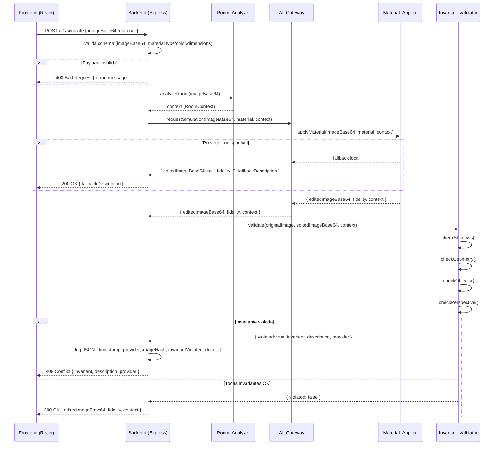

# Design Document — pisosrealview-refactor

## Overview

Refatoração do projeto `pisosrealview-pro-transformed` para separar claramente backend (Node.js + Express) e frontend (React + Vite). O backend expõe uma API REST com dois endpoints principais (`/v1/analyze` e `/v1/simulate`). O frontend consome essa API via `fetch`, sem nenhuma dependência de módulos Node.js.

A motivação central é eliminar os erros de runtime causados por importações de `Buffer`, `sharp` e `fs` no bundle do navegador, movendo toda a lógica de IA, gateway e validação de invariantes para o servidor.

## Architecture

```
pisosrealview-pro-transformed/
├── backend/
│   ├── server.js                  # Entry point Express
│   ├── .env                       # Variáveis de ambiente do backend
│   ├── package.json
│   ├── routes/
│   │   ├── analyze.js             # POST /v1/analyze
│   │   └── simulate.js            # POST /v1/simulate
│   └── services/
│       ├── ai/
│       │   ├── roomAnalyzer.js    # (movido de services/ai/)
│       │   ├── materialApplier.js # (movido de services/ai/)
│       │   └── invariants.js      # (movido de services/ai/)
│       ├── gateway/               # (movido de services/gateway/)
│       │   └── aiGateway.js
│       └── core/
│           └── invariants/        # (movido de services/core/invariants/)
│               └── validator.js
└── frontend/
    ├── .env                       # VITE_API_BASE_URL
    ├── package.json
    ├── vite.config.js
    └── src/
        ├── App.jsx                # Componente raiz
        ├── components/
        │   ├── ImageUploader.jsx  # FileReader → base64
        │   ├── MaterialSelector.jsx # Dropdown de materiais
        │   └── ResultViewer.jsx   # Exibe editedImageBase64
        └── api/
            └── client.js          # fetch wrapper para /v1/*
```

## Components and Interfaces

### Backend Components

| Componente | Responsabilidade |
|---|---|
| `server.js` | Bootstrap Express, middleware stack, registro de rotas |
| `routes/analyze.js` | Valida payload, chama `roomAnalyzer`, retorna RoomContext |
| `routes/simulate.js` | Valida payload + schema de `material`, chama `materialApplier`, executa `Invariant_Validator`, retorna resultado |
| `services/ai/roomAnalyzer.js` | Analisa imagem via AI_Gateway, extrai RoomContext |
| `services/ai/materialApplier.js` | Aplica material à imagem via AI_Gateway, retorna imagem editada + fidelity |
| `services/ai/invariants.js` | Orquestra as quatro verificações de invariante |
| `services/gateway/aiGateway.js` | Gerencia provedores de IA com fallback local |
| `services/core/invariants/validator.js` | Implementações das verificações: sombras, geometria, objetos, perspectiva |

### Frontend Components

| Componente | Responsabilidade |
|---|---|
| `App.jsx` | Estado global, orquestra upload + seleção + simulação |
| `ImageUploader.jsx` | Input file → FileReader → base64 |
| `MaterialSelector.jsx` | Dropdown com lista de materiais disponíveis |
| `ResultViewer.jsx` | Renderiza `` com `editedImageBase64` ou mensagens de erro |
| `api/client.js` | Funções `analyze(imageBase64)` e `simulate(imageBase64, material)` |

## Data Models

### Material Schema

```json
{
  "type": "string",
  "color": "string",
  "dimensions": "string"
}
```

Todos os campos são obrigatórios. Exemplos de valores:
- `type`: `"porcelanato"`, `"vinílico"`, `"madeira"`
- `color`: `"bege"`, `"cinza-claro"`, `"carvalho"`
- `dimensions`: `"60x60cm"`, `"120x20cm"`

### RoomContext Schema

```json
{
  "geometry": { "width": "number", "height": "number", "depth": "number" },
  "lighting": { "direction": "string", "intensity": "number" },
  "objects": ["string"],
  "perspective": "string",
  "estimatedByFallback": "boolean"
}
```

### SimulationResponse Schema

```json
{
  "editedImageBase64": "string",
  "fidelity": "number",
  "context": { "$ref": "RoomContext" }
}
```

### InvariantViolation Log Schema

```json
{
  "timestamp": "string (ISO 8601)",
  "provider": "string",
  "imageHash": "string (SHA-256 hex)",
  "invariantViolated": "string (shadows|geometry|objects|perspective)",
  "details": "string"
}
```

## API Contracts

### POST /v1/analyze

**Request:**
```json
{
  "imageBase64": "data:image/jpeg;base64,/9j/4AAQSkZJRgAB..."
}
```

**Response 200 — sucesso:**
```json
{
  "geometry": { "width": 4.2, "height": 2.8, "depth": 3.5 },
  "lighting": { "direction": "top-left", "intensity": 0.75 },
  "objects": ["sofa", "coffee-table", "rug"],
  "perspective": "isometric",
  "estimatedByFallback": false
}
```

**Response 200 — fallback (provedor indisponível):**
```json
{
  "geometry": { "width": 4.0, "height": 2.7, "depth": 3.0 },
  "lighting": { "direction": "unknown", "intensity": 0.5 },
  "objects": [],
  "perspective": "unknown",
  "estimatedByFallback": true
}
```

**Response 400 — imageBase64 ausente ou inválido:**
```json
{
  "error": "Bad Request",
  "message": "O campo 'imageBase64' é obrigatório e deve ser uma string base64 válida."
}
```

---

### POST /v1/simulate

**Request:**
```json
{
  "imageBase64": "data:image/jpeg;base64,/9j/4AAQSkZJRgAB...",
  "material": {
    "type": "porcelanato",
    "color": "cinza-claro",
    "dimensions": "60x60cm"
  }
}
```

**Response 200 — sucesso:**
```json
{
  "editedImageBase64": "data:image/jpeg;base64,/9j/4AAQSkZJRgAB...",
  "fidelity": 0.87,
  "context": {
    "geometry": { "width": 4.2, "height": 2.8, "depth": 3.5 },
    "lighting": { "direction": "top-left", "intensity": 0.75 },
    "objects": ["sofa", "coffee-table"],
    "perspective": "isometric",
    "estimatedByFallback": false
  }
}
```

**Response 200 — fallback (provedor indisponível):**
```json
{
  "editedImageBase64": null,
  "fidelity": 0.0,
  "context": null,
  "fallbackDescription": "Simulação indisponível no momento. O material 'porcelanato cinza-claro 60x60cm' seria aplicado ao piso da imagem com acabamento fosco."
}
```

**Response 400 — campo material incompleto:**
```json
{
  "error": "Bad Request",
  "message": "O campo obrigatório 'material.dimensions' está ausente."
}
```

**Response 409 — violação de invariante:**
```json
{
  "invariant": "shadows",
  "description": "A sombra projetada pelo sofá foi eliminada após a aplicação do material, violando a coerência física da cena.",
  "provider": "openai-gpt4o"
}
```

**Response 429 — rate limit excedido:**
```json
{
  "error": "Too Many Requests",
  "retryAfter": 42
}
```

**Response 413 — payload muito grande:**
```json
{
  "error": "Payload Too Large",
  "message": "O tamanho máximo permitido é 10 MB."
}
```

## Sequence Diagram — POST /v1/simulate



## Module Mapping

| Caminho Antigo | Caminho Novo |
|---|---|
| `services/ai/roomAnalyzer.js` | `backend/services/ai/roomAnalyzer.js` |
| `services/ai/materialApplier.js` | `backend/services/ai/materialApplier.js` |
| `services/ai/invariants.js` | `backend/services/ai/invariants.js` |
| `services/gateway/aiGateway.js` | `backend/services/gateway/aiGateway.js` |
| `services/gateway/*.js` (outros) | `backend/services/gateway/*.js` |
| `services/core/invariants/validator.js` | `backend/services/core/invariants/validator.js` |
| `services/core/invariants/*.js` (outros) | `backend/services/core/invariants/*.js` |

Nenhuma lógica é reescrita — apenas movida e com imports ajustados.

## Migration Plan

Sequência de comandos bash para executar a migração:

```bash
# 1. Criar estrutura de diretórios do backend
mkdir -p backend/routes
mkdir -p backend/services/ai
mkdir -p backend/services/gateway
mkdir -p backend/services/core/invariants

# 2. Mover módulos de IA
mv services/ai/roomAnalyzer.js   backend/services/ai/roomAnalyzer.js
mv services/ai/materialApplier.js backend/services/ai/materialApplier.js
mv services/ai/invariants.js     backend/services/ai/invariants.js

# 3. Mover gateway
mv services/gateway/*            backend/services/gateway/

# 4. Mover invariants core
mv services/core/invariants/*    backend/services/core/invariants/

# 5. Criar estrutura de diretórios do frontend (se ainda não existir)
mkdir -p frontend/src/components
mkdir -p frontend/src/api

# 6. Ajustar imports manualmente após mover os módulos
# Os imports relativos mudam de profundidade após a migração.
# Exemplo: require('../../gateway/aiGateway') pode virar require('../gateway/aiGateway')
# Recomendação: ajuste manualmente cada arquivo movido e então execute:
cd backend && node --check server.js && echo "Sem erros de sintaxe"
# Ou, se usar npm scripts:
cd backend && npm run build 2>&1 | grep "Cannot find module" | sort -u
# Corrija cada import reportado um a um.

# 7. Criar arquivos de entrada
touch backend/server.js
touch backend/.env
touch backend/routes/analyze.js
touch backend/routes/simulate.js
touch frontend/.env
touch frontend/src/App.jsx
touch frontend/src/api/client.js

# 8. Inicializar package.json do backend (se necessário)
cd backend && npm init -y && npm install express cors dotenv express-rate-limit
cd ..

# 9. Verificar que o frontend não tem imports Node.js
grep -r "require('fs')\|require('path')\|require('sharp')\|require('buffer')" frontend/src && echo "ERRO: imports Node.js encontrados" || echo "OK: nenhum import Node.js"
```

> ⚠️ **Atenção**: Não use `sed` para ajustar imports automaticamente. Os caminhos relativos variam por arquivo e profundidade de diretório. Prefira ajuste manual ou ferramentas de refatoração de IDE (ex: VS Code "Update imports on move").

## Environment Configuration

### backend/.env

```dotenv
# Servidor
PORT=3001
NODE_ENV=development

# CORS — origem permitida do frontend
CORS_ORIGIN=http://localhost:5173

# Provedores de IA
OPENAI_API_KEY=sk-...
ANTHROPIC_API_KEY=sk-ant-...
# Provedores chineses (se aplicável)
ZHIPU_API_KEY=...
BAIDU_API_KEY=...
BAIDU_SECRET_KEY=...

# Fallback local
USE_LOCAL_FALLBACK=true

# Rate limiting (produção)
RATE_LIMIT_WINDOW_MS=60000
RATE_LIMIT_MAX=60

# Limite de payload
MAX_PAYLOAD_SIZE=10mb
```

### frontend/.env

```dotenv
VITE_API_BASE_URL=http://localhost:3001
```

## Backend server.js — Skeleton

```js
// backend/server.js
import express from 'express';
import cors from 'cors';
import dotenv from 'dotenv';
import rateLimit from 'express-rate-limit';
import analyzeRouter from './routes/analyze.js';
import simulateRouter from './routes/simulate.js';

dotenv.config();

const app = express();
const isProd = process.env.NODE_ENV === 'production';

// --- Middleware: payload limit ---
app.use(express.json({ limit: process.env.MAX_PAYLOAD_SIZE || '10mb' }));

// --- Middleware: CORS ---
app.use(cors({ origin: process.env.CORS_ORIGIN }));

// --- Middleware: segurança (produção) ---
if (isProd) {
  app.use((req, res, next) => {
    res.setHeader('X-Content-Type-Options', 'nosniff');
    next();
  });
}

// --- Middleware: rate limiting (produção) ---
if (isProd) {
  const limiter = rateLimit({
    windowMs: Number(process.env.RATE_LIMIT_WINDOW_MS) || 60_000,
    max: Number(process.env.RATE_LIMIT_MAX) || 60,
    standardHeaders: true,
    legacyHeaders: false,
    handler: (req, res) => {
      const retryAfter = Math.ceil(req.rateLimit.resetTime / 1000 - Date.now() / 1000);
      res.status(429).json({ error: 'Too Many Requests', retryAfter });
    },
  });
  app.use('/v1/analyze', limiter);
  app.use('/v1/simulate', limiter);
}

// --- Rotas ---
app.use('/v1/analyze', analyzeRouter);
app.use('/v1/simulate', simulateRouter);

// --- Error handler global ---
app.use((err, req, res, next) => {
  if (err.type === 'entity.too.large') {
    return res.status(413).json({ error: 'Payload Too Large', message: 'O tamanho máximo permitido é 10 MB.' });
  }
  console.error(err);
  res.status(500).json({ error: 'Internal Server Error' });
});

app.listen(process.env.PORT || 3001, () => {
  console.log(`Backend rodando na porta ${process.env.PORT || 3001}`);
});
```

### routes/simulate.js — Skeleton com Invariant_Validator

```js
// backend/routes/simulate.js
import { Router } from 'express';
import { analyzeRoom } from '../services/ai/roomAnalyzer.js';
import { applyMaterial } from '../services/ai/materialApplier.js';
import { validateInvariants } from '../services/core/invariants/validator.js';
import crypto from 'crypto';

const router = Router();

// Valida schema do campo material
function validateMaterial(material) {
  for (const field of ['type', 'color', 'dimensions']) {
    if (!material?.[field]) return field;
  }
  return null;
}

router.post('/', async (req, res) => {
  const { imageBase64, material } = req.body;

  // Validação de campos obrigatórios de nível superior
  if (!imageBase64) {
    return res.status(400).json({ error: 'Bad Request', message: "O campo 'imageBase64' é obrigatório." });
  }
  if (!material) {
    return res.status(400).json({ error: 'Bad Request', message: "O campo 'material' é obrigatório." });
  }

  // Validação do schema de material
  const missingField = validateMaterial(material);
  if (missingField) {
    return res.status(400).json({
      error: 'Bad Request',
      message: `O campo obrigatório 'material.${missingField}' está ausente.`,
    });
  }

  // Processamento via Material_Applier (com fallback interno no gateway)
  const context = await analyzeRoom(imageBase64);
  const result = await applyMaterial(imageBase64, material, context);

  // Fallback ativado — retorna descrição textual
  if (result.fallback) {
    return res.status(200).json({
      editedImageBase64: null,
      fidelity: 0.0,
      context: null,
      fallbackDescription: result.fallbackDescription,
    });
  }

  // Validação de invariantes
  const imageHash = crypto.createHash('sha256').update(imageBase64).digest('hex');
  const invariantResult = await validateInvariants(imageBase64, result.editedImageBase64, result.context);

  if (invariantResult.violated) {
    // Log estruturado JSON
    console.log(JSON.stringify({
      timestamp: new Date().toISOString(),
      provider: result.provider,
      imageHash,
      invariantViolated: invariantResult.invariant,
      details: invariantResult.description,
    }));

    return res.status(409).json({
      invariant: invariantResult.invariant,
      description: invariantResult.description,
      provider: result.provider,
    });
  }

  return res.status(200).json({
    editedImageBase64: result.editedImageBase64,
    fidelity: result.fidelity,
    context: result.context,
  });
});

export default router;
```

## Frontend App.jsx — Skeleton

```jsx
// frontend/src/App.jsx
import { useState } from 'react';
import ImageUploader from './components/ImageUploader.jsx';
import MaterialSelector from './components/MaterialSelector.jsx';
import ResultViewer from './components/ResultViewer.jsx';
import { simulate } from './api/client.js';

const MATERIALS = [
  { type: 'porcelanato', color: 'cinza-claro', dimensions: '60x60cm' },
  { type: 'vinílico',    color: 'carvalho',    dimensions: '120x20cm' },
  { type: 'madeira',     color: 'bege',        dimensions: '90x15cm' },
];

export default function App() {
  const [imageBase64, setImageBase64] = useState(null);
  const [material, setMaterial]       = useState(MATERIALS[0]);
  const [result, setResult]           = useState(null);   // { editedImageBase64 } | null
  const [error, setError]             = useState(null);   // string | null
  const [loading, setLoading]         = useState(false);

  async function handleSimulate() {
    if (!imageBase64) return;
    setLoading(true);
    setError(null);
    setResult(null);

    try {
      const response = await simulate(imageBase64, material);

      if (response.status === 200) {
        const data = await response.json();
        if (data.editedImageBase64) {
          setResult(data);
        } else if (data.fallbackDescription) {
          setError(`Fallback: ${data.fallbackDescription}`);
        } else {
          setError('Resposta inesperada do servidor.');
        }
      } else if (response.status === 409) {
        setError('Este material não é compatível com a imagem. Tente outro material ou outra foto.');
      } else {
        setError('Ocorreu um erro ao processar sua solicitação. Tente novamente.');
      }
    } catch {
      setError('Ocorreu um erro ao processar sua solicitação. Tente novamente.');
    } finally {
      setLoading(false);
    }
  }

  return (
    <main>
      <ImageUploader onImage={setImageBase64} />
      <MaterialSelector materials={MATERIALS} selected={material} onChange={setMaterial} />
      <button onClick={handleSimulate} disabled={!imageBase64 || loading}>
        {loading ? 'Simulando...' : 'Simular'}
      </button>
      <ResultViewer result={result} error={error} />
    </main>
  );
}
```

### ResultViewer.jsx — Tratamento de fallback

O componente deve exibir a imagem quando `result.editedImageBase64` estiver presente, ou a mensagem de fallback como texto quando não houver imagem:

```jsx
// frontend/src/components/ResultViewer.jsx
export default function ResultViewer({ result, error }) {
  if (error) return <p role="alert">{error}</p>;
  if (!result) return null;
  if (result.editedImageBase64) {
    return ;
  }
  return null; // fallbackDescription já tratado como error em App.jsx
}
```

### frontend/src/api/client.js

```js
// frontend/src/api/client.js
const BASE_URL = import.meta.env.VITE_API_BASE_URL;

export function simulate(imageBase64, material) {
  return fetch(`${BASE_URL}/v1/simulate`, {
    method: 'POST',
    headers: { 'Content-Type': 'application/json' },
    body: JSON.stringify({ imageBase64, material }),
  });
}

export function analyze(imageBase64) {
  return fetch(`${BASE_URL}/v1/analyze`, {
    method: 'POST',
    headers: { 'Content-Type': 'application/json' },
    body: JSON.stringify({ imageBase64 }),
  });
}
```

## Structured Logs — Invariant Violations

Toda violação de invariante é registrada via `console.log(JSON.stringify(...))` no formato exato:

```json
{
  "timestamp": "2024-11-15T14:32:07.123Z",
  "provider": "openai-gpt4o",
  "imageHash": "a3f8c2d1e4b7...",
  "invariantViolated": "shadows",
  "details": "A sombra projetada pelo sofá foi eliminada após a aplicação do material porcelanato cinza-claro."
}
```

Valores válidos para `invariantViolated`: `"shadows"`, `"geometry"`, `"objects"`, `"perspective"`.

## Correctness Properties

*A property is a characteristic or behavior that should hold true across all valid executions of a system — essentially, a formal statement about what the system should do. Properties serve as the bridge between human-readable specifications and machine-verifiable correctness guarantees.*

### Property 1: Frontend sem imports Node.js

*For any* arquivo em `frontend/src/`, nenhum deve conter imports de módulos Node.js (`fs`, `path`, `sharp`, `Buffer`, `crypto`) nem de módulos do diretório `backend/`.

**Validates: Requirements 1.3, 5.7**

---

### Property 2: POST /v1/analyze retorna RoomContext para inputs válidos

*For any* string base64 válida enviada como `imageBase64`, o endpoint `POST /v1/analyze` deve retornar status 200 com um objeto contendo os campos `geometry`, `lighting`, `objects`, `perspective` e `estimatedByFallback`.

**Validates: Requirements 2.1, 2.2**

---

### Property 3: POST /v1/analyze rejeita inputs inválidos com 400

*For any* requisição a `POST /v1/analyze` onde `imageBase64` está ausente ou não é uma string base64 válida, o endpoint deve retornar status 400 com um campo `message` descritivo.

**Validates: Requirements 2.3**

---

### Property 4: POST /v1/simulate retorna campos obrigatórios para inputs válidos

*For any* `imageBase64` válido e `material` com todos os campos (`type`, `color`, `dimensions`) preenchidos, o endpoint `POST /v1/simulate` deve retornar status 200 com um objeto contendo `editedImageBase64`, `fidelity` e `context`.

**Validates: Requirements 3.1, 3.3**

---

### Property 5: Validação de campos obrigatórios retorna 400 com campo faltante identificado

*For any* requisição a `POST /v1/simulate` onde qualquer campo obrigatório (`imageBase64`, `material`, `material.type`, `material.color`, `material.dimensions`) está ausente, o endpoint deve retornar status 400 com uma mensagem que identifica especificamente o campo faltante.

**Validates: Requirements 3.2, 3.4, 3.5**

---

### Property 6: fidelity está sempre no intervalo [0.0, 1.0]

*For any* resposta bem-sucedida de `POST /v1/simulate` (status 200 com `editedImageBase64` não nulo), o campo `fidelity` deve ser um número no intervalo fechado [0.0, 1.0].

**Validates: Requirements 3.7**

---

### Property 7: Invariant_Validator executa todas as quatro verificações

*For any* imagem processada pelo `Material_Applier`, o `Invariant_Validator` deve invocar as quatro funções de verificação (`checkShadows`, `checkGeometry`, `checkObjects`, `checkPerspective`) de forma independente antes de emitir o resultado.

**Validates: Requirements 4.1, 4.5**

---

### Property 8: Log de violação de invariante contém todos os campos obrigatórios

*For any* violação de invariante detectada, o objeto JSON registrado em log deve conter exatamente os campos `timestamp`, `provider`, `imageHash`, `invariantViolated` e `details`, todos com valores não nulos.

**Validates: Requirements 4.3**

---

### Property 9: Violação de invariante retorna 409 com campos obrigatórios

*For any* violação de invariante detectada, o endpoint `POST /v1/simulate` deve retornar status 409 com um objeto JSON contendo os campos `invariant`, `description` e `provider`.

**Validates: Requirements 4.4**

---

### Property 10: FileReader converte qualquer arquivo de imagem para base64

*For any* arquivo de imagem selecionado pelo usuário, o componente `ImageUploader` deve usar `FileReader.readAsDataURL` e produzir uma string base64 não vazia como resultado.

**Validates: Requirements 5.1**

---

### Property 11: Botão "Simular" envia payload correto

*For any* combinação de `imageBase64` e `material` selecionados, clicar no botão "Simular" deve disparar um `fetch` para `POST /v1/simulate` com body `{ imageBase64, material }` e `Content-Type: application/json`.

**Validates: Requirements 5.3**

---

### Property 12: Resposta 200 renderiza a imagem resultante

*For any* resposta 200 de `POST /v1/simulate` contendo `editedImageBase64`, o componente `ResultViewer` deve renderizar um elemento `` com `src` igual ao valor de `editedImageBase64`.

**Validates: Requirements 5.4**

---

### Property 13: Erros não-200/não-409 exibem mensagem genérica sem detalhes internos

*For any* resposta HTTP com status diferente de 200 e 409, o frontend deve exibir uma mensagem de erro genérica que não contenha stack traces, nomes de módulos internos, chaves de API ou qualquer detalhe de implementação.

**Validates: Requirements 5.6**

---

### Property 14: Rate limiter retorna 429 com retryAfter após exceder 60 req/min

*For any* cliente (identificado por IP) que envie mais de 60 requisições em uma janela de 60 segundos para `/v1/analyze` ou `/v1/simulate` em ambiente de produção, a requisição excedente deve receber status 429 com um objeto JSON contendo `error` e `retryAfter` (número inteiro positivo).

**Validates: Requirements 8.1, 8.2, 8.5**

---

### Property 15: Payloads acima de 10 MB retornam 413

*For any* requisição cujo payload ultrapasse 10 MB, o backend deve retornar status 413 sem processar o corpo da requisição.

**Validates: Requirements 8.4**

## Error Handling

| Cenário | Status | Resposta |
|---|---|---|
| `imageBase64` ausente | 400 | `{ error, message }` |
| Campo de `material` ausente | 400 | `{ error, message }` com campo identificado |
| Provedor de IA indisponível | 200 | Resposta de fallback |
| Violação de invariante | 409 | `{ invariant, description, provider }` |
| Rate limit excedido (prod) | 429 | `{ error, retryAfter }` |
| Payload > 10 MB (prod) | 413 | `{ error, message }` |
| Erro interno não tratado | 500 | `{ error: "Internal Server Error" }` |

O frontend nunca expõe detalhes de erros 5xx ao usuário — exibe apenas mensagem genérica.

## Testing Strategy

### Abordagem Dual

Testes unitários e testes baseados em propriedades são complementares e ambos são necessários.

**Testes unitários** focam em:
- Exemplos específicos de request/response
- Comportamento de fallback (mock do provedor falhando)
- Integração entre rotas e serviços
- Renderização de componentes React com estados específicos

**Testes de propriedade** focam em:
- Propriedades universais que devem valer para todos os inputs válidos
- Cobertura ampla via geração aleatória de dados

### Biblioteca de Property-Based Testing

- **Backend (Node.js)**: [`fast-check`](https://github.com/dubzzz/fast-check)
- **Frontend (React)**: [`fast-check`](https://github.com/dubzzz/fast-check) + `@testing-library/react`

### Configuração

Cada teste de propriedade deve rodar com mínimo de **100 iterações**:

```js
import fc from 'fast-check';

// Exemplo de configuração
fc.assert(fc.property(...), { numRuns: 100 });
```

### Mapeamento Propriedade → Teste

Cada propriedade do design deve ser implementada por **um único teste de propriedade**, anotado com:

```
// Feature: pisosrealview-refactor, Property N: <texto da propriedade>
```

| Propriedade | Tipo de Teste | Biblioteca |
|---|---|---|
| P1: Frontend sem imports Node.js | Análise estática (grep/AST) | — |
| P2: /v1/analyze retorna RoomContext | Property test | fast-check |
| P3: /v1/analyze rejeita inputs inválidos | Property test | fast-check |
| P4: /v1/simulate retorna campos obrigatórios | Property test | fast-check |
| P5: Validação retorna 400 com campo identificado | Property test | fast-check |
| P6: fidelity em [0.0, 1.0] | Property test | fast-check |
| P7: Invariant_Validator executa 4 verificações | Property test + mock | fast-check + sinon |
| P8: Log de violação contém todos os campos | Property test | fast-check |
| P9: Violação retorna 409 com campos corretos | Property test | fast-check |
| P10: FileReader produz base64 | Property test | fast-check + jsdom |
| P11: Botão envia payload correto | Property test | fast-check + RTL |
| P12: 200 renderiza imagem | Property test | fast-check + RTL |
| P13: Erros genéricos sem detalhes internos | Property test | fast-check + RTL |
| P14: Rate limiter retorna 429 após 60 req/min | Property test | fast-check + supertest |
| P15: Payload > 10 MB retorna 413 | Property test | fast-check + supertest |
