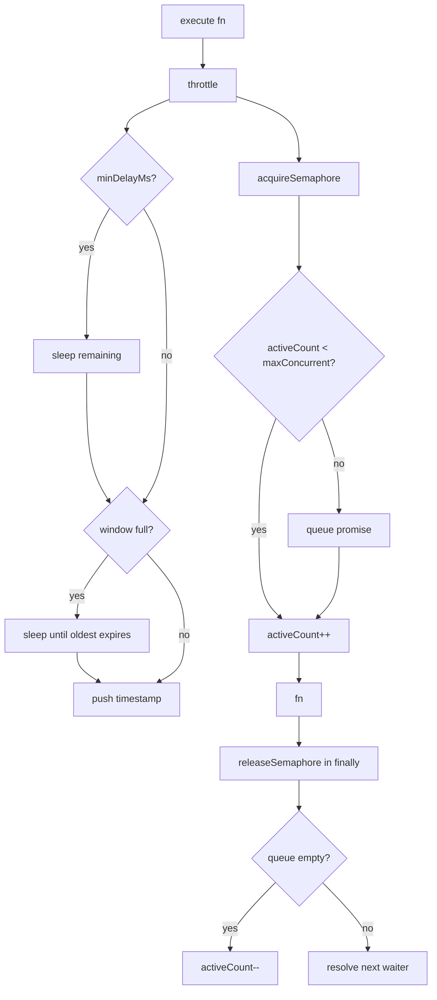

# Design Document: RateLimiter Unification

## Overview

Two `RateLimiter` classes currently coexist under different paths with incompatible interfaces:

- `src/ratelimit/RateLimiter.ts` — sliding-window throttle used by sovereignty tests
- `src/security/RateLimiter.ts` — semaphore + fixed-window token bucket used by DeepDependencyScanner and the CLI

The goal is to merge both into a single class at `src/ratelimit/RateLimiter.ts`, expose both APIs under one coherent config interface, delete `src/security/RateLimiter.ts`, and update all import sites. No new npm dependencies are introduced.

---

## Architecture

The unified class combines two orthogonal control mechanisms that compose sequentially inside `execute()`:

```
execute(fn)
  │
  ├─ 1. throttle()          ← Token Bucket (sliding window)
  │       checks windowMs / maxRequests / minDelayMs
  │
  ├─ 2. acquireSemaphore()  ← Semaphore (concurrency limit)
  │       blocks if activeCount >= maxConcurrent
  │
  └─ 3. fn()                ← user function
          releaseSemaphore() in finally
```

`throttle()` is also callable directly (sovereignty tests never use `execute()`).



---

## Components and Interfaces

### RateLimiterConfig

```typescript
export interface RateLimiterConfig {
  maxRequests?: number;    // window-based limit (undefined = unlimited)
  windowMs?: number;       // time window in ms (default: 60000)
  maxConcurrent?: number;  // concurrency limit (default: unlimited)
  minDelayMs?: number;     // minimum delay between requests (default: 0)
}
```

All fields are optional. A zero-argument constructor applies all defaults.

**Migration mapping from old configs:**

| Old field (security/RateLimiter) | New field              |
|----------------------------------|------------------------|
| `maxPerMinute`                   | `maxRequests`          |
| `maxConcurrent`                  | `maxConcurrent`        |
| (implicit 60 000 ms window)      | `windowMs: 60000`      |

### RateLimiter class

```typescript
export class RateLimiter {
  constructor(config?: RateLimiterConfig)

  // Throttle API — used by sovereignty tests
  async throttle(): Promise<void>
  getRequestCount(): number
  reset(): void

  // Execute API — used by DeepDependencyScanner and CLI
  async execute<T>(fn: () => Promise<T>): Promise<T>
  getStats(): { queued: number; active: number; remaining?: number }
}
```

`execute()` calls `throttle()` internally, so both rate-limiting mechanisms apply to every `execute()` call.

---

## Data Models

### Internal state

```typescript
// Token bucket (sliding window)
private readonly requests: number[] = [];   // timestamps of completed throttle() calls
private lastRequestTime = 0;

// Semaphore
private activeCount = 0;
private readonly semaphoreQueue: Array<() => void> = [];

// Resolved config (all defaults filled in)
private readonly config: Required<RateLimiterConfig>;
```

### Default values

```typescript
const DEFAULTS = {
  maxRequests: Infinity,   // no window limit unless specified
  windowMs: 60_000,
  maxConcurrent: Infinity, // no concurrency limit unless specified
  minDelayMs: 0,
};
```

Using `Infinity` for unlimited fields lets the guard conditions (`requests.length >= maxRequests`, `activeCount < maxConcurrent`) work correctly without special-casing `undefined`.

### getStats() shape

```typescript
{
  queued: number;      // semaphoreQueue.length
  active: number;      // activeCount
  remaining?: number;  // maxRequests - getRequestCount(), omitted when maxRequests is Infinity
}
```

---

## Correctness Properties

*A property is a characteristic or behavior that should hold true across all valid executions of a system — essentially, a formal statement about what the system should do. Properties serve as the bridge between human-readable specifications and machine-verifiable correctness guarantees.*

### Property 1: Window count invariant

*For any* valid config with `maxRequests = R` and `windowMs = W`, after exactly N sequential calls to `throttle()` where N ≤ R, all within a single window, `getRequestCount()` shall equal N.

**Validates: Requirements 7.1, 2.4**

### Property 2: Token bucket invariant

*For any* valid config with `maxRequests = R` and `windowMs = W`, no more than R calls to `throttle()` shall resolve within any contiguous W-millisecond interval without incurring a wait.

**Validates: Requirements 7.3, 2.1, 2.3**

### Property 3: Concurrency invariant

*For any* valid config with `maxConcurrent = K`, at no point during concurrent `execute()` calls shall the number of simultaneously active (in-flight) functions exceed K.

**Validates: Requirements 7.2, 3.2**

### Property 4: Reset invariant

*For any* RateLimiter state (any number of prior `throttle()` calls), calling `reset()` shall cause `getRequestCount()` to return 0 immediately.

**Validates: Requirements 7.4, 2.5**

### Property 5: Error-release invariant

*For any* function `fn` that throws or rejects, `execute(fn)` shall release the semaphore slot such that a subsequent `execute()` call with a non-throwing function completes successfully.

**Validates: Requirements 7.5, 4.1, 3.3**

---

## Error Handling

| Scenario | Behavior |
|---|---|
| `fn` throws synchronously | `execute()` catches in `finally`, releases semaphore, re-throws |
| `fn` rejects (async) | Same as above — `await fn()` surfaces the rejection |
| `windowMs` exhausted | `throttle()` sleeps until oldest timestamp expires, then retries |
| `maxConcurrent` reached | `acquireSemaphore()` returns a queued `Promise<void>` resolved by `releaseSemaphore()` |
| Zero-argument constructor | All fields default to `Infinity` / `0` / `60000`; no throw |

The semaphore release always happens in a `finally` block, so deadlock after errors is impossible.

---

## Testing Strategy

### Dual approach

Both unit tests and property-based tests are required. They are complementary:

- Unit tests catch concrete bugs at specific inputs and verify integration points.
- Property tests verify universal invariants across randomized inputs, catching edge cases that examples miss.

### Unit tests (existing + updated)

- `tests/sovereignty/sovereignty.test.ts` — existing RateLimiter unit tests; must pass unchanged after the rewrite.
- `tests/sovereignty/sovereignty.integration.test.ts` — existing integration tests; must pass unchanged.
- `tests/security/DeepDependencyScanner.regression.test.ts` — update import path only; no logic changes.

### Property-based tests

**File:** `tests/ratelimit/RateLimiter.pbt.test.ts`

**Library:** `fast-check` (already available in the project's dev dependencies).

**Configuration:** Each property test runs a minimum of 100 iterations.

**Tag format:** `// Feature: ratelimiter-unification, Property N: <property text>`

Each of the five correctness properties maps to exactly one property-based test:

| Test | Property | fast-check arbitraries |
|---|---|---|
| Window count invariant | P1 | `fc.integer({min:1,max:20})` for N, `fc.integer({min:1,max:20})` for R (N≤R) |
| Token bucket invariant | P2 | `fc.integer({min:1,max:5})` for R, short windowMs to keep tests fast |
| Concurrency invariant | P3 | `fc.integer({min:1,max:10})` for K, `fc.integer({min:K+1,max:K+5})` for concurrent calls |
| Reset invariant | P4 | `fc.integer({min:0,max:10})` for number of prior throttle() calls |
| Error-release invariant | P5 | `fc.string()` for error message, verify next execute() succeeds |

**Unit test balance:** Avoid duplicating property test coverage in unit tests. Unit tests should focus on:
- The zero-argument constructor default values (Req 1.2)
- `getStats()` shape verification (Req 3.4)
- The `maxConcurrent` unlimited edge case (Req 3.5)
- Sequential throw-then-success example (Req 4.2)

### Import migration verification

TypeScript compilation (`tsc --noEmit`) serves as the test for Requirements 5.1–5.4. No runtime test is needed.
