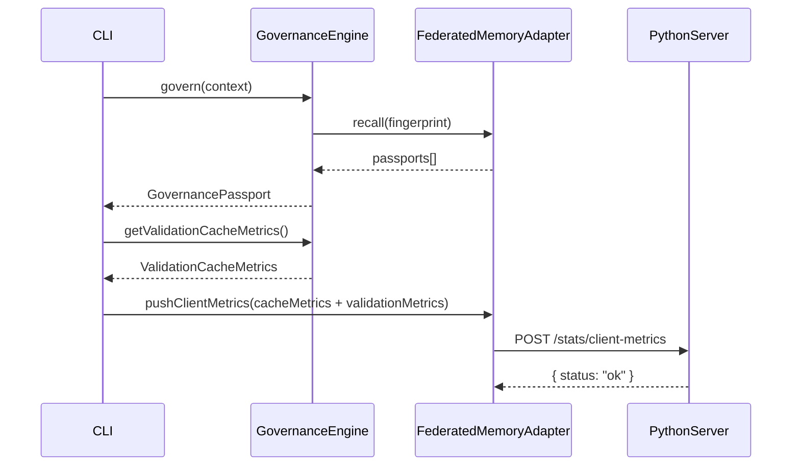

# Design: validation-result-cache

## Visão Geral

Esta feature adiciona três melhorias ao sistema CodeMemória Governance:

1. **Cache de ValidationResult** — quando `recallExact` retorna um passaporte com validações persistidas, a estratégia `thorough` reutiliza o resultado sem chamar `validationEngine.validate()`, economizando tempo e tokens de LLM.
2. **Campo `cacheSource`** — rastreia a origem do resultado de validação em cada `GovernancePassport` (`'engram'`, `'vector'` ou `'full'`).
3. **Flag `--no-cache`** — permite forçar revalidação completa via CLI.
4. **ASTNgramExtractor** (Fase 2, opcional) — substitui o `astSignature` baseado em keywords por n-gramas de nós AST reais via `@babel/parser`.

---

## Arquitetura

### Fluxo do `govern()` com cache de ValidationResult

```mermaid
flowchart TD
    A[govern(context)] --> B{strategy?}
    B -- fast --> C[recall(fingerprint, 0.7)]
    C --> D[Passport sem validations\ncacheSource: 'full']

    B -- thorough --> E{noCache?}
    E -- true --> F[validationEngine.validate()]
    F --> G[cacheSource: 'full'\ncache_misses++]

    E -- false --> H[recallExact(fingerprint)]
    H --> I{passaportes com\nvalidations.length > 0?}
    I -- sim --> J[Reutiliza ValidationResult\ncacheSource: 'engram'\ncache_hits++]
    I -- não --> K[validationEngine.validate()\ncacheSource: 'full'\ncache_misses++]

    J --> L[compliance.check()]
    K --> L
    G --> L
    L --> M[computeRiskLevel()]
    M --> N[memory.save(passport)]
    N --> O[audit.log()]
    O --> P[GovernancePassport]

    B -- compliance-first --> Q[compliance.check()]
    Q --> R{avgScore >= 0.5?}
    R -- sim --> S[validationEngine.validate()]
    R -- não --> T[Passport sem validations\ncacheSource: 'full']
    S --> M
    T --> N
```

### Integração de métricas com o servidor federado



---

## Componentes e Interfaces

### `GovernanceEngine` — mudanças

**Novo campo interno:**
```typescript
private _validationCacheHits = 0;
private _validationCacheMisses = 0;
private _validationTimes: number[] = [];  // ms de cada chamada a validate()
```

**Novo parâmetro em `govern()`:**
```typescript
interface GovernanceContext {
  // ... campos existentes ...
  noCache?: boolean;  // novo campo opcional
}
```

**Lógica da estratégia `thorough` (substituição):**
```typescript
} else if (strategy === 'thorough') {
  const similar = await this.memory.recall(fingerprint, 0.7);
  memoryEnriched = similar.length > 0;

  // Tenta cache de ValidationResult (a menos que noCache=true)
  const cachedPassport = !context.noCache
    ? (await (this.memory as HybridMemoryAdapter | FederatedMemoryAdapter)
        .recallExact?.(fingerprint) ?? [])
        .find(p => p.validations.length > 0)
    : undefined;

  if (cachedPassport) {
    validationResult = cachedPassport.validations[0];
    cacheSource = 'engram';
    this._validationCacheHits++;
  } else {
    const t0 = Date.now();
    validationResult = await this.validationEngine.validate(context.code);
    this._validationTimes.push(Date.now() - t0);
    cacheSource = 'full';
    this._validationCacheMisses++;
  }
  complianceStamps = await this.compliance.check(context.code, context.requirements);
}
```

**Novo método público:**
```typescript
getValidationCacheMetrics(): ValidationCacheMetrics
```

### `HybridMemoryAdapter` — mudanças

- `PassportJson` ganha campo `cacheSource?: string`
- `deserializePassport` atribui `cacheSource: json.cacheSource ?? 'full'` (compatibilidade retroativa)
- `save()` serializa `cacheSource` no JSON

### `IHybridMemory` — mudanças

Adicionar `recallExact` à interface para que `GovernanceEngine` possa chamá-la sem `instanceof`:

```typescript
export interface IHybridMemory {
  save(passport: GovernancePassport): Promise<void>;
  recall(fingerprint: CodeFingerprint, threshold: number): Promise<GovernancePassport[]>;
  recallExact?(fingerprint: CodeFingerprint): Promise<GovernancePassport[]>;  // opcional
  getSuccessRate(fingerprint: CodeFingerprint): Promise<number>;
}
```

### `FederatedMemoryAdapter` — mudanças

- `ClientMetricsPayload` expandido com campos de validação
- Novo método `pushValidationMetrics(metrics: ValidationCacheMetrics)` que envia ao `/stats/client-metrics`

### CLI `govern` — mudanças

```
--no-cache    Ignora cache de ValidationResult e força revalidação completa
              (implica --strategy thorough; emite aviso se outra estratégia for passada)
```

### `ASTNgramExtractor` (Fase 2 — opcional)

Novo arquivo: `src/governance/utils/astNgrams.ts`

```typescript
export function extractAstNgrams(code: string, n = 3): string
```

- Usa `@babel/parser` com plugins `['typescript', 'jsx']`
- Percorre AST em depth-first, coleta `node.type` de cada nó
- Gera n-gramas de tamanho `n`, serializa como `"A|B|C,B|C|D,..."`
- Em caso de falha do parser, retorna `buildAstSignature(code)` (fallback existente)

---

## Modelos de Dados

### `GovernancePassport` — campo novo

```typescript
export interface GovernancePassport {
  // ... campos existentes ...
  /** Origem do resultado de validação neste passaporte */
  cacheSource?: 'engram' | 'vector' | 'full';
}
```

O campo é opcional para compatibilidade retroativa. Passaportes antigos sem o campo recebem `'full'` na desserialização.

### `ValidationCacheMetrics` — tipo novo

```typescript
/**
 * Métricas de eficiência do cache de ValidationResult.
 * Expostas via GovernanceEngine.getValidationCacheMetrics().
 */
export interface ValidationCacheMetrics {
  /** Número de vezes que o ValidationResult foi servido do cache */
  validation_cache_hits: number;
  /** Número de vezes que validationEngine.validate() foi chamado */
  validation_cache_misses: number;
  /** Média aritmética dos tempos de execução de validate() em ms */
  avg_validation_time_ms: number;
  /** Estimativa de tokens economizados: hits * avg_time_ms * 0.1 */
  tokens_saved_estimate: number;
}
```

### `PassportJson` — campo novo

```typescript
interface PassportJson {
  // ... campos existentes ...
  cacheSource?: 'engram' | 'vector' | 'full';
}
```

### `ClientMetricsPayload` — campos novos

```typescript
export interface ClientMetricsPayload {
  engramHitRate: number;
  vectorHitRate: number;
  federatedHitRate: number;
  // novos:
  validationCacheHits: number;
  validationCacheMisses: number;
  avgValidationTimeMs: number;
}
```

### `ClientMetricsRequest` (Python) — campos novos

```python
class ClientMetricsRequest(BaseModel):
    engram_hit_rate: float
    vector_hit_rate: float
    federated_hit_rate: float
    # novos:
    validation_cache_hits: int = 0
    validation_cache_misses: int = 0
    avg_validation_time_ms: float = 0.0
```

### `StatsResponse` (Python) — campos novos

```python
class StatsResponse(BaseModel):
    # ... campos existentes ...
    client_validation_cache_hits: int = 0
    client_validation_cache_misses: int = 0
    client_avg_validation_time_ms: float = 0.0
```

### `ASTNgramCache` — tabela SQLite nova (Fase 2)

```sql
CREATE TABLE IF NOT EXISTS ast_ngram_cache (
  ngram_hash         TEXT PRIMARY KEY,
  partial_result_json TEXT NOT NULL,
  confidence         REAL NOT NULL CHECK(confidence >= 0.0 AND confidence <= 1.0),
  created_at         TEXT NOT NULL
);
```

---

## Propriedades de Corretude

*Uma propriedade é uma característica ou comportamento que deve ser verdadeiro em todas as execuções válidas de um sistema — essencialmente, uma declaração formal sobre o que o sistema deve fazer. Propriedades servem como ponte entre especificações legíveis por humanos e garantias de corretude verificáveis por máquina.*

### Propriedade 1: Cache hit evita revalidação e define cacheSource correto

*Para qualquer* código e qualquer passaporte previamente salvo com `validations.length > 0` para o mesmo hash, chamar `govern()` com `strategy: 'thorough'` e `noCache: false` deve: (a) não invocar `validationEngine.validate()`, (b) retornar passaporte com `cacheSource === 'engram'`, e (c) incrementar `validation_cache_hits` em 1.

**Valida: Requisitos 1.1, 1.3, 1.7**

### Propriedade 2: Cache miss dispara validação e define cacheSource correto

*Para qualquer* código sem passaporte cacheado (ou com `validations` vazio), chamar `govern()` com `strategy: 'thorough'` deve: (a) invocar `validationEngine.validate()` exatamente uma vez, (b) retornar passaporte com `cacheSource === 'full'`, e (c) incrementar `validation_cache_misses` em 1.

**Valida: Requisitos 1.2, 1.4, 1.8**

### Propriedade 3: Invariante estrutural do GovernancePassport

*Para qualquer* execução de `govern()` (com ou sem cache, qualquer estratégia), o passaporte resultante deve: (a) ter `cacheSource` com valor em `{'engram', 'vector', 'full'}`, (b) ter todos os campos obrigatórios preenchidos (`passportId`, `codeFingerprint`, `validations`, `complianceStamps`, `auditTrail`, `memoryEnriched`, `riskLevel`, `estimatedRemediationCost`), e (c) ter `estimatedRemediationCost >= 0`.

**Valida: Requisitos 2.1, 6.1, 6.3**

### Propriedade 4: Round-trip de serialização do cacheSource

*Para qualquer* passaporte com `cacheSource` definido, salvar no SQLite via `HybridMemoryAdapter.save()` e recuperar via `recallExact()` deve produzir um passaporte com o mesmo valor de `cacheSource`.

**Valida: Requisito 2.5**

### Propriedade 5: Cálculo correto de métricas de cache

*Para qualquer* sequência de chamadas a `govern()` com mix de hits e misses, `getValidationCacheMetrics()` deve retornar: (a) `avg_validation_time_ms` igual à média aritmética dos tempos reais de `validate()`, e (b) `tokens_saved_estimate` igual a `validation_cache_hits * avg_validation_time_ms * 0.1`.

**Valida: Requisitos 3.3, 3.4**

### Propriedade 6: `--no-cache` força estratégia `thorough`

*Para qualquer* valor de `--strategy` passado junto com `--no-cache`, a estratégia efetivamente usada pelo `GovernanceEngine` deve ser `'thorough'` e `noCache` deve ser `true`.

**Valida: Requisito 4.2**

### Propriedade 7: Determinismo do ASTNgramExtractor

*Para qualquer* string de código, chamar `computeFingerprint(code)` duas vezes deve produzir exatamente o mesmo `astSignature` nas duas chamadas.

**Valida: Requisito 5.5**

### Propriedade 8: Formato correto dos n-gramas

*Para qualquer* código JavaScript/TypeScript válido com pelo menos 3 nós AST, o `astSignature` gerado pelo `ASTNgramExtractor` deve conter n-gramas no formato `"NodeType1|NodeType2|NodeType3"` separados por vírgula, onde cada segmento tem exatamente 2 pipes (`|`).

**Valida: Requisito 5.3**

### Propriedade 9: Fallback sem exceção para código inválido

*Para qualquer* string (incluindo código sintaticamente inválido, strings vazias, binários), `computeFingerprint()` nunca deve lançar exceção — deve retornar um `CodeFingerprint` válido usando o fallback de keywords.

**Valida: Requisito 5.2**

### Propriedade 10: Round-trip do astSignature

*Para qualquer* código válido, o `astSignature` gerado deve ser serializável e desserializável de volta para a mesma representação (i.e., `parse(serialize(ngrams)) === ngrams`).

**Valida: Requisito 5.8**

### Propriedade 11: Equivalência de riskLevel com e sem cache

*Para qualquer* código, `govern()` com cache habilitado deve produzir o mesmo `riskLevel` que seria produzido por uma validação completa com o mesmo `ValidationResult` — o cache não deve alterar a lógica de cálculo de risco.

**Valida: Requisito 6.4**

### Propriedade 12: Estratégia `fast` preservada

*Para qualquer* contexto com `strategy: 'fast'`, `govern()` nunca deve chamar `validationEngine.validate()`, independentemente do estado do cache.

**Valida: Requisito 1.5**

---

## Tratamento de Erros

| Situação | Comportamento |
|---|---|
| `recallExact` lança exceção | Captura silenciosa; trata como cache miss e chama `validate()` |
| `validationEngine.validate()` lança exceção | Propaga normalmente (comportamento existente) |
| `@babel/parser` falha ao parsear | Retorna `astSignature` baseado em keywords (fallback) |
| `ast_ngram_cache` corrompida | Log de aviso; ignora cache de n-gramas e prossegue |
| Passaporte sem `cacheSource` no SQLite | Desserializa com `cacheSource: 'full'` (compatibilidade retroativa) |
| `--no-cache` com `--strategy fast` | Emite aviso em stderr; força `strategy: 'thorough'` |

---

## Estratégia de Testes

### Abordagem dual

Os testes usam duas camadas complementares:

- **Testes unitários** (vitest): exemplos específicos, casos de borda, integração entre componentes
- **Testes de propriedade** (fast-check para TypeScript, hypothesis para Python): propriedades universais sobre todos os inputs

### Testes unitários (vitest)

Focados em:
- Estado inicial de `getValidationCacheMetrics()` retorna zeros (Requisito 3.2)
- Compatibilidade retroativa: passaporte sem `cacheSource` recebe `'full'` (Requisito 6.2)
- Schema da tabela `ast_ngram_cache` criado corretamente (Requisito 5.6)
- Payload enviado ao `/stats/client-metrics` contém campos de validação (Requisito 3.5)
- CLI aceita `--no-cache` sem erro de parsing (Requisito 4.1)
- Aviso emitido quando `--no-cache` + `--strategy fast` (Requisito 4.5)

### Testes de propriedade (fast-check)

Biblioteca: **fast-check** (já usada no projeto em `tests/academic/arbitraries.ts`)

Configuração mínima: **100 iterações** por propriedade.

Cada teste deve incluir comentário de rastreabilidade:
```
// Feature: validation-result-cache, Property N: <texto da propriedade>
```

**Propriedades a implementar:**

```typescript
// Property 1: Cache hit evita revalidação
fc.assert(fc.asyncProperty(
  fc.string({ minLength: 1 }),
  async (code) => {
    // Arrange: salva passaporte com validations preenchidas
    // Act: govern() com strategy thorough
    // Assert: validate() não chamado, cacheSource === 'engram', hits++
  }
), { numRuns: 100 });

// Property 2: Cache miss dispara validação
fc.assert(fc.asyncProperty(
  fc.string({ minLength: 1 }),
  async (code) => {
    // Arrange: memória vazia
    // Act: govern() com strategy thorough
    // Assert: validate() chamado 1x, cacheSource === 'full', misses++
  }
), { numRuns: 100 });

// Property 3: Invariante estrutural do passaporte
fc.assert(fc.asyncProperty(
  governanceContextArbitrary(),
  async (context) => {
    const passport = await engine.govern(context);
    return (
      ['engram', 'vector', 'full'].includes(passport.cacheSource ?? 'full') &&
      passport.estimatedRemediationCost >= 0 &&
      typeof passport.passportId === 'string'
    );
  }
), { numRuns: 100 });

// Property 4: Round-trip de serialização do cacheSource
fc.assert(fc.asyncProperty(
  fc.constantFrom('engram', 'vector', 'full' as const),
  async (cacheSource) => {
    // Arrange: cria passaporte com cacheSource
    // Act: save() + recallExact()
    // Assert: cacheSource preservado
  }
), { numRuns: 100 });

// Property 5: Cálculo correto de métricas
fc.assert(fc.property(
  fc.array(fc.nat({ max: 5000 }), { minLength: 1, maxLength: 50 }),
  fc.nat({ max: 100 }),
  (times, hits) => {
    // Simula engine com times de validate() e hits de cache
    // Verifica avg e tokens_saved_estimate
  }
), { numRuns: 100 });

// Property 7: Determinismo do ASTNgramExtractor
fc.assert(fc.property(
  fc.string(),
  (code) => computeFingerprint(code).astSignature === computeFingerprint(code).astSignature
), { numRuns: 100 });

// Property 9: Fallback sem exceção
fc.assert(fc.property(
  fc.string(),
  (code) => { computeFingerprint(code); return true; }
), { numRuns: 100 });

// Property 11: Equivalência de riskLevel com e sem cache
fc.assert(fc.asyncProperty(
  fc.string({ minLength: 1 }),
  async (code) => {
    // Executa govern() completo, salva, executa novamente com cache
    // Verifica que riskLevel é igual
  }
), { numRuns: 100 });

// Property 12: Estratégia fast preservada
fc.assert(fc.asyncProperty(
  governanceContextArbitrary({ strategy: 'fast' }),
  async (context) => {
    await engine.govern(context);
    return validateSpy.callCount === 0;
  }
), { numRuns: 100 });
```

### Testes de propriedade (hypothesis — Python)

Biblioteca: **hypothesis** (já usada no projeto)

```python
# Feature: validation-result-cache, Property 6: --no-cache força strategy thorough
@given(
    strategy=st.sampled_from(['fast', 'thorough', 'compliance-first']),
    hits=st.integers(min_value=0, max_value=1000),
    avg_time=st.floats(min_value=0.0, max_value=10000.0),
)
def test_tokens_saved_formula(strategy, hits, avg_time):
    expected = hits * avg_time * 0.1
    assert abs(compute_tokens_saved(hits, avg_time) - expected) < 1e-9

# Feature: validation-result-cache, Property 3: campos de métricas no payload
@given(
    hits=st.integers(min_value=0),
    misses=st.integers(min_value=0),
    avg_time=st.floats(min_value=0.0, allow_nan=False, allow_infinity=False),
)
def test_client_metrics_payload_contains_validation_fields(hits, misses, avg_time):
    payload = ClientMetricsRequest(
        engram_hit_rate=0.5,
        vector_hit_rate=0.5,
        federated_hit_rate=0.5,
        validation_cache_hits=hits,
        validation_cache_misses=misses,
        avg_validation_time_ms=avg_time,
    )
    assert payload.validation_cache_hits == hits
    assert payload.validation_cache_misses == misses
```

### Arquivos de teste a criar/modificar

| Arquivo | Tipo | Conteúdo |
|---|---|---|
| `tests/governance/GovernanceEngine.cache.test.ts` | Unitário + Propriedade | Propriedades 1, 2, 3, 5, 11, 12 |
| `tests/governance/HybridMemoryAdapter.cache.test.ts` | Unitário + Propriedade | Propriedades 4; compatibilidade retroativa |
| `tests/governance/ASTNgramExtractor.test.ts` | Unitário + Propriedade | Propriedades 7, 8, 9, 10 |
| `federated-server/tests/test_validation_metrics.py` | Unitário + Propriedade | Campos novos em ClientMetricsRequest e StatsResponse |
